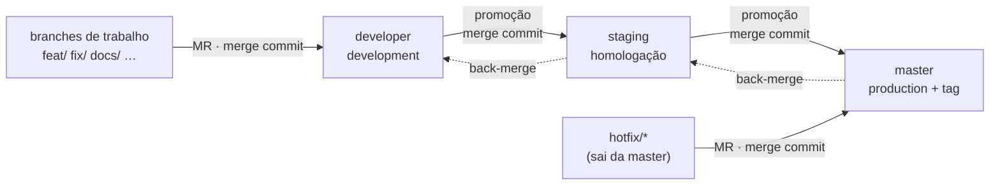

# Contribuindo — branches, commits e merge requests

Este repositório contém **dois projetos independentes**. As regras completas estão no guia de cada um:

| Projeto | Guia completo | `.gitmessage` | Templates de MR |
|---------|---------------|---------------|-----------------|
| Backend (API REST + WebSocket) | [backend/CONTRIBUTING.md](./backend/CONTRIBUTING.md) | [backend/.gitmessage](./backend/.gitmessage) | [`backend/.gitlab/merge_request_templates/`](./backend/.gitlab/merge_request_templates) |
| Frontend (Next.js — web + admin) | [frontend/CONTRIBUTING.md](./frontend/CONTRIBUTING.md) | [frontend/.gitmessage](./frontend/.gitmessage) | [`frontend/.gitlab/merge_request_templates/`](./frontend/.gitlab/merge_request_templates) |

Este arquivo resume as regras e documenta o que é específico da raiz. **Ao mudar uma regra, atualize os três arquivos.**

Plataforma: **GitLab** (repositório e merge requests) · Tickets: **Jira** (`CPBS-xxx`).

## 1. Branches e fluxo de publicação

Três branches permanentes, **todas protegidas** (sem push direto, sem force push, não podem ser apagadas), cada uma ligada a um ambiente:

| Branch | Ambiente | Recebe | Merge por |
|--------|----------|--------|-----------|
| `developer` (**padrão**) | development | MRs de trabalho · back-merge da `staging` | Developers + Maintainers |
| `staging` | staging / homologação | Promoção da `developer` · back-merge da `master` | Maintainers |
| `master` | production | Promoção da `staging` · `hotfix/*` | Maintainers |



| Origem | Destino | Tipo | Método | Template |
|--------|---------|------|--------|----------|
| `feat/*` `fix/*` `docs/*` `test/*` `refactor/*` `perf/*` `build/*` `chore/*` | `developer` | Trabalho | merge commit | Default / Bugfix / Docs |
| `developer` | `staging` | Promoção | merge commit | Release |
| `staging` | `master` | Promoção | merge commit | Release |
| `hotfix/*` | `master` | Hotfix | merge commit | Hotfix |
| `master` → `staging` → `developer` | — | Back-merge pós-hotfix | merge commit | Release |

- Branch de trabalho: `<tipo>/CPBS-<numero>-<descricao>` (ex.: `feat/CPBS-123-health-check`), criada da `developer` (hotfix: da `master`).
- Bug encontrado em staging → `fix/*` na `developer` e nova promoção; nunca commit direto em `staging`/`master`.
- Passo a passo de promoção e hotfix: §1.6 e §1.7 do guia de cada projeto.

## 2. Commits

```text
<tipo>(<escopo>): <descrição em pt-BR, minúscula, sem ponto final>   ← máx. 72 caracteres

[corpo: por que a mudança foi feita]

Refs: CPBS-123
```

| Escopo | Projeto |
|--------|---------|
| `backend` | backend |
| `frontend`, `web`, `admin` | frontend (`web`/`admin` = uma área; `frontend` = transversal) |
| `deps`, `repo` | qualquer projeto ou a raiz |
| `release` | somente títulos de MR de promoção/back-merge (`chore(release): promove developer para staging`) |

Um commit — e um MR — **não mistura backend e frontend**.

## 3. Merge requests

- Título no formato de commit; template do **projeto** e do tipo de MR (Default, Bugfix, Docs, Hotfix, Release).
- **Sem squash:** todos os MRs usam merge commit (squash desabilitado no projeto). Todo commit vai para o histórico — commits no padrão, sem `wip`.
- Promoções e back-merges não apagam a branch de origem.
- Aprovações: trabalho ≥ 1; promoção ≥ 1 Maintainer (→ `master`: 2); hotfix 2.
- Mudanças que envolvem os dois projetos: o backend chega a cada ambiente **antes ou junto** do frontend que depende dele.

> ⚠️ O GitLab só oferece no seletor os templates de `.gitlab/merge_request_templates/` **na raiz do repositório**. Neste repositório, copie o conteúdo do template do projeto (`backend/.gitlab/` ou `frontend/.gitlab/`) para a descrição do MR.

## 4. Versionamento

Tags anotadas **somente na `master`**, por projeto: `backend-vX.Y.Z` e `frontend-vX.Y.Z` (SemVer derivado dos commits). `developer` e `staging` não recebem tags de versão.

## 5. Arquivos da raiz

| Arquivo | Conteúdo |
|---------|----------|
| [`.gitmessage`](./.gitmessage) | Template de commit com a união dos escopos |
| `commitlint.config.mjs` | Escopos: `backend`, `frontend`, `web`, `admin`, `deps`, `repo`, `release` (demais regras iguais às dos projetos) |
| `scripts/check-branch-name.sh` | Igual ao dos projetos (§5.2 dos guias) |
| `.pre-commit-config.yaml` | Commitlint + nome da branch + hooks de lint de cada projeto filtrados por pasta (`files: ^backend/`, `files: ^frontend/`) |

Configurações do GitLab (branch padrão `developer`, branches e tags protegidas, merge commit sem squash): §5.4 do guia de cada projeto.
