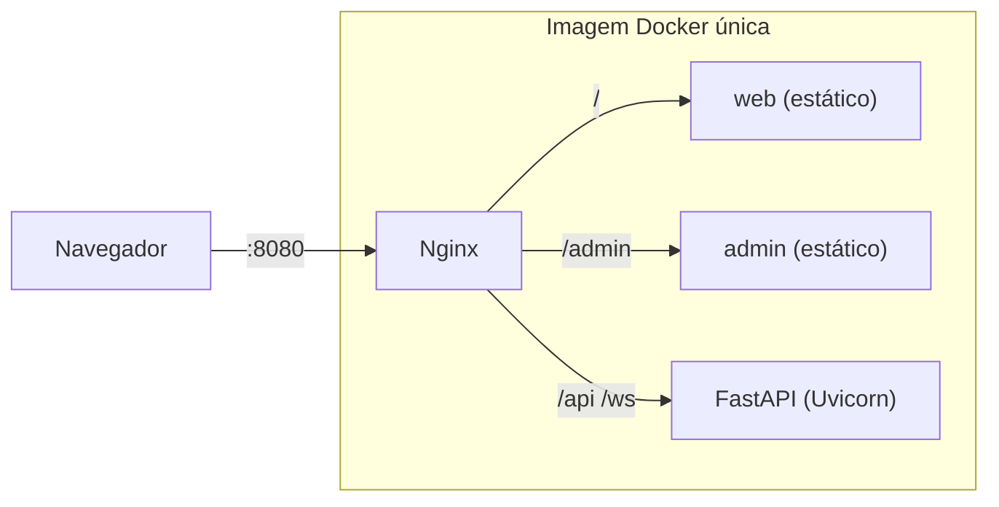

# Bot Varejo

Plataforma de atendimento, via chat, de serviços de parceiros de varejo.

| Parte | Stack | Pasta |
|-------|-------|-------|
| API | Python 3.13 · FastAPI · async · WebSockets | [`backend/`](./backend) |
| Front público | Next.js SPA · React · TypeScript · Tailwind | [`web/`](./web) |
| Front admin | Next.js SPA · React · TypeScript · Tailwind | [`admin/`](./admin) |
| Pacotes compartilhados | UI kit, cliente HTTP/WS tipados, configs | [`packages/`](./packages) |
| Roteamento / estáticos | Nginx | [`infra/nginx/`](./infra/nginx) |
| Empacotamento | Docker (imagem única) + Docker Compose | [`infra/docker/`](./infra/docker) |

> 📚 **Documentação completa:** [`docs/`](./docs/README.md) — arquitetura, diagramas, estrutura de pastas, padrões, testes e ADRs.
> Por parte: [backend](./docs/backend/README.md) · [web](./docs/web/README.md) · [admin](./docs/admin/README.md) · [frontend comum](./docs/frontend-comum/README.md)
>
> ⚠️ **Status (CPBS-275):** fase de documentação. Os comandos abaixo descrevem o funcionamento **alvo** da fundação e passam a valer quando a implementação for concluída.

## Arquitetura em 30 segundos



## Pré-requisitos

| Ferramenta | Versão | Para quê |
|------------|--------|----------|
| Docker + Docker Compose v2 | Compose ≥ 2.24 | Rodar a aplicação |
| Node.js | 24 LTS (ver `.nvmrc`) | Desenvolver os frontends |
| pnpm | via `corepack enable` | Workspaces do front |
| Python | 3.13 (ver `.python-version`) | Desenvolver o backend |
| uv | última estável | Dependências Python |
| make | qualquer | Atalhos |

> Para **apenas rodar** a aplicação, basta Docker.

## Rodando localmente

### Opção 1 — Aplicação completa (imagem única, igual à produção)

```bash
# 1. Clonar o repositório
git clone <url-do-repo> bot-varejo && cd bot-varejo

# 2. (Opcional) configurar variáveis
cp .env.example .env

# 3. Subir
docker compose up --build        # ou: make up
```

Acesse:

| URL | O quê |
|-----|-------|
| http://localhost:8080/ | Front público (web) |
| http://localhost:8080/health/ | Tela de status do web |
| http://localhost:8080/admin/ | Front admin |
| http://localhost:8080/admin/health/ | Tela de status do admin |
| http://localhost:8080/api/docs | Swagger |
| http://localhost:8080/api/openapi.json | OpenAPI |
| http://localhost:8080/api/v1/public/health | Health (public) |
| http://localhost:8080/api/v1/admin/health | Health (admin) |

Verificação rápida pelo terminal:

```bash
curl -s http://localhost:8080/api/v1/public/health
# {"status":"ok","scope":"public","version":"0.1.0","uptimeSeconds":3.2,"checkedAt":"…","components":[]}

curl -s http://localhost:8080/api/v1/admin/health
# {"status":"ok","scope":"admin",…}
```

Testar o WebSocket (com [websocat](https://github.com/vi/websocat) ou pelo console do navegador):

```bash
echo '{"type":"health.ping","id":"1","payload":{}}' | websocat ws://localhost:8080/ws/public
# {"type":"health.pong","id":"1","payload":{"status":"ok","scope":"public",…}}
```

Parar: `docker compose down` (ou `make down`).

### Opção 2 — Desenvolvimento com hot reload

```bash
cp .env.example .env
docker compose -f docker-compose.dev.yml up --build     # ou: make dev
```

Mesmas URLs (`http://localhost:8080`). Alterações em `backend/src`, `web/src`, `admin/src` e `packages/*/src` recarregam automaticamente.

### Rodando testes, lint e tipos (na máquina)

```bash
make setup        # uv sync + pnpm install + hooks do pre-commit + template de commit
make lint         # ruff, eslint, prettier, import-linter
make typecheck    # mypy --strict, tsc
make test         # pytest + vitest
make e2e          # Playwright contra docker compose
make openapi      # regenera o cliente TS após mudar a API
```

Sem `make`? Os comandos equivalentes estão em [docs/07 §3](./docs/07-fluxo-trabalho-ci.md#3-makefile--atalhos-padronizados), [docs/backend](./docs/backend/README.md#comandos) e [docs/frontend-comum](./docs/frontend-comum/README.md#comandos).

## Variáveis de ambiente

| Variável | Padrão | Descrição |
|----------|--------|-----------|
| `APP_ENV` | `local` | Ambiente |
| `APP_VERSION` | `0.1.0` | Versão exibida no health/OpenAPI |
| `APP_LOG_LEVEL` | `INFO` | Nível de log |
| `APP_DOCS_ENABLED` | `true` | Habilita Swagger/OpenAPI |
| `HTTP_PORT` | `8080` | Porta publicada no host |

## Solução de problemas

| Sintoma | Causa provável | Solução |
|---------|----------------|---------|
| `port is already allocated` | Porta 8080 em uso | `HTTP_PORT=8081 docker compose up` |
| `/admin` abre o web | Build antigo em cache | `docker compose build --no-cache` |
| WebSocket não conecta no dev | Nginx dev sem headers de upgrade | Conferir `infra/nginx/snippets/proxy-ws.conf` |
| Front mostra tipos desatualizados | `openapi.json` antigo | `make openapi` |
| Mudança em `package.json`/`pyproject.toml` não aparece no dev | Dependências instaladas no build da imagem | Subir de novo com `--build` |

## Contribuindo

Leia [docs/08 — Branches, commits e merge requests](./docs/08-branches-commits-mr.md), [docs/06 — Padrões gerais de código](./docs/06-padroes-gerais.md), [docs/05 — Estratégia de testes](./docs/05-estrategia-testes.md) e [docs/07 — Fluxo de trabalho e CI](./docs/07-fluxo-trabalho-ci.md).

Resumo:

```text
branch:  feat/CPBS-123-descricao-curta
commit:  feat(backend): adiciona health check por escopo
         (linha em branco)
         Refs: CPBS-123
MR:      título = cabeçalho do commit · template do GitLab · ≥ 1 aprovação · pipeline verde · squash
```

TDD, toda rota/feature/tela com teste. Templates de MR em [`.gitlab/merge_request_templates/`](./.gitlab/merge_request_templates).
