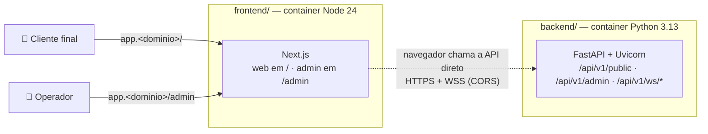

# Bot Varejo

Plataforma de atendimento, via chat, de serviços de parceiros de varejo.

Este repositório contém **dois projetos independentes**. Cada um tem seu próprio README, CONTRIBUTING, `.gitmessage`, documentação, ADRs, templates de MR, Dockerfile, docker compose, Makefile e pipeline.

| Projeto | Stack | Domínio | Imagem | Documentação |
|---------|-------|---------|--------|--------------|
| [**backend/**](./backend/README.md) | Python 3.13 · FastAPI · async · WebSockets | `api.<dominio>` | `python:3.13-slim` | [backend/docs](./backend/docs/README.md) |
| [**frontend/**](./frontend/README.md) | Node 24 · Next.js (SPA) · React · TypeScript · Tailwind | `app.<dominio>` | `node:24-slim` | [frontend/docs](./frontend/docs/README.md) |

> ⚠️ **Status (CPBS-275):** fase de documentação. Os comandos descrevem o funcionamento **alvo**.

## Visão geral



- Cada projeto roda **um processo por container**; TLS e domínios ficam na plataforma de deploy.
- A única ligação entre os projetos é o **contrato HTTP/WebSocket** ([backend/docs/06-contratos-api.md](./backend/docs/06-contratos-api.md)).

## Rodando tudo localmente

```bash
# terminal 1 — API em http://localhost:8000
cd backend && docker compose up --build

# terminal 2 — front em http://localhost:3000
cd frontend && docker compose up --build
```

Acesse http://localhost:3000/health (web) e http://localhost:3000/admin/health (admin). Detalhes e alternativas sem Docker nos READMEs de cada projeto.

## Estrutura do repositório

```text
bot-varejo/
├── README.md                 # este arquivo
├── CONTRIBUTING.md           # padrão de branches, commits, MRs e versionamento
├── .gitmessage               # template de mensagem de commit
├── .gitlab-ci.yml            # orquestra: valida o MR e inclui o CI de cada projeto
├── commitlint.config.mjs     # regras de commit (a criar na implementação)
├── .pre-commit-config.yaml   # hooks de commit/push e lint por projeto (a criar)
├── scripts/
│   └── check-branch-name.sh  # validação do nome da branch (a criar)
├── backend/                  # projeto backend — README, CONTRIBUTING, .gitmessage, .gitlab, docs, Dockerfile, compose, CI
└── frontend/                 # projeto frontend — README, CONTRIBUTING, .gitmessage, .gitlab, docs, Dockerfile, compose, CI
```

## Contribuindo

Leia o [CONTRIBUTING.md](./CONTRIBUTING.md). Cada projeto tem também o seu guia completo: [backend/CONTRIBUTING.md](./backend/CONTRIBUTING.md) · [frontend/CONTRIBUTING.md](./frontend/CONTRIBUTING.md). Resumo:

```text
branches:  developer (development) → staging (homologação) → master (production) — todas protegidas
branch:    feat/CPBS-123-descricao-curta  (sai da developer)
commit:    feat(backend): adiciona health check por escopo   ← escopos: backend | frontend, web, admin | ci, deps, repo | release
           (linha em branco)
           Refs: CPBS-123
MR:        → developer · merge commit (sem squash) · um projeto por MR · template do projeto · pipeline verde
publicar:  MRs de promoção developer → staging → master (template Release)
tags:      backend-vX.Y.Z · frontend-vX.Y.Z (na master)
```

## Templates de merge request

Cada projeto tem os seus, em `<projeto>/.gitlab/merge_request_templates/` (Default, Bugfix, Hotfix, Docs).

> ⚠️ O GitLab só oferece no seletor os templates que estão em `.gitlab/merge_request_templates/` **na raiz do repositório**. Neste repositório, copie o conteúdo do template do projeto para a descrição do MR.
