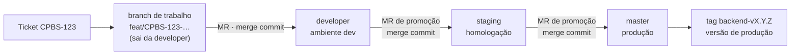
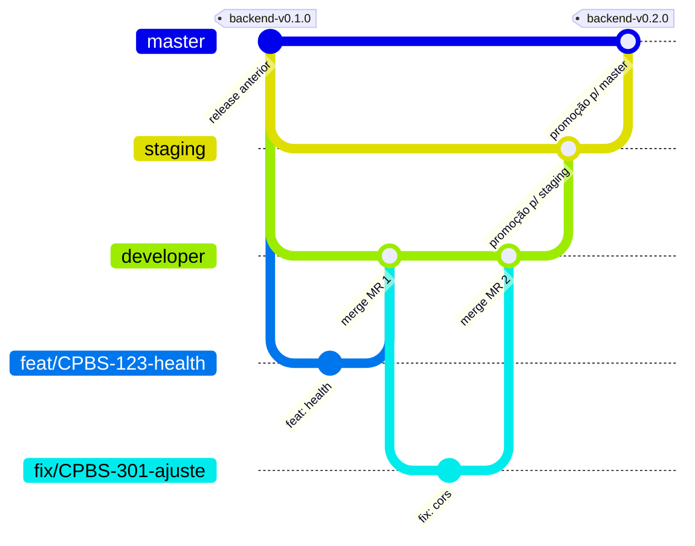
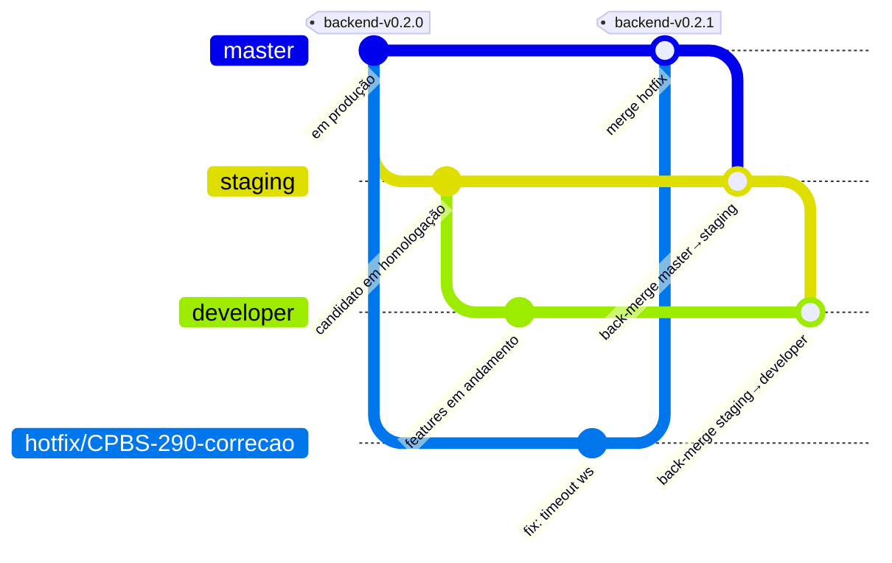
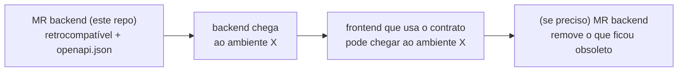

# Contribuindo — Backend

> Projeto: **Backend** — API REST + WebSocket (Python 3.13 · FastAPI).

Plataforma: **GitLab** (repositório e merge requests) · Tickets: **Jira** (`CPBS-xxx`).

Resumo: **branch de trabalho** `tipo/CPBS-123-descricao` criada da `developer` → **commits** `tipo: [CPBS-123] descrição` → **MR para `developer`** (merge commit) → **promoção** `developer → staging → master` (MRs de release, merge commit) → **tag** `backend-vX.Y.Z` na `master` → produção.



## 1. Branches e fluxo de publicação

### 1.1 Branches permanentes (protegidas)

O repositório tem **três branches permanentes**, cada uma ligada a um ambiente. **Todas são travadas**: ninguém faz push direto, force push é proibido e elas não podem ser apagadas. Só recebem código por **merge request** aprovado.

| Branch | Ambiente | Recebe | Quem pode fazer merge |
|--------|----------|--------|------------------------|
| `developer` | **development** (`api-dev.<dominio>`) | MRs das branches de trabalho · back-merge da `staging` | Developers + Maintainers |
| `staging` | **staging / homologação** (`api-staging.<dominio>`) | **Somente** promoção da `developer` · back-merge da `master` | Maintainers |
| `master` | **production** (`api.<dominio>`) | **Somente** promoção da `staging` · `hotfix/*` | Maintainers |

- **Branch padrão do repositório: `developer`** — é o destino padrão dos MRs e a base de todas as branches de trabalho.
- `master` é sempre o que está (ou vai para) produção; `staging` é o candidato a release; `developer` é a integração contínua do time.
- Domínios de cada ambiente: a definir (os nomes acima são a convenção proposta).

### 1.2 Fluxo de publicação: `developer → staging → master`



| Etapa | O que acontece | Ambiente atualizado |
|-------|----------------|---------------------|
| 1. Desenvolvimento | Branch de trabalho criada da `developer`; MR para `developer` (merge commit — todos os commits da branch entram na `developer`) | **development** |
| 2. Promoção para homologação | MR **`developer → staging`** (template *Release*, merge commit) | **staging** |
| 3. Homologação | QA/validação em staging. Problema encontrado? Correção vai **na `developer`** e sobe numa nova promoção — nunca direto na `staging` | — |
| 4. Promoção para produção | MR **`staging → master`** (template *Release*, merge commit) | — |
| 5. Release | Tag **`backend-vX.Y.Z`** criada na `master`, marcando a versão que vai para produção | **production** |

### 1.3 Matriz origem → destino

Qualquer combinação fora desta tabela é **proibida** — quem revisa confere origem e destino (§3.3).

| Origem | Destino | Tipo de MR | Método | Template |
|--------|---------|------------|--------|----------|
| `feat/*` `fix/*` `docs/*` `test/*` `refactor/*` `perf/*` `build/*` `chore/*` | `developer` | Trabalho | merge commit | Default / Bugfix / Docs |
| `developer` | `staging` | Promoção | merge commit | Release |
| `staging` | `master` | Promoção | merge commit | Release |
| `hotfix/*` | `master` | Hotfix | merge commit | Hotfix |
| `master` | `staging` | Back-merge (pós-hotfix) | merge commit | Release |
| `staging` | `developer` | Back-merge (pós-hotfix) | merge commit | Release |

**Não usamos squash** em nenhum MR: todos são integrados com **merge commit**. Assim cada commit da branch de trabalho — com seu `[CPBS-xxx]` — é preservado, e as três branches compartilham **exatamente os mesmos commits**: o que está em produção é, commit a commit, o que foi validado em staging.

### 1.4 Nome das branches de trabalho

```text
<tipo>/<TICKET>-<descricao-curta>
```

| Parte | Regra | Exemplo |
|-------|-------|---------|
| `tipo` | Um dos tipos da tabela abaixo | `feat` |
| `TICKET` | Chave do Jira, **obrigatória**, em maiúsculas | `CPBS-123` |
| `descricao-curta` | 2 a 5 palavras, kebab-case, minúsculas, sem acentos | `health-check` |
| Tamanho total | Máximo 60 caracteres | — |

Regex de referência (as permanentes `developer`, `staging` e `master` são aceitas à parte):

```text
^(feat|fix|hotfix|docs|test|refactor|perf|build|chore)/CPBS-[0-9]+-[a-z0-9]+(-[a-z0-9]+)*$
```

| Tipo | Quando usar | Sai de | Volta para |
|------|-------------|--------|------------|
| `feat` | Nova funcionalidade | `developer` | `developer` |
| `fix` | Correção de bug (fluxo normal, inclusive bug achado em staging) | `developer` | `developer` |
| `hotfix` | Correção **urgente** de algo em **produção** | `master` | `master` (+ back-merge) |
| `docs` | Somente documentação / ADR | `developer` | `developer` |
| `test` | Somente testes | `developer` | `developer` |
| `refactor` | Refatoração sem mudar comportamento | `developer` | `developer` |
| `perf` | Melhoria de performance | `developer` | `developer` |
| `build` | Docker, dependências, build | `developer` | `developer` |
| `chore` | Manutenção geral | `developer` | `developer` |

✅ `feat/CPBS-123-health-check` · ✅ `hotfix/CPBS-290-ws-timeout`
❌ `feature/fundacao` (tipo inválido, sem ticket) · ❌ `feat/cpbs-123-Saúde` (ticket minúsculo, maiúscula, acento) · ❌ `fulano/teste` (sem padrão)

### 1.5 Regras de vida da branch de trabalho

1. **Sempre** criar a partir da `developer` atualizada: `git switch developer && git pull && git switch -c feat/CPBS-123-descricao` (hotfix: a partir da `master`).
2. **Uma branch = um ticket.** Ticket grande? Quebre em sub-tickets e MRs menores.
3. **Vida curta:** ideal até 3 dias. Branch parada fica desatualizada e gera conflito.
4. **Atualizar com rebase** na branch de origem: `git fetch && git rebase origin/developer` (hotfix: `origin/master`). Depois: `git push --force-with-lease` (nunca `--force` puro; nunca em branch permanente).
5. **Apagar após o merge** (marque "Delete source branch" no MR). Branches permanentes nunca são apagadas.

### 1.6 Promoção (release)

Feita por um **Maintainer** (responsável pelo release).

**`developer → staging`**

1. Conferir que a validação completa da `developer` está verde (§3.1) e que o ambiente **development** está saudável.
2. Abrir MR `developer → staging` com o template **Release**, título `chore: promove developer para staging`.
3. Listar os MRs/tickets incluídos: `git log --oneline --no-merges origin/staging..origin/developer`.
4. Confirmar dependências entre projetos (§3.4) e variáveis de ambiente novas já configuradas em **staging**.
5. Merge **sem apagar a branch de origem**; o ambiente **staging** passa a rodar esta versão.
6. Validação/QA em staging. Bug encontrado → `fix/*` a partir da `developer` → nova promoção.

**`staging → master`**

1. Validação em staging concluída e registrada no MR.
2. Abrir MR `staging → master` com o template **Release**, título `chore: promove staging para master (backend-vX.Y.Z)`.
3. Calcular a versão (§4) e conferir variáveis de ambiente de **production**.
4. Merge → criar a tag **`backend-vX.Y.Z`** no commit de merge da `master`: é a versão que vai para **production**.
5. Validação em **production** (health, telas/fluxos críticos) e comunicação do release.

Enquanto uma versão está em homologação, a `developer` continua recebendo MRs normalmente; eles entram na **próxima** promoção.

### 1.7 Hotfix



1. Ticket de prioridade alta; branch `hotfix/CPBS-xxx-descricao` **a partir da `master`**.
2. Correção **mínima** + teste de regressão; MR `hotfix/* → master` com o template **Hotfix**.
3. Merge → tag de patch `backend-vX.Y.Z+1`, a versão que vai para **production**.
4. **Back-merge obrigatório** no mesmo dia: MR `master → staging` e depois `staging → developer` (template **Release**, merge commit, título `chore: back-merge master para staging` / `… staging para developer`). Sem isso a correção some na próxima promoção.

## 2. Commits

### 2.1 Formato

```text
<tipo>: [CPBS-123] <descrição>
```

| Parte | Regra |
|-------|-------|
| `tipo` | Obrigatório — tabela §2.2 |
| `[CPBS-123]` | **Obrigatório** — chave do ticket no Jira, entre colchetes, em maiúsculas |
| `descrição` | Obrigatória; **pt-BR**, verbo no presente (completa a frase "este commit…": *adiciona*, *corrige*, *remove*); começa com **minúscula**; **sem ponto final** |
| Tamanho | Primeira linha com no máximo **72 caracteres** |
| Corpo | Opcional, depois de uma linha em branco: explica o **porquê** (o diff já mostra o quê) |
| Quebra de compatibilidade | `!` depois do tipo (`feat!: …`) e o impacto explicado no corpo |

### 2.2 Tipos

| Tipo | Uso | Gera versão |
|------|-----|-------------|
| `feat` | Nova funcionalidade para o usuário/consumidor | minor |
| `fix` | Correção de bug | patch |
| `perf` | Melhoria de performance | patch |
| `refactor` | Mudança de código sem alterar comportamento | — |
| `test` | Adiciona/ajusta testes, sem mudar produção | — |
| `docs` | Somente documentação | — |
| `style` | Formatação pura (sem mudança de lógica) | — |
| `build` | Dockerfile, dependências (`requirements.txt` / `requirements-test.txt`), build | — |
| `chore` | Manutenção; também nos títulos de promoção/back-merge | — |
| `revert` | Reverte um commit anterior | — |

Qualquer tipo com `!` gera versão **major** (em `0.x`, **minor**).

### 2.3 Exemplos

✅ Bons:

```text
feat: [CPBS-123] adiciona health check por escopo
```

```text
feat: [CPBS-123] adiciona health check por escopo

Expõe GET /api/v1/{public,admin}/health usando o mesmo caso de uso,
para que o frontend valide a comunicação ponta a ponta.
```

```text
fix: [CPBS-301] fecha websocket com código 1008 para origem não permitida
test: [CPBS-123] cobre rejeição de origem no handshake websocket
feat!: [CPBS-340] renomeia campo uptime para uptimeSeconds no health
```

✅ Título de MR de promoção/back-merge (sem ticket):

```text
chore: promove developer para staging
chore: promove staging para master (backend-v0.2.0)
```

❌ Ruins:

| Mensagem | Problema |
|----------|----------|
| `ajustes` | Sem tipo, sem ticket, não diz nada |
| `feat: adiciona health` | Sem o ticket `[CPBS-…]` |
| `feat: [cpbs-123] Adicionado health.` | Ticket minúsculo, maiúscula, particípio, ponto final |
| `feat(backend): [CPBS-123] …` | Sem escopo entre parênteses: o formato é `tipo: [ticket] descrição` |
| `wip`, `ajuste`, `fix review` | Sem squash, todo commit vai para o histórico: reescreva commits temporários antes de abrir o MR (`git rebase -i origin/developer`) |

### 2.4 Boas práticas

- **Um commit = uma mudança lógica.** Facilita revisão e `git revert`.
- **Sem squash, o histórico é o que você commitar:** todos os commits da branch vão para `developer`, `staging` e `master`. Antes de abrir o MR, revise-os (`git log origin/developer..HEAD`) e reescreva mensagens fora do padrão ou commits temporários com `git rebase -i origin/developer`.
- **Durante a revisão:** ajustes pedidos entram como **novos commits** no padrão (ex.: `fix: [CPBS-123] trata origem ausente no handshake`), sem reescrever o que já foi revisado.
- **TDD no histórico:** é bem-vindo o par `test: …` → `feat: …`, mostrando o teste antes da implementação.
- **Nada quebrado:** cada commit deveria passar em lint e testes.
- **Sem arquivos gerados** fora os previstos (`openapi.json`) e **sem segredos** — nunca.

## 3. Merge Requests

### 3.1 Regras

| Regra | MR de trabalho (→ `developer`) | MR de promoção / back-merge | MR de hotfix (→ `master`) |
|-------|-------------------------------|-----------------------------|---------------------------|
| **Título** | Formato de commit: `feat: [CPBS-123] adiciona health check por escopo` | `chore: promove <origem> para <destino>` | Formato de commit: `fix: [CPBS-…] …` |
| Template | Default / Bugfix / Docs | **Release** | **Hotfix** |
| Apagar branch de origem | Sim | **Não** (branch permanente) | Sim |
| Aprovações | ≥ 1 (não o autor) | ≥ 1 **Maintainer**; para `master`: **2** | **2**, incluindo 1 Maintainer |
| Quem faz o merge | Autor, após aprovação | Maintainer responsável pelo release | Maintainer |

Regras comuns a todos:

| Regra | Valor |
|-------|-------|
| Método de merge | **Merge commit** em todos os MRs — squash **desabilitado** no projeto |
| Commits | Todos no padrão da §2; nada de `wip` |
| Em andamento | Prefixo `Draft:` no título — não pode ser mergeado |
| Preenchimento | **Todas** as seções do template; o que não se aplica recebe "N/A" com motivo |
| Tamanho (trabalho) | Ideal **até ~400 linhas** alteradas (sem contar arquivos gerados). Maior que isso: quebrar |
| Escopo do MR | Só mudanças **deste projeto** |
| Validação | Lint, tipos e testes rodados localmente e verdes antes de abrir o MR (checklist do template) |
| Threads | Todas resolvidas antes do merge |

### 3.2 Templates

Em [`.gitlab/merge_request_templates/`](./.gitlab/merge_request_templates) — aparecem no seletor **"Description → Choose a template"** ao criar o MR; o `Default.md` é aplicado automaticamente.

| Template | Arquivo | Usar para |
|----------|---------|-----------|
| **Default** (feature/geral) | [`Default.md`](./.gitlab/merge_request_templates/Default.md) | `feat`, `refactor`, `perf`, `test`, `build`, `chore` → `developer` |
| **Bugfix** | [`Bugfix.md`](./.gitlab/merge_request_templates/Bugfix.md) | `fix` → `developer` |
| **Docs** | [`Docs.md`](./.gitlab/merge_request_templates/Docs.md) | `docs` → `developer` |
| **Hotfix** | [`Hotfix.md`](./.gitlab/merge_request_templates/Hotfix.md) | `hotfix/*` → `master` |
| **Release** | [`Release.md`](./.gitlab/merge_request_templates/Release.md) | Promoções (`developer → staging`, `staging → master`) e back-merges |

| Seção | O que o template do backend pede |
|-------|----------------------------------|
| Partes afetadas | Camadas DDD (domínio, aplicação, infraestrutura, apresentação), WebSocket, `core/`, Docker |
| Contrato | `openapi.json` atualizado, retrocompatibilidade, impacto no frontend |
| Configuração | Novas variáveis, mudanças em `APP_CORS_ORIGINS` |
| Evidências | Requests/respostas, logs |
| Checklist | ruff, mypy `--strict`, lint-imports, pytest ≥ 90%, camadas DDD |
| Validação de hotfix | Health dos escopos `public`/`admin` + WebSocket |
| Release | MRs/tickets incluídos, contrato compatível com o frontend do ambiente de destino, variáveis configuradas, rollback |

Todos terminam com a *quick action* `/assign me`, aplicada ao criar o MR.

### 3.3 Checklist de revisão (para quem revisa)

- [ ] O título e os commits seguem o padrão; o ticket faz sentido com a mudança.
- [ ] Origem e destino respeitam a matriz da §1.3.
- [ ] O código segue os [padrões do backend](./docs/10-padroes-codigo.md) (PEP 8 no Python, camelCase no JSON — ADR-0005).
- [ ] Camadas DDD respeitadas: domínio sem FastAPI/Pydantic; presentation não acessa infrastructure direto; contexts isolados.
- [ ] Toda rota HTTP e mensagem WebSocket nova/alterada tem teste de integração; casos de uso com teste unitário.
- [ ] Contrato mudou? `openapi.json` e [Contratos de API](./docs/06-contratos-api.md) atualizados; mudança **retrocompatível** (ou `/api/v2`); frontend avisado (ticket/MR).
- [ ] CORS / `Origin` do WebSocket continuam restritos a `APP_CORS_ORIGINS`.
- [ ] Persistência (DynamoDB): cada context só acessa a própria tabela; consultas por chave/índice (sem `Scan`); escritas com condição/`version`; padrões de acesso documentados ([12](./docs/12-persistencia-dynamodb.md)).
- [ ] Documentação (`docs/`) e ADR atualizados quando necessário.
- [ ] Sem segredos, logs de debug, código comentado ou TODO sem ticket.

Comentários de revisão: prefixar com **`bloqueante:`**, **`sugestão:`** ou **`dúvida:`** para deixar claro o que impede o merge.

### 3.4 Mudanças que envolvem o Frontend

Mudanças de contrato consumidas pelo **frontend** seguem esta ordem **em cada ambiente**, porque os dois projetos são implantados separadamente:



- O backend é promovido (`developer → staging → master`) **antes ou junto** do frontend que depende dele — nunca depois.
- Toda mudança precisa ser compatível com o frontend que **já está** no ambiente de destino.
- Incompatibilidade inevitável → nova versão de rota (`/api/v2`) convivendo com a anterior; ver [evolução do contrato](./docs/06-contratos-api.md#evolução-do-contrato).
- Cada MR cita o outro na seção **"MRs relacionados"** do template.

## 4. Versionamento e tags

- **SemVer**, com tags anotadas **somente na `master`**, no formato **`backend-vMAJOR.MINOR.PATCH`** (ex.: `backend-v0.2.0`). O prefixo identifica o projeto nas tags.
- A versão é derivada dos commits desde a última tag (tabela §2.2): `feat` → minor, `fix`/`perf` → patch, breaking → major. Em `0.x`, breaking sobe o **minor**. Hotfix → patch.
- Criada pelo Maintainer responsável pelo release, **depois** do merge na `master`: tag anotada no commit de merge, enviada com `git push origin <tag>`.
- `developer` e `staging` **não recebem tags de versão**.
- Futuro (opcional): `CHANGELOG.md` gerado a partir dos tipos e tickets dos commits.

## 5. Cola rápida

```bash
# começar uma tarefa
git switch developer && git pull
git switch -c feat/CPBS-123-minha-feature

# commitar
git add -p
git commit -m "feat: [CPBS-123] adiciona health check por escopo"

# atualizar com a developer
git fetch && git rebase origin/developer
git push --force-with-lease

# abrir o MR → developer: título no formato do commit + template Default

# hotfix
git switch master && git pull
git switch -c hotfix/CPBS-456-correcao
# MR → master com template Hotfix; depois back-merge master → staging → developer

# release (Maintainer): MR developer → staging e staging → master com template Release;
# após o merge na master, criar a tag anotada backend-vX.Y.Z e enviar com git push origin <tag>
```
