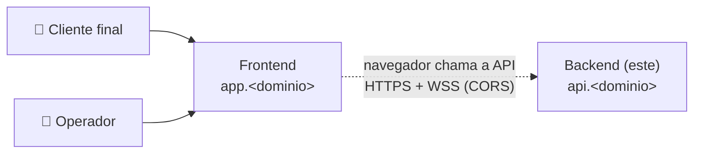

# Bot Varejo — Backend

API REST + WebSocket do Bot Varejo: **Python 3.13 · FastAPI · async · WebSockets · DynamoDB**. Atende os escopos `public` (cliente final) e `admin` (operação), consumidos pelo **frontend** (repositório próprio) em outro domínio.

> 📚 Documentação completa: [`docs/`](./docs/README.md) · Branch/commit/MR: [CONTRIBUTING.md](./CONTRIBUTING.md) · Templates de MR: [`.gitlab/`](./.gitlab/merge_request_templates)
>
> **Status:** fundação implementada — health check (`public`/`admin`) via HTTP e WebSocket, CORS, validação de `Origin`, erros padronizados, log JSON e `X-Request-ID`. O acesso ao DynamoDB (`core/dynamodb`) chega com o primeiro context que persistir dados.

## O sistema

O Bot Varejo tem dois projetos, implantados de forma independente:

| Projeto | Domínio | Papel |
|---------|---------|-------|
| **Backend** (este) | `api.<dominio>` | APIs REST (`/api/v1/public`, `/api/v1/admin`) e WebSocket (`/api/v1/ws/public`, `/api/v1/ws/admin`) |
| Frontend | `app.<dominio>` | App Next.js: web em `/` (escopo `public`) e admin em `/admin` (escopo `admin`) |



- **Um processo por container** (Uvicorn); TLS e domínio ficam na plataforma de deploy.
- A única ligação com o frontend é o **contrato** HTTP/WebSocket: [docs/06-contratos-api.md](./docs/06-contratos-api.md) + `openapi.json`.
- O frontend tem repositório, documentação e deploy próprios.

## Pré-requisitos

| Ferramenta | Versão | Obrigatória para |
|------------|--------|------------------|
| Docker Engine + Docker Compose v2 (Windows/macOS: Docker Desktop) | Compose ≥ 2.24 | Rodar a API e o banco (caminho recomendado) |
| Git (Windows: **Git for Windows**, que traz o Git Bash) | — | Clonar e contribuir |
| Python | 3.13 (Windows: instalador do python.org marcando *Add python.exe to PATH*; Debian/Ubuntu: `sudo apt install python3.13 python3.13-venv`) | Rodar sem Docker, testes e lint |
| make | qualquer | *(opcional)* atalhos do `Makefile` — ver [Instalando o make](#instalando-o-make); todo comando também está escrito por extenso |
| websocat, AWS CLI | — | *(opcionais)* testar WebSocket e inspecionar o DynamoDB Local |

> **Linux/WSL:** seu usuário precisa estar no grupo `docker` — `sudo usermod -aG docker $USER` e abra um novo terminal. Sem isso aparece `permission denied … docker.sock`.

### Instalando o make

O `make` é opcional (todo comando também está escrito por extenso), mas deixa o dia a dia mais simples: `make install`, `make dev`, `make check`…

#### Windows — passo a passo

1. **Abra o PowerShell** (menu Iniciar → digite "PowerShell"). Não precisa ser como administrador.
2. **Instale o make pelo winget** (já vem no Windows 10/11):

   ```powershell
   winget install ezwinports.make
   ```

   Aceite os termos se ele perguntar (`Y`).
3. **Feche todos os terminais** (PowerShell, Git Bash e o terminal do VS Code — se o VS Code estiver aberto, feche e abra de novo). O PATH novo só vale em terminais abertos depois da instalação.
4. **Abra o Git Bash** na pasta do projeto e confira:

   ```bash
   make --version
   # GNU Make 4.4.1 ...
   ```

5. **Teste no projeto:**

   ```bash
   make help       # lista os atalhos
   make install    # cria o .venv e instala as dependências
   ```

Use o `make` sempre pelo **Git Bash**: o Makefile usa comandos de shell (`grep`, `awk`) que o Git Bash já traz. Ele detecta o Windows sozinho (usa `.venv/Scripts`) e chama `python`; se o seu `python` não for o 3.13, rode `make install PYTHON="py -3.13"`.

**Sem winget?** Alternativas (escolha uma):

| Gerenciador | Comando | Observação |
|-------------|---------|------------|
| Chocolatey | `choco install make` | PowerShell **como administrador** |
| Scoop | `scoop install make` | Se você já usa o Scoop |

**`make: command not found` depois de instalar?**

1. Confirme que abriu um terminal **novo**.
2. No PowerShell, rode `Get-Command make` para ver onde ele está. Se não aparecer, procure `make.exe` em `%LOCALAPPDATA%\Microsoft\WinGet\Links` (winget), `C:\ProgramData\chocolatey\bin` (Chocolatey) ou `~\scoop\shims` (Scoop).
3. Adicione essa pasta ao PATH: menu Iniciar → "Editar as variáveis de ambiente para sua conta" → *Path* → *Editar* → *Novo* → cole a pasta → *OK*.
4. Abra um terminal novo e rode `make --version` de novo.

#### Linux, WSL e macOS

- **Ubuntu/Debian/WSL:** `sudo apt install make`
- **macOS:** `xcode-select --install`

## Configuração

1. **Clonar e entrar no repositório**

   ```bash
   git clone <url-do-repositorio-backend> bot-varejo-backend
   cd bot-varejo-backend
   ```

2. **Criar o `.env`** a partir do exemplo (os valores padrão já funcionam localmente):

   ```bash
   cp .env.example .env
   ```

   O `.env` é lido pelo Docker Compose (portas e variáveis `APP_*`) e pela aplicação. O endereço do banco (`APP_DYNAMODB_ENDPOINT_URL`) já é definido pelo compose; só precisa ir no `.env` quando a API roda **fora** do Docker. Todas as variáveis estão em [Variáveis de ambiente](#variáveis-de-ambiente).

3. **Preparar o ambiente Python** *(uma vez por clone — necessário para testes, lint e rodar sem Docker)*:

   Com `make` (qualquer sistema, no Windows pelo Git Bash):

   ```bash
   make install    # cria o .venv e instala requirements-test.txt
   ```

   Sem `make`: crie o ambiente virtual, **ative** e instale as dependências. Ativar faz o terminal usar o Python e as libs do projeto (o prompt passa a mostrar `(.venv)`); repita a ativação em todo terminal novo.

   ```bash
   # Linux / macOS / WSL
   python3.13 -m venv .venv
   source .venv/bin/activate

   # Windows — Git Bash
   py -3.13 -m venv .venv
   source .venv/Scripts/activate

   # Windows — PowerShell
   py -3.13 -m venv .venv
   .venv\Scripts\Activate.ps1
   ```

   Depois, em qualquer sistema (com o venv ativado):

   ```bash
   pip install -r requirements-test.txt     # runtime + testes e qualidade
   ```

   Detalhes (cmd, sair do venv, política de execução do PowerShell): [docs/11 — Comandos](./docs/11-comandos.md#1-ambiente-virtual-venv).

## Rodando

O compose sobe dois serviços:

| Serviço | Container (runtime / dev) | Porta no host | O que é |
|---------|---------------------------|---------------|---------|
| `bot-varejo-api` | `bot-varejo-api` / `bot-varejo-api-dev` | `8000` (`API_PORT`) | API FastAPI |
| `bot-varejo-dynamodb` | `bot-varejo-dynamodb` / `bot-varejo-dynamodb-dev` | `8001` (`DYNAMODB_PORT`) | DynamoDB Local (dados no volume `bot-varejo-dynamodb-data` / `…-dev-data`) |

### Desenvolvimento (recomendado no dia a dia)

Código de `api/` montado no container: **cada alteração recarrega a API sozinha** (~2 s), sem subir de novo. Só mudar `requirements.txt`, `requirements-test.txt` ou `Dockerfile` pede `--build`.

```bash
docker compose -f docker-compose.dev.yml up --build
```

### Imagem de produção

Mesma imagem que vai para os ambientes (sem reload, usuário não-root, healthcheck):

```bash
docker compose up --build -d
```

### Sem Docker para a API

Útil para depurar na IDE. O banco continua no Docker:

```bash
docker compose -f docker-compose.dev.yml up -d bot-varejo-dynamodb
make run
```

Sem `make`: coloque `APP_DYNAMODB_ENDPOINT_URL=http://localhost:8001` no `.env` e, com o venv ativado, rode `uvicorn main:app --reload --reload-dir api --port 8000` (ou `python main.py`, sem reload).

### Tabelas do banco

Cada bounded context com persistência tem sua tabela ([docs/12](./docs/12-persistencia-dynamodb.md)). O script que cria as tabelas no DynamoDB Local (`python -m api.scripts.create_tables`, idempotente) chega junto com o primeiro context que persistir dados.

### Comandos úteis

Acrescente `-f docker-compose.dev.yml` quando estiver usando o compose de desenvolvimento.

| Ação | Comando |
|------|---------|
| Ver status | `docker compose ps` |
| Acompanhar logs da API | `docker compose logs -f bot-varejo-api` |
| Parar tudo | `docker compose down` |
| Parar e **apagar os dados** do banco local | `docker compose down -v` |
| Recriar após mudar `requirements*.txt`/`Dockerfile` (código em `api/` não precisa) | `docker compose up --build` |
| Shell dentro da API | `docker compose exec bot-varejo-api sh` |
| Listar tabelas do banco local | `aws dynamodb list-tables --endpoint-url http://localhost:8001` |

### URLs

| URL | O quê |
|-----|-------|
| http://localhost:8000/api/v1/public/health | Health (public) |
| http://localhost:8000/api/v1/admin/health | Health (admin) |
| ws://localhost:8000/api/v1/ws/public · /api/v1/ws/admin | WebSocket |
| http://localhost:8000/api/docs | Swagger |
| http://localhost:8000/api/redoc | ReDoc |
| http://localhost:8000/api/openapi.json | OpenAPI |
| http://localhost:8001 | DynamoDB Local |

### Verificação rápida

```bash
curl -s http://localhost:8000/api/v1/public/health
# {"status":"ok","scope":"public","version":"0.0.0-local","uptimeSeconds":3.2,"checkedAt":"…","components":[]}

# WebSocket (websocat) — o header Origin precisa estar em APP_CORS_ORIGINS
echo '{"type":"health.ping","id":"1","payload":{}}' \
  | websocat -H "Origin: http://localhost:3000" ws://localhost:8000/api/v1/ws/public
# {"type":"health.pong","id":"1","payload":{"status":"ok","scope":"public",…}}
```

### Junto com o frontend

1. Suba este projeto (API em `:8000`, banco em `:8001`).
2. No repositório do **frontend**, suba o compose dele (`bot-varejo-web` em `:3000`).
3. Acesse `http://localhost:3000/health` e `http://localhost:3000/admin/health`.

O CORS já libera `http://localhost:3000` por padrão; se o front rodar em outra porta, ajuste `APP_CORS_ORIGINS` no `.env`.

## Estrutura e dependências

```text
api/                     # código da aplicação
├── app_run.py           # create_app()
├── config.py            # Settings (variáveis APP_*)
├── container.py         # montagem de adapters e casos de uso
├── core/                # cors, swagger, logs, errors, request_id, websocket…
├── routes/              # public.py, admin.py, websocket.py
├── contexts/<context>/  # DDD: domain, application, infrastructure, presentation
└── scripts/             # python -m api.scripts.<nome>
tests/                   # unit, integration, contract
config/                  # deploy/infra da plataforma (não alterar a estrutura)
certificates/            # certificados de CA adicionais (.crt)
requirements.txt         # dependências de runtime (versões fixadas)
requirements-test.txt    # -r requirements.txt + testes e qualidade
```

- O que vai em cada pasta e onde colocar algo novo: [docs/02 — Estrutura](./docs/02-estrutura.md#o-que-vai-em-cada-pasta).
- Cada lib, para que serve e como adicionar/atualizar: [docs/13 — Dependências](./docs/13-dependencias.md).
- GitHub Copilot (VS Code): regras em `.github/`, prompts `/novo-context`, `/novo-modulo`, `/novo-endpoint`, `/nova-mensagem-ws`, `/revisar-arquitetura` e o agente `backend-ddd` — ver [docs/14 — IA](./docs/14-ia-copilot.md). Lib nova = linha com versão fixada no arquivo certo + `docker compose … up --build`.

## Testes e qualidade

```bash
make check      # lint + tipos + testes com cobertura (≥ 90%) + contrato OpenAPI
make openapi    # atualiza o openapi.json depois de mudar o contrato
```

Sem `make`, com o venv ativado, na raiz do projeto:

```bash
coverage run -m pytest && coverage report   # testes + cobertura (≥ 90%) + contrato OpenAPI
ruff check .                                # lint
ruff format .                               # formatação
mypy main.py api tests                      # tipos (--strict)
lint-imports                                # fronteiras das camadas DDD
python -m api.scripts.export_openapi openapi.json   # atualiza o contrato
```

Os testes de integração dos repositórios usam o DynamoDB Local: deixe `bot-varejo-dynamodb` no ar e rode com `APP_DYNAMODB_ENDPOINT_URL=http://localhost:8001`.

## Variáveis de ambiente

| Variável | Padrão | Descrição |
|----------|--------|-----------|
| `APP_ENV` | `local` | Ambiente |
| `APP_VERSION` | `0.0.0-local` | Versão exibida no health/OpenAPI |
| `APP_LOG_LEVEL` | `INFO` | Nível de log |
| `APP_DOCS_ENABLED` | `true` | Habilita Swagger/OpenAPI |
| `APP_CORS_ORIGINS` | `["http://localhost:3000"]` | Origens do frontend (JSON) — CORS e WebSocket |
| `APP_HOST` / `APP_PORT` | `0.0.0.0` / `8000` | Onde `python main.py` escuta (dentro do container, mantenha 8000) |
| `FORWARDED_ALLOW_IPS` | `127.0.0.1` | Proxies confiáveis (`X-Forwarded-*`) |
| `API_PORT` | `8000` | Porta publicada no host |
| `APP_AWS_REGION` | `sa-east-1` | Região do DynamoDB |
| `APP_DYNAMODB_ENDPOINT_URL` | `http://bot-varejo-dynamodb:8000` (compose) | DynamoDB Local; vazio na AWS |
| `DYNAMODB_PORT` | `8001` | Porta do DynamoDB Local no host |
| `APP_DYNAMODB_TABLE_PREFIX` | `bot-varejo-local` | Prefixo das tabelas |

## Solução de problemas

| Sintoma | Causa provável | Solução |
|---------|----------------|---------|
| `permission denied … docker.sock` | Usuário fora do grupo `docker` | `sudo usermod -aG docker $USER` e abrir um novo terminal |
| `port is already allocated` (8000 ou 8001) | Porta em uso por outro processo | Parar o outro compose ou mudar `API_PORT`/`DYNAMODB_PORT` no `.env` |
| DynamoDB Local não sobe ou não grava | Volume corrompido ou de outra versão | `docker compose down -v` e subir de novo (apaga os dados locais) |
| Front mostra erro de CORS no console | Origem do front fora de `APP_CORS_ORIGINS` | Ajustar `.env`: `APP_CORS_ORIGINS='["http://localhost:3000"]'` |
| WebSocket fecha na hora (código 1008) | `Origin` ausente ou não permitido | Enviar `Origin` permitido (navegador envia sozinho) |
| Teste de contrato falhando | `openapi.json` desatualizado | `make openapi` (ou `python -m api.scripts.export_openapi openapi.json` com o venv ativado) e commitar |
| Lib nova não aparece no dev (`ModuleNotFoundError`) | Deps instaladas no build da imagem | Subir com `--build`; fora do Docker, `pip install -r requirements-test.txt` com o venv ativado (ou `make install`) |
| `ModuleNotFoundError` fora do Docker (`api`, `fastapi`…) | Comando rodado fora da raiz do projeto ou sem o venv ativado | Rodar da raiz do projeto com o venv ativado (ou usar o `make`) |
| `make: command not found` | `make` não instalado ou fora do PATH | [Instalando o make](#instalando-o-make) — e abrir um terminal novo |
| `pip`/`pytest` não encontrado ou usando libs do sistema | venv não ativado neste terminal | Ativar: `source .venv/bin/activate` (Linux/macOS) ou `source .venv/Scripts/activate` (Git Bash) |

## Contribuindo

Leia o [CONTRIBUTING.md](./CONTRIBUTING.md). Resumo:

```text
branch:    feat/CPBS-123-descricao-curta                        ← sai da developer
commit:    feat: [CPBS-123] adiciona health check por escopo    ← tipo: [ticket] descrição
MR:        → developer · merge commit (sem squash) · template de .gitlab/ · ≥ 1 aprovação · `make check` verde
publicar:  developer → staging → master   (MRs de promoção, template Release)
tag:       backend-vX.Y.Z na master (versão de production)
```

- Templates de MR: [`.gitlab/merge_request_templates/`](./.gitlab/merge_request_templates) — Default, Bugfix, Docs, Hotfix, Release.
- Branches permanentes e protegidas: `developer` (development), `staging` (homologação), `master` (production) — fluxo e promoção em [CONTRIBUTING §1](./CONTRIBUTING.md#1-branches-e-fluxo-de-publicação).
- Mudanças que envolvem o frontend: ver [CONTRIBUTING §3.4](./CONTRIBUTING.md#34-mudanças-que-envolvem-o-frontend).
