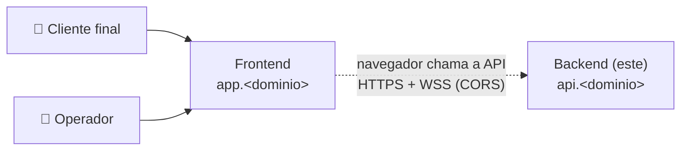

# Bot Varejo — Backend

API REST + WebSocket do Bot Varejo: **Python 3.13 · FastAPI · async · WebSockets · DynamoDB**. Atende os escopos `public` (cliente final) e `admin` (operação), consumidos pelo **frontend** (repositório próprio) em outro domínio.

> 📚 Documentação completa: [`docs/`](./docs/README.md) · Branch/commit/MR: [CONTRIBUTING.md](./CONTRIBUTING.md) · Templates de MR: [`.gitlab/`](./.gitlab/merge_request_templates)
>
> ⚠️ **Status:** fase de documentação. Os comandos abaixo descrevem o funcionamento **alvo** e passam a valer quando a implementação for concluída.

## O sistema

O Bot Varejo tem dois projetos, implantados de forma independente:

| Projeto | Domínio | Papel |
|---------|---------|-------|
| **Backend** (este) | `api.<dominio>` | APIs REST (`/api/v1/public`, `/api/v1/admin`) e WebSocket (`/api/v1/ws/public`, `/api/v1/ws/admin`) |
| Frontend | `app.<dominio>` | App Next.js: web em `/` (escopo `public`) e admin em `/admin` (escopo `admin`) |



- **Um processo por container** (Uvicorn); TLS e domínio ficam na plataforma de deploy.
- A única ligação com o frontend é o **contrato** HTTP/WebSocket: [docs/06-contratos-api.md](./docs/06-contratos-api.md) + `openapi.json`.
- O frontend tem repositório, documentação e deploy próprios.

## Pré-requisitos

| Ferramenta | Versão | Para quê |
|------------|--------|----------|
| Docker + Docker Compose v2 | Compose ≥ 2.24 | Rodar a API |
| Python | 3.13 (ver `.python-version`) | Desenvolver sem Docker |
| uv | última estável | Dependências |
| make | qualquer | Atalhos |

> Para **apenas rodar**, basta Docker.

## Rodando localmente

### Opção 1 — Imagem de runtime (igual à produção)

```bash
cp .env.example .env          # opcional
docker compose up --build     # ou: make up
```

### Opção 2 — Desenvolvimento com reload

```bash
docker compose -f docker-compose.dev.yml up --build     # ou: make dev
# sem Docker:
uv sync && make run
```

### URLs

| URL | O quê |
|-----|-------|
| http://localhost:8000/api/v1/public/health | Health (public) |
| http://localhost:8000/api/v1/admin/health | Health (admin) |
| ws://localhost:8000/api/v1/ws/public · /api/v1/ws/admin | WebSocket |
| http://localhost:8000/api/docs | Swagger |
| http://localhost:8000/api/redoc | ReDoc |
| http://localhost:8000/api/openapi.json | OpenAPI |

### Verificação rápida

```bash
curl -s http://localhost:8000/api/v1/public/health
# {"status":"ok","scope":"public","version":"0.1.0","uptimeSeconds":3.2,"checkedAt":"…","components":[]}

# WebSocket (websocat) — o header Origin precisa estar em APP_CORS_ORIGINS
echo '{"type":"health.ping","id":"1","payload":{}}' \
  | websocat -H "Origin: http://localhost:3000" ws://localhost:8000/api/v1/ws/public
# {"type":"health.pong","id":"1","payload":{"status":"ok","scope":"public",…}}
```

Para ver a integração, suba também o **frontend** (repositório próprio) em `http://localhost:3000`.

## Testes e qualidade

```bash
make setup        # uv sync + hooks do pre-commit + template de commit
make lint         # ruff + lint-imports
make typecheck    # mypy --strict
make test         # pytest + cobertura (≥ 90%) + contrato OpenAPI
make openapi      # atualiza openapi.json após mudar a API
```

## Variáveis de ambiente

| Variável | Padrão | Descrição |
|----------|--------|-----------|
| `APP_ENV` | `local` | Ambiente |
| `APP_VERSION` | `0.1.0` | Versão exibida no health/OpenAPI |
| `APP_LOG_LEVEL` | `INFO` | Nível de log |
| `APP_DOCS_ENABLED` | `true` | Habilita Swagger/OpenAPI |
| `APP_CORS_ORIGINS` | `["http://localhost:3000"]` | Origens do frontend (JSON) — CORS e WebSocket |
| `FORWARDED_ALLOW_IPS` | `127.0.0.1` | Proxies confiáveis (`X-Forwarded-*`) |
| `API_PORT` | `8000` | Porta publicada no host |
| `APP_AWS_REGION` | `sa-east-1` | Região do DynamoDB |
| `APP_DYNAMODB_ENDPOINT_URL` | `http://dynamodb:8000` (local) | DynamoDB Local; vazio na AWS |
| `APP_DYNAMODB_TABLE_PREFIX` | `bot-varejo-local` | Prefixo das tabelas |

## Solução de problemas

| Sintoma | Causa provável | Solução |
|---------|----------------|---------|
| Front mostra erro de CORS no console | Origem do front fora de `APP_CORS_ORIGINS` | Ajustar `.env`: `APP_CORS_ORIGINS='["http://localhost:3000"]'` |
| WebSocket fecha na hora (código 1008) | `Origin` ausente ou não permitido | Enviar `Origin` permitido (navegador envia sozinho) |
| `port is already allocated` | Porta 8000 em uso | `API_PORT=8001 docker compose up` |
| Teste de contrato falhando | `openapi.json` desatualizado | `make openapi` e commitar |
| Mudança em `pyproject.toml` não aparece no dev | Deps instaladas no build | Subir com `--build` |

## Contribuindo

Leia o [CONTRIBUTING.md](./CONTRIBUTING.md). Resumo:

```text
branch:    feat/CPBS-123-descricao-curta                        ← sai da developer
commit:    feat(backend): adiciona health check por escopo      ← escopos: backend | ci deps repo
           (linha em branco)
           Refs: CPBS-123
MR:        → developer · merge commit (sem squash) · template de .gitlab/ · ≥ 1 aprovação · pipeline verde
publicar:  developer → staging → master   (MRs de promoção, template Release)
tag:       backend-vX.Y.Z na master → deploy em production (aprovação manual)
```

- Template de commit: [`.gitmessage`](./.gitmessage) (`git config commit.template .gitmessage`, feito pelo `make setup`).
- Templates de MR: [`.gitlab/merge_request_templates/`](./.gitlab/merge_request_templates) — Default, Bugfix, Docs, Hotfix, Release.
- Branches permanentes e protegidas: `developer` (development), `staging` (homologação), `master` (production) — fluxo e promoção em [CONTRIBUTING §1](./CONTRIBUTING.md#1-branches-e-fluxo-de-publicação).
- Mudanças que envolvem o frontend: ver [CONTRIBUTING §3.5](./CONTRIBUTING.md#35-mudanças-que-envolvem-o-frontend).
