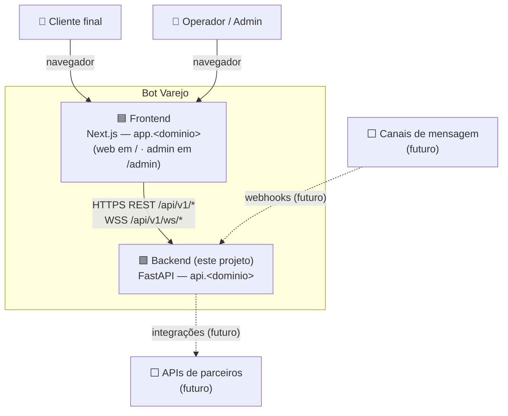
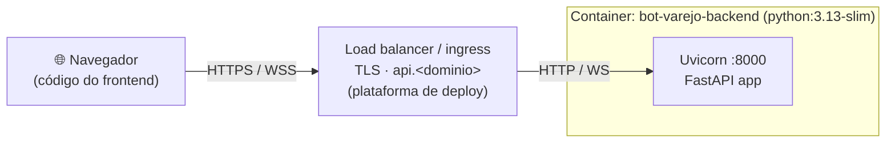
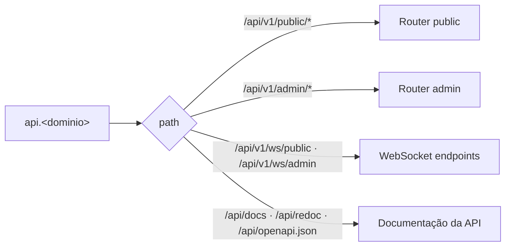
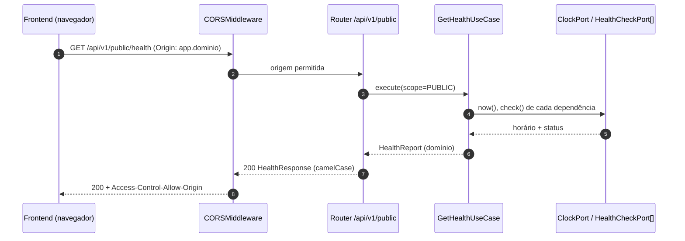
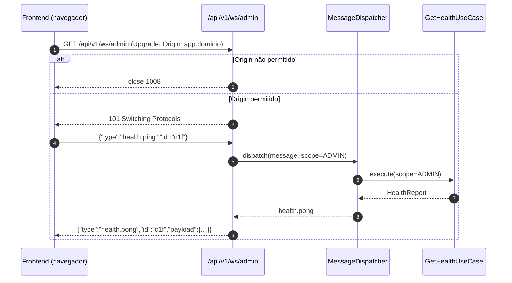
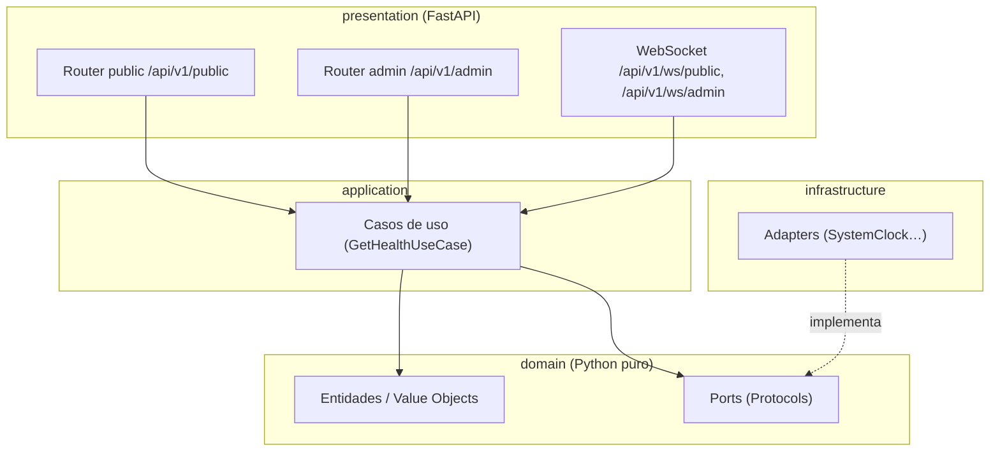
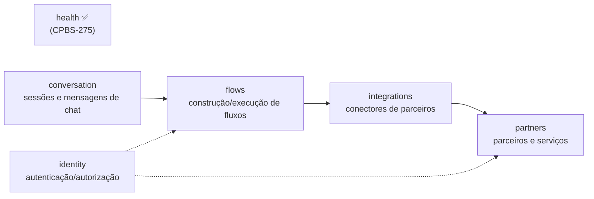

# 01 — Arquitetura (backend)

Diagramas no estilo **C4** (Contexto → Containers → Componentes), em Mermaid.

## 1. Contexto do sistema

> O navegador chama a API **diretamente** (outro domínio): por isso CORS e validação de `Origin` são parte da arquitetura.

## 2. Containers

| Elemento | Responsabilidade |
|----------|------------------|
| Load balancer / ingress | TLS, domínio, balanceamento. Fora do escopo desta task (plataforma) |
| Uvicorn + FastAPI | REST (`/api/v1/*`), WebSocket (`/api/v1/ws/*`), OpenAPI/Swagger, CORS, validação de `Origin` |

**Um processo por container.** Detalhes em [08 — Docker e deploy](./08-docker-deploy.md).

## 3. Rotas expostas

## 4. Fluxos de requisição

### 4.1 Health via HTTP (escopo public)

### 4.2 Health via WebSocket (escopo admin)

## 5. Componentes internos (DDD)

Detalhes em [03 — Arquitetura DDD](./03-arquitetura-ddd.md).

## 6. Evolução prevista (não implementar agora)

Cada um será um pacote em `src/bot_varejo/contexts/<nome>/` com as mesmas quatro camadas. Com mais de uma réplica e WebSocket com estado (chat), será necessário *pub/sub* (ex.: Redis) — decisão futura em ADR.
