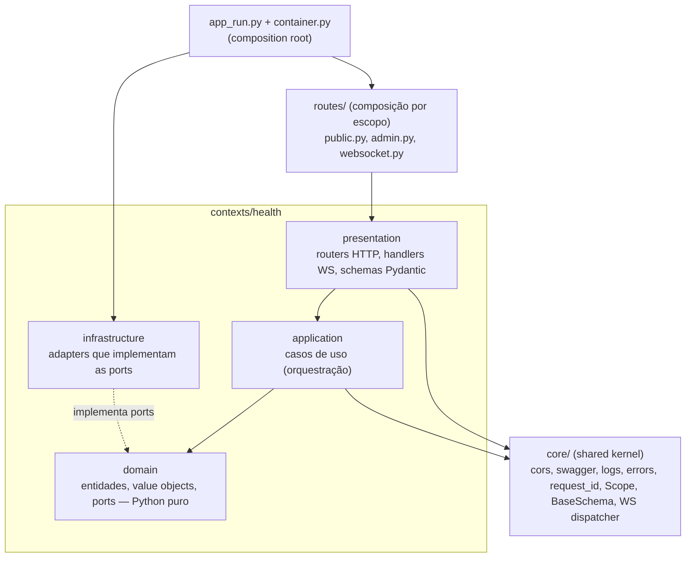

# 03 — Arquitetura DDD

## Organização: DDD com bounded contexts

Cada **bounded context** (`contexts/<nome>/`) é um módulo autocontido com quatro camadas. O primeiro context é `health`. Os próximos (`conversation`, `flows`, `integrations`, `partners`, `identity`) seguem o mesmo molde — ver [01 — Arquitetura, evolução prevista](./01-arquitetura.md#6-evolução-prevista-não-implementar-agora).



### Responsabilidade de cada camada

| Camada | Pode importar | Não pode importar | Conteúdo |
|--------|---------------|-------------------|----------|
| `domain` | stdlib, `core.scope`, `core.exceptions` | FastAPI, Pydantic, Starlette, boto/aioboto3, httpx, tenacity, `application`, `infrastructure`, `presentation` | Entidades, value objects, regras de negócio, *ports* (`typing.Protocol`) |
| `application` | `domain`, `core` | FastAPI, Starlette, boto/aioboto3, httpx, `infrastructure`, `presentation` | Casos de uso: orquestram domínio + ports. Uma classe = um caso de uso |
| `infrastructure` | `domain`, `core`, libs externas | `presentation` | Implementações concretas das ports (relógio, repositórios DynamoDB, HTTP de parceiros…) |
| `presentation` | `application`, `domain`, `core`, FastAPI | `infrastructure` diretamente | Routers, schemas de entrada/saída, handlers WS, conversão domínio ⇄ DTO |
| `routes/` | `presentation` de todos os contexts | — | Agrupa routers por escopo (`public`/`admin`) e define prefixos |
| `app_run.py` / `container.py` | tudo | — | **Composition root**: instancia adapters e injeta nos casos de uso |

Essas fronteiras são verificadas pelo **import-linter** (`lint-imports`, contratos em `pyproject.toml`). Os contratos usam `api.contexts.*`: todo context novo é coberto sem editar o `pyproject.toml`, e precisa ter as quatro camadas. Um context também não importa código de outro context.

```toml
# pyproject.toml (trecho)
[tool.importlinter]
root_packages = ["api"]
include_external_packages = true   # necessário para proibir fastapi/pydantic/boto no domínio

[[tool.importlinter.contracts]]
name = "Camadas de cada context"
type = "layers"
containers = ["api.contexts.*"]            # todo context novo entra sozinho
layers = ["presentation", "application", "domain"]

[[tool.importlinter.contracts]]
name = "Presentation não importa infrastructure diretamente (só via container)"
type = "forbidden"
source_modules = ["api.contexts.*.presentation"]
forbidden_modules = ["api.contexts.*.infrastructure"]
allow_indirect_imports = true

[[tool.importlinter.contracts]]
name = "Domínio não depende de frameworks nem de AWS"
type = "forbidden"
source_modules = ["api.contexts.*.domain"]
forbidden_modules = [
    "fastapi", "pydantic", "starlette", "aioboto3", "boto3", "botocore", "httpx", "tenacity",
]

[[tool.importlinter.contracts]]
name = "Casos de uso não dependem de framework web, AWS nem HTTP (usam as ports)"
type = "forbidden"
source_modules = ["api.contexts.*.application"]
forbidden_modules = ["fastapi", "starlette", "aioboto3", "boto3", "botocore", "httpx"]

[[tool.importlinter.contracts]]
name = "Contexts independentes entre si"
type = "independence"
modules = ["api.contexts.*"]
```

## Anatomia de um context

Todo context tem a mesma estrutura. Exemplo com um context `partners` (cadastro de parceiros):

```text
api/contexts/partners/
├── __init__.py
├── domain/
│   ├── __init__.py
│   ├── entities.py            # Partner (agregado raiz)
│   ├── value_objects.py       # PartnerId, PartnerStatus, Document
│   ├── ports.py               # PartnerRepository, ClockPort (Protocols)
│   └── errors.py              # PartnerInactiveError, DuplicateDocumentError
├── application/
│   ├── __init__.py
│   ├── create_partner.py      # CreatePartnerUseCase + CreatePartnerCommand
│   ├── get_partner.py         # GetPartnerUseCase
│   └── list_active_partners.py
├── infrastructure/
│   ├── __init__.py
│   ├── dynamodb_partner_repository.py   # implementa PartnerRepository
│   └── codecs.py              # Partner ⇄ item do DynamoDB
└── presentation/
    ├── __init__.py
    ├── schemas.py             # CreatePartnerRequest, PartnerResponse
    ├── dependencies.py        # get_create_partner_use_case(...) para Depends()
    ├── http.py                # build_partners_router(scope) → APIRouter
    └── ws_handlers.py         # PartnersListHandler ("partners.list")
```

### O que é cada arquivo

| Arquivo | Camada | O que contém | Regras | Teste |
|---------|--------|--------------|--------|-------|
| `domain/entities.py` | domain | Entidades e agregado raiz: dados + regras de negócio (validações, transições de estado) | `@dataclass(frozen=True, slots=True, kw_only=True)`; mudança de estado devolve nova instância; `version` quando houver locking otimista; Python puro | `tests/unit/contexts/<ctx>/domain/test_entities.py` |
| `domain/value_objects.py` | domain | Tipos pequenos e imutáveis do negócio: ids, status, documento, dinheiro | `StrEnum`, dataclass frozen ou `NewType`; validam o próprio valor | `tests/unit/contexts/<ctx>/domain/test_value_objects.py` |
| `domain/ports.py` | domain | Interfaces do que o context precisa do mundo externo: `<Entidade>Repository` (persistência), `<Nome>Port` (relógio, APIs de parceiros) | `typing.Protocol`; métodos de I/O `async`; pequenas e específicas | Implementadas por *fakes* em `tests/fakes.py` |
| `domain/errors.py` | domain | Exceções de negócio do context | Herdam de `DomainError`, `NotFoundError` ou `ConflictError` (`api.core.exceptions`); `code` snake_case estável ([07](./07-erros-logging.md#exceções-de-negócio)) | Cobertas pelos testes que as disparam |
| `application/<verbo>_<substantivo>.py` | application | **Um caso de uso por arquivo**: classe `<Verbo><Substantivo>UseCase` com `async def execute(...)` e, se houver vários campos de entrada, o `…Command`/`…Query` (dataclass frozen) | Dependências pelo construtor, tipadas pelas ports; orquestra, não contém regra de negócio; devolve objetos do domínio | `tests/unit/contexts/<ctx>/application/test_<arquivo>.py` com *fakes* |
| `infrastructure/<tecnologia>_<conceito>.py` | infrastructure | Adapters que implementam as ports: repositório DynamoDB, cliente HTTP de parceiro, relógio | Uma port por arquivo; só este código conhece boto/httpx; erros externos viram exceções do domínio | `tests/integration/contexts/<ctx>/` (DynamoDB Local / `httpx.MockTransport`) |
| `infrastructure/codecs.py` | infrastructure | Conversão entre entidade e formato externo (item do DynamoDB, JSON do parceiro) | Funções `…_to_item` / `…_from_item`; o domínio nunca vê `dict` cru | Junto dos testes do adapter |
| `presentation/schemas.py` | presentation | Formato da API: `…Request` (entrada) e `…Response` (saída) | Herdam de `BaseSchema` (camelCase automático); `Response.from_domain(...)` converte a entidade | Pelos testes de rota |
| `presentation/dependencies.py` | presentation | Funções que entregam os casos de uso para o `Depends()` do FastAPI, lendo do `Container` | Nunca instanciam adapters (isso é do `container.py`); substituídas nos testes com `dependency_overrides` | Pelos testes de rota |
| `presentation/http.py` | presentation | `build_<ctx>_router(scope)`: rotas REST do context | Só traduz HTTP ⇄ caso de uso; `summary`, `operation_id` camelCase, `responses=`; sem prefixo `/api/v1/...` (vem de `routes/`) | `tests/integration/api/test_<ctx>.py` |
| `presentation/ws_handlers.py` | presentation | Handlers das mensagens WebSocket (`<ctx>.<acao>`) | Chamam o mesmo caso de uso do HTTP; registrados no `container.py` | `tests/integration/websocket/test_<ctx>_ws.py` |

Arquivos só entram quando o context precisa deles (um context sem persistência não tem repositório; sem WebSocket, não tem `ws_handlers.py`), mas as **quatro pastas** sempre existem — o contrato de camadas do import-linter exige.

### Fora do context

| Arquivo | Papel para o context |
|---------|----------------------|
| `api/container.py` | Instancia os adapters, monta os casos de uso e registra os handlers WS |
| `api/routes/public.py` / `admin.py` | Incluem o router do context no escopo (`/api/v1/public`, `/api/v1/admin`) |
| `api/core/` | Peças compartilhadas que o context usa: `scope`, `exceptions`, `schemas` (`BaseSchema`), `websocket`, `dynamodb` |
| `tests/fakes.py` | *Fakes* das ports do context para os testes unitários |

Implementação de referência completa: o context `health` ([04](./04-context-health.md)). Passo a passo para criar um context: [checklist](./README.md#checklist-para-criar-um-novo-context).

## Aplicação de SOLID, DRY, KISS

| Princípio | Onde aparece |
|-----------|--------------|
| **S** — Single Responsibility | `GetHealthUseCase` só calcula o relatório; `HealthResponse` só serializa; router só traduz HTTP ⇄ caso de uso |
| **O** — Open/Closed | Novas dependências no health = novo `HealthCheckPort` registrado no container, sem alterar o caso de uso. Novas mensagens WS = novo handler registrado no `MessageDispatcher` |
| **L** — Liskov | Qualquer implementação de `ClockPort` (sistema ou fake de teste) é intercambiável |
| **I** — Interface Segregation | Ports pequenas e específicas (`ClockPort.now()`), nada de "god interfaces" |
| **D** — Dependency Inversion | Caso de uso depende de `Protocol`, não de classes concretas; concreto injetado no composition root |
| **DRY** | `build_health_router(scope)` gera o mesmo router para `public` e `admin`; `BaseSchema` centraliza a config camelCase |
| **KISS** | Sem framework de DI, sem ORM, sem event bus enquanto não forem necessários — um `Container` dataclass resolve |
