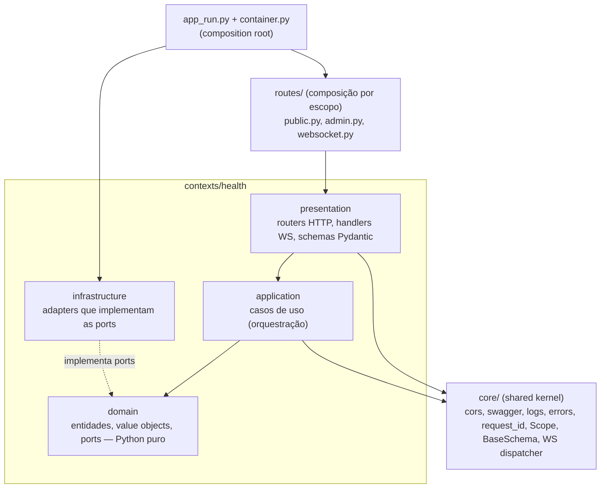

# 03 — Arquitetura DDD

## Organização: DDD com bounded contexts

Cada **bounded context** (`contexts/<nome>/`) é um módulo autocontido com quatro camadas. O primeiro context é `health`. Os próximos (`conversation`, `flows`, `integrations`, `partners`, `identity`) seguem o mesmo molde — ver [01 — Arquitetura, evolução prevista](./01-arquitetura.md#6-evolução-prevista-não-implementar-agora).



### Responsabilidade de cada camada

| Camada | Pode importar | Não pode importar | Conteúdo |
|--------|---------------|-------------------|----------|
| `domain` | stdlib, `core.scope`, `core.exceptions` | FastAPI, Pydantic, Starlette, boto/aioboto3, httpx, tenacity, `application`, `infrastructure`, `presentation` | Entidades, value objects, regras de negócio, *ports* (`typing.Protocol`) |
| `application` | `domain`, `core` | FastAPI, Starlette, boto/aioboto3, httpx, `infrastructure`, `presentation` | Casos de uso: orquestram domínio + ports. Uma classe = um caso de uso |
| `infrastructure` | `domain`, `core`, libs externas | `presentation` | Implementações concretas das ports (relógio, repositórios DynamoDB, HTTP de parceiros…) |
| `presentation` | `application`, `domain`, `core`, FastAPI | `infrastructure` diretamente | Routers, schemas de entrada/saída, handlers WS, conversão domínio ⇄ DTO |
| `routes/` | `presentation` de todos os contexts | — | Agrupa routers por escopo (`public`/`admin`) e define prefixos |
| `app_run.py` / `container.py` | tudo | — | **Composition root**: instancia adapters e injeta nos casos de uso |

Essas fronteiras são verificadas pelo **import-linter** (`lint-imports`, contratos em `pyproject.toml`). Os contratos usam `api.contexts.*`: todo context novo é coberto sem editar o `pyproject.toml`, e precisa ter as quatro camadas. Um context também não importa código de outro context.

```toml
# pyproject.toml (trecho)
[tool.importlinter]
root_packages = ["api"]
include_external_packages = true   # necessário para proibir fastapi/pydantic/boto no domínio

[[tool.importlinter.contracts]]
name = "Camadas de cada context"
type = "layers"
containers = ["api.contexts.*"]            # todo context novo entra sozinho
layers = ["presentation", "application", "domain"]

[[tool.importlinter.contracts]]
name = "Presentation não importa infrastructure diretamente (só via container)"
type = "forbidden"
source_modules = ["api.contexts.*.presentation"]
forbidden_modules = ["api.contexts.*.infrastructure"]
allow_indirect_imports = true

[[tool.importlinter.contracts]]
name = "Domínio não depende de frameworks nem de AWS"
type = "forbidden"
source_modules = ["api.contexts.*.domain"]
forbidden_modules = [
    "fastapi", "pydantic", "starlette", "aioboto3", "boto3", "botocore", "httpx", "tenacity",
]

[[tool.importlinter.contracts]]
name = "Casos de uso não dependem de framework web, AWS nem HTTP (usam as ports)"
type = "forbidden"
source_modules = ["api.contexts.*.application"]
forbidden_modules = ["fastapi", "starlette", "aioboto3", "boto3", "botocore", "httpx"]

[[tool.importlinter.contracts]]
name = "Contexts independentes entre si"
type = "independence"
modules = ["api.contexts.*"]
```

## Aplicação de SOLID, DRY, KISS

| Princípio | Onde aparece |
|-----------|--------------|
| **S** — Single Responsibility | `GetHealthUseCase` só calcula o relatório; `HealthResponse` só serializa; router só traduz HTTP ⇄ caso de uso |
| **O** — Open/Closed | Novas dependências no health = novo `HealthCheckPort` registrado no container, sem alterar o caso de uso. Novas mensagens WS = novo handler registrado no `MessageDispatcher` |
| **L** — Liskov | Qualquer implementação de `ClockPort` (sistema ou fake de teste) é intercambiável |
| **I** — Interface Segregation | Ports pequenas e específicas (`ClockPort.now()`), nada de "god interfaces" |
| **D** — Dependency Inversion | Caso de uso depende de `Protocol`, não de classes concretas; concreto injetado no composition root |
| **DRY** | `build_health_router(scope)` gera o mesmo router para `public` e `admin`; `BaseSchema` centraliza a config camelCase |
| **KISS** | Sem framework de DI, sem ORM, sem event bus enquanto não forem necessários — um `Container` dataclass resolve |
