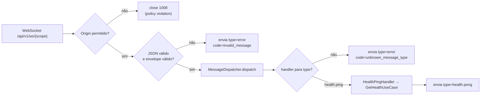

# 05 — WebSocket

## Desenho

- Um endpoint por escopo: `/api/v1/ws/public` e `/api/v1/ws/admin`, no domínio da API (`wss://api.<dominio>/api/v1/ws/<scope>`).
- O handshake só é aceito se o header `Origin` estiver em `APP_CORS_ORIGINS` (senão fecha com código `1008`).
- Mensagens em JSON com **envelope único** (`type`, `id`, `payload`) — ver [Contratos de API — WebSocket](./06-contratos-api.md#protocolo-websocket).
- Um `MessageDispatcher` roteia por `type` para *handlers* registrados no container (**Open/Closed**: nova mensagem = novo handler, sem tocar no loop).
- Handlers chamam **os mesmos casos de uso** do HTTP — nada de lógica duplicada.



## `core/websocket/messages.py`

```python
from typing import Any

from pydantic import Field

from api.core.schemas import BaseSchema


class WsMessage(BaseSchema):
    type: str
    id: str | None = None
    # Any só na fronteira: cada handler valida o próprio payload.
    payload: dict[str, Any] = Field(default_factory=dict)


def ws_error(code: str, message: str, *, request_id: str | None = None) -> WsMessage:
    return WsMessage(type="error", id=request_id, payload={"code": code, "message": message})
```

## `core/websocket/dispatcher.py`

```python
from collections.abc import Awaitable, Callable

from api.core.scope import Scope
from api.core.websocket.messages import WsMessage, ws_error

WsHandler = Callable[[WsMessage, Scope], Awaitable[WsMessage]]


class MessageDispatcher:
    def __init__(self) -> None:
        self._handlers: dict[str, WsHandler] = {}

    def register(self, message_type: str, handler: WsHandler) -> None:
        if message_type in self._handlers:
            raise ValueError(f"Handler já registrado para '{message_type}'")
        self._handlers[message_type] = handler

    async def dispatch(self, message: WsMessage, scope: Scope) -> WsMessage:
        handler = self._handlers.get(message.type)
        if handler is None:
            return ws_error(
                "unknown_message_type",
                f"Tipo de mensagem não suportado: {message.type}",
                request_id=message.id,
            )
        return await handler(message, scope)
```

## `contexts/health/presentation/ws_handlers.py`

```python
from api.contexts.health.application.get_health import GetHealthUseCase
from api.contexts.health.presentation.schemas import HealthResponse
from api.core.scope import Scope
from api.core.websocket.messages import WsMessage


class HealthPingHandler:
    def __init__(self, use_case: GetHealthUseCase) -> None:
        self._use_case = use_case

    async def __call__(self, message: WsMessage, scope: Scope) -> WsMessage:
        report = await self._use_case.execute(scope)
        return WsMessage(
            type="health.pong",
            id=message.id,
            payload=HealthResponse.from_domain(report).model_dump(mode="json", by_alias=True),
        )
```

## `routes/websocket.py`

```python
import logging
from typing import Annotated

from fastapi import APIRouter, Depends, WebSocket, WebSocketDisconnect, status
from pydantic import ValidationError

from api.container import Container, get_container
from api.core.scope import Scope
from api.core.websocket.messages import WsMessage, ws_error

logger = logging.getLogger(__name__)
ws_router = APIRouter()


async def serve_socket(websocket: WebSocket, scope: Scope, container: Container) -> None:
    # CORS não se aplica a WebSocket: o navegador conecta de qualquer origem.
    # Validamos o Origin no handshake para impedir Cross-Site WebSocket Hijacking.
    if websocket.headers.get("origin") not in container.settings.cors_origins:
        await websocket.close(code=status.WS_1008_POLICY_VIOLATION)
        logger.warning("ws.rejected_origin", extra={"scope": scope.value})
        return

    await websocket.accept()
    try:
        while True:
            raw = await websocket.receive_text()
            try:
                message = WsMessage.model_validate_json(raw)
            except ValidationError:
                reply = ws_error("invalid_message", "Envelope inválido")
            else:
                reply = await container.ws_dispatcher.dispatch(message, scope)
            await websocket.send_text(reply.model_dump_json(by_alias=True))
    except WebSocketDisconnect:
        logger.info("ws.disconnected", extra={"scope": scope.value})


@ws_router.websocket("/api/v1/ws/public")
async def public_socket(
    websocket: WebSocket, container: Annotated[Container, Depends(get_container)]
) -> None:
    await serve_socket(websocket, Scope.PUBLIC, container)


@ws_router.websocket("/api/v1/ws/admin")
async def admin_socket(
    websocket: WebSocket, container: Annotated[Container, Depends(get_container)]
) -> None:
    await serve_socket(websocket, Scope.ADMIN, container)
```

> WebSocket **não aparece no OpenAPI** (limitação da especificação). O protocolo é documentado em [Contratos de API — WebSocket](./06-contratos-api.md#protocolo-websocket) e os tipos TS ficam no frontend, em `src/shared/ws` (`docs/07-integracao-api.md` no repositório do **frontend**).
