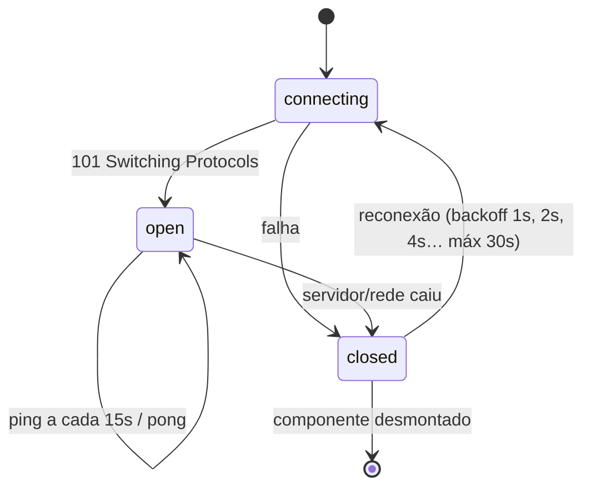
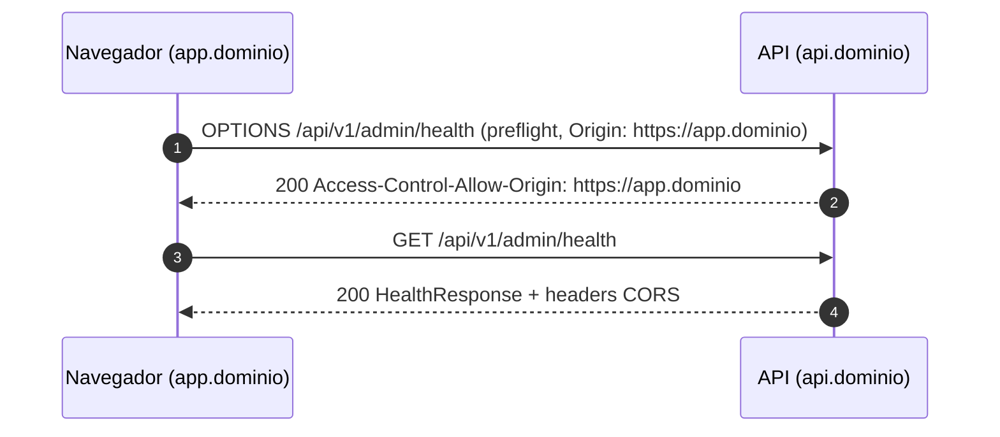

# 06 — Contratos de API (REST, WebSocket, OpenAPI)

Este documento é o **contrato entre o backend e o frontend**. Os dois vivem em projetos separados e domínios diferentes, então tudo o que o front consome precisa estar aqui e no OpenAPI.

## URLs e domínios

| Ambiente | Base REST | Base WebSocket |
|----------|-----------|----------------|
| Local | `http://localhost:8000` | `ws://localhost:8000` |
| Dev / staging / produção | `https://api.<dominio>` (a definir) | `wss://api.<dominio>` |

O frontend recebe essas bases por variável de ambiente em runtime (`API_URL`, `WS_URL` — ver `docs/07-integracao-api.md` no repositório do **frontend**). TLS e domínio são responsabilidade da plataforma de deploy (load balancer/ingress), não da aplicação.

## Convenções gerais

| Item | Convenção |
|------|-----------|
| Prefixo | Todas as rotas da aplicação sob `/api`, seguido da versão: REST `/api/v{major}/{scope}/...` (ex.: `/api/v1/public/health`), WebSocket `/api/v{major}/ws/{scope}` (ex.: `/api/v1/ws/admin`), documentação `/api/docs` |
| Escopos | `public` (cliente final) e `admin` (operação) |
| Versionamento | Major no path. Mudança incompatível = `v2` convivendo com `v1` até migração |
| Formato | JSON UTF-8 |
| Nomes de campos | **camelCase** no JSON (ADR-0005); snake_case no Python é convertido por `BaseSchema` |
| Datas | ISO 8601 em UTC — `2026-09-29T14:30:00Z` |
| Enums | strings minúsculas — `"ok"`, `"degraded"`, `"down"` |
| Recursos (futuro) | substantivos no plural, kebab-case — `/api/v1/admin/partner-services` |
| IDs de operação (OpenAPI) | camelCase — `getPublicHealth`, `getAdminHealth` (viram nomes no client) |
| Correlação | Header `X-Request-ID` aceito e devolvido |

## REST

### Endpoints

| Método | Path | Escopo | operationId | Respostas |
|--------|------|--------|-------------|-----------|
| `GET` | `/api/v1/public/health` | public | `getPublicHealth` | `200` HealthResponse · `503` HealthResponse |
| `GET` | `/api/v1/admin/health` | admin | `getAdminHealth` | `200` HealthResponse · `503` HealthResponse |
| `GET` | `/api/docs` | — | — | Swagger UI |
| `GET` | `/api/redoc` | — | — | ReDoc |
| `GET` | `/api/openapi.json` | — | — | Especificação OpenAPI 3.1 |

Regras do status HTTP do health:

| `status` do relatório | HTTP | Motivo |
|-----------------------|------|--------|
| `ok` | 200 | Tudo saudável |
| `degraded` | 200 | Funciona com alguma dependência não crítica ruim — não deve derrubar o container |
| `down` | 503 | Load balancer / Docker healthcheck devem tirar a instância de rotação |

### Schema `HealthResponse`

```json
{
  "status": "ok",
  "scope": "public",
  "version": "0.1.0",
  "uptimeSeconds": 1234.56,
  "checkedAt": "2026-09-29T14:30:00Z",
  "components": []
}
```

| Campo | Tipo | Obrigatório | Descrição |
|-------|------|-------------|-----------|
| `status` | `"ok" \| "degraded" \| "down"` | sim | Pior status entre os componentes; `ok` se não houver componentes |
| `scope` | `"public" \| "admin"` | sim | Escopo que respondeu — prova que o roteamento chegou ao lugar certo |
| `version` | `string` | sim | Versão da aplicação (`APP_VERSION`) |
| `uptimeSeconds` | `number` | sim | Segundos desde o start do processo |
| `checkedAt` | `string` (date-time) | sim | Momento da verificação (UTC) |
| `components` | `ComponentHealth[]` | sim | Dependências verificadas (ex.: `database` — DynamoDB). Vazio enquanto não houver dependências externas |

`ComponentHealth`:

| Campo | Tipo | Obrigatório | Descrição |
|-------|------|-------------|-----------|
| `name` | `string` | sim | Ex.: `database`, `partner:acme` |
| `status` | `"ok" \| "degraded" \| "down"` | sim | Status do componente |
| `detail` | `string \| null` | não | Mensagem curta, sem dados sensíveis |

### Formato padrão de erro

Todo erro (4xx/5xx), exceto o 503 do health, segue:

```json
{
  "error": {
    "code": "validation_error",
    "message": "Dados de entrada inválidos",
    "details": [{ "field": "name", "message": "Campo obrigatório" }],
    "requestId": "7f1c…"
  }
}
```

| Campo | Descrição |
|-------|-----------|
| `code` | Identificador estável, snake_case, para o front tomar decisão (`not_found`, `validation_error`, `internal_error`…) |
| `message` | Mensagem legível (pt-BR) |
| `details` | Opcional — lista de detalhes (ex.: erros por campo) |
| `requestId` | Mesmo valor do header `X-Request-ID` |

## Protocolo WebSocket

### Endpoints

| Path | Escopo |
|------|--------|
| `/api/v1/ws/public` | public |
| `/api/v1/ws/admin` | admin |

URL no navegador: `${WS_URL}/api/v1/ws/<scope>` — ex.: `wss://api.<dominio>/api/v1/ws/public` (montada pelo front com `buildWsUrl`). O handshake exige `Origin` permitido.

### Envelope

Toda mensagem, nos dois sentidos, é um objeto JSON:

```json
{ "type": "dominio.acao", "id": "uuid-opcional", "payload": {} }
```

| Campo | Tipo | Descrição |
|-------|------|-----------|
| `type` | `string` | `<contexto>.<ação>` em minúsculas com ponto. Ex.: `health.ping` |
| `id` | `string \| null` | Correlação: a resposta repete o `id` da requisição |
| `payload` | `object` | Dados da mensagem (camelCase) |

### Mensagens

| Direção | `type` | `payload` | Resposta |
|---------|--------|-----------|----------|
| cliente → servidor | `health.ping` | `{}` | `health.pong` |
| servidor → cliente | `health.pong` | `HealthResponse` | — |
| servidor → cliente | `error` | `{ "code": string, "message": string }` | — |

Códigos de erro WS:

| `code` | Quando |
|--------|--------|
| `invalid_message` | Texto não é JSON ou não respeita o envelope |
| `unknown_message_type` | Não há handler registrado para `type` |
| `invalid_payload` | O `payload` não respeita o schema da mensagem (validado pelo handler) |

### Exemplo de sessão

```text
→ {"type":"health.ping","id":"a1","payload":{}}
← {"type":"health.pong","id":"a1","payload":{"status":"ok","scope":"admin","version":"0.1.0","uptimeSeconds":42.1,"checkedAt":"2026-09-29T14:30:00Z","components":[]}}
→ {"type":"chat.send","id":"a2","payload":{}}
← {"type":"error","id":"a2","payload":{"code":"unknown_message_type","message":"Tipo de mensagem não suportado: chat.send"}}
→ não é json
← {"type":"error","id":null,"payload":{"code":"invalid_message","message":"Envelope inválido"}}
```

### Ciclo de vida da conexão



## CORS

Frontend (`https://app.<dominio>`) e API (`https://api.<dominio>`) são **origens diferentes**: o navegador só permite as chamadas se a API responder com os headers de CORS.

| Item | Valor |
|------|-------|
| Origens permitidas | Lista em `APP_CORS_ORIGINS` (JSON). Nunca `*` |
| Credenciais | `allow_credentials=True` (preparado para cookies de sessão no futuro) |
| Métodos | `GET, POST, PUT, PATCH, DELETE, OPTIONS` |
| Headers expostos | `X-Request-ID` |
| WebSocket | CORS não se aplica; o backend valida o header `Origin` contra a mesma lista |



> Quando houver autenticação por cookie: `app.<dominio>` e `api.<dominio>` compartilham o mesmo domínio registrável (*same-site*), então cookies `SameSite=Lax; Secure; Domain=.<dominio>` funcionam. Decisão fica para o ADR de autenticação.

## Evolução do contrato

Como front e back são implantados separadamente, **nenhuma mudança pode quebrar o front em produção**:

1. Mudança **compatível** (campo novo, endpoint novo): backend primeiro; o front passa a usar depois.
2. Mudança **incompatível**: nova versão (`/api/v2/...`) convivendo com a antiga até o front migrar; só então a antiga é removida.
3. Todo MR do backend que muda o contrato atualiza `openapi.json` e esta página, e cita o MR/ticket correspondente do frontend.

## OpenAPI e Swagger

- Gerado automaticamente pelo FastAPI a partir dos schemas Pydantic e das anotações de tipo.
- Disponível em `/api/docs` (Swagger UI), `/api/redoc` e `/api/openapi.json`.
- Tags: `public`, `admin` (escopo) e `health` (context) — o Swagger agrupa por elas.
- Controlado por `APP_DOCS_ENABLED` (padrão `true`; em produção pode ser desligado ou protegido quando existir auth).
- Uma cópia é versionada em `openapi.json` na raiz do repositório (`make openapi`) e **o CI falha se ela divergir do código** (teste de contrato em `tests/contract/`) — assim toda mudança de contrato aparece no diff do MR.
- O frontend gera seus tipos a partir do `/api/openapi.json` publicado pela API (local ou ambiente de dev) — ver `docs/07-integracao-api.md` no repositório do **frontend**.
- Cada rota deve declarar `summary`, `operation_id` e as respostas não-2xx relevantes (`responses=`).
