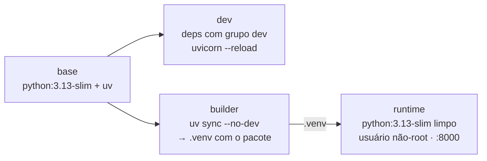
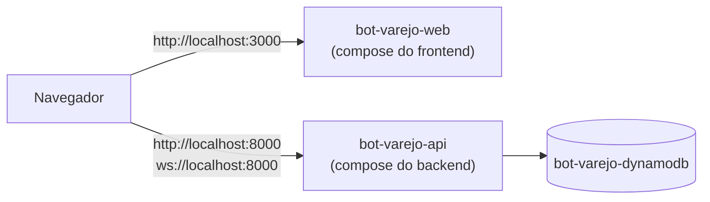
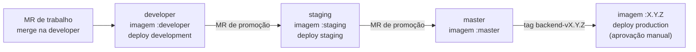

# 08 — Docker e deploy (backend)

Imagem própria do backend, baseada em **`python:3.13-slim`**, rodando **Uvicorn diretamente** — um processo por container ([ADR-0001](./adr/0001-imagem-python-uvicorn.md)). TLS e domínio (`api.<dominio>`) ficam na plataforma de deploy (load balancer/ingress).

## 1. Dockerfile multi-stage



### `Dockerfile`

```dockerfile
# syntax=docker/dockerfile:1
ARG PYTHON_VERSION=3.13
ARG UV_VERSION=0.12.21

# ---------- uv (binário fixado) --------------------------------------------------
FROM ghcr.io/astral-sh/uv:${UV_VERSION} AS uv

# ---------- base ---------------------------------------------------------------
FROM python:${PYTHON_VERSION}-slim AS base
COPY --from=uv /uv /uvx /bin/
ENV UV_COMPILE_BYTECODE=1 \
    UV_LINK_MODE=copy \
    UV_PYTHON_DOWNLOADS=never
WORKDIR /app

# ---------- dev (docker-compose.dev.yml) ---------------------------------------
FROM base AS dev
COPY pyproject.toml uv.lock ./
RUN --mount=type=cache,target=/root/.cache/uv uv sync --frozen --no-install-project
ENV PATH=/app/.venv/bin:$PATH \
    PYTHONPATH=/app/src \
    PYTHONUNBUFFERED=1 \
    PYTHONDONTWRITEBYTECODE=1
EXPOSE 8000
CMD ["uvicorn", "bot_varejo.main:create_app", "--factory", "--reload", "--reload-dir", "/app/src", "--host", "0.0.0.0", "--port", "8000"]

# ---------- builder ------------------------------------------------------------
FROM base AS builder
COPY pyproject.toml uv.lock ./
RUN --mount=type=cache,target=/root/.cache/uv uv sync --frozen --no-dev --no-install-project
COPY src ./src
RUN --mount=type=cache,target=/root/.cache/uv uv sync --frozen --no-dev --no-editable

# ---------- runtime (imagem final) ---------------------------------------------
FROM python:${PYTHON_VERSION}-slim AS runtime
ARG APP_VERSION=0.0.0-local
ENV APP_VERSION=${APP_VERSION} \
    PATH=/app/.venv/bin:$PATH \
    PYTHONUNBUFFERED=1 \
    FORWARDED_ALLOW_IPS=127.0.0.1

RUN useradd --system --uid 10001 --no-create-home app
WORKDIR /app
COPY --from=builder --chown=app:app /app/.venv /app/.venv

USER app
EXPOSE 8000
HEALTHCHECK --interval=30s --timeout=3s --start-period=10s --retries=3 \
  CMD ["python", "-c", "import urllib.request; urllib.request.urlopen('http://127.0.0.1:8000/api/v1/public/health', timeout=2)"]
CMD ["uvicorn", "bot_varejo.main:create_app", "--factory", "--host", "0.0.0.0", "--port", "8000", "--proxy-headers"]
```

Pontos importantes:

- **Sem `curl`** na imagem: o HEALTHCHECK usa o próprio Python. `urlopen` falha em 503, então health `down` marca o container como *unhealthy*.
- **Não-root** (`app`, uid 10001).
- `--proxy-headers` + `FORWARDED_ALLOW_IPS`: o Uvicorn só confia em `X-Forwarded-*` vindos desses IPs. Em produção, configure com o IP/rede do load balancer (ou `*` se o container só for acessível pela rede privada).
- **1 processo Uvicorn** por container; escalar = mais réplicas. WebSocket com estado entre réplicas exigirá *pub/sub* (futuro).
- `.dockerignore`: `.venv`, caches, relatórios de teste, `docs/`, `tests/`, `.env*` (exceto `.env.example`) e os próprios arquivos Docker.
- Versões fixadas: `uv` (argumento `UV_VERSION`) e `amazon/dynamodb-local` no compose.

## 2. Docker Compose

| Arquivo | Propósito | Comando |
|---------|-----------|---------|
| `docker-compose.yml` | Sobe a **imagem de runtime** (igual à produção) + DynamoDB Local | `docker compose up --build` |
| `docker-compose.dev.yml` | Desenvolvimento com `--reload` e código montado + DynamoDB Local | `docker compose -f docker-compose.dev.yml up --build` |

| Serviço (container) | Imagem | O que é |
|---------------------|--------|---------|
| `bot-varejo-api` (`bot-varejo-api` / `bot-varejo-api-dev`) | `bot-varejo-api:local` / `:dev` | API FastAPI |
| `bot-varejo-dynamodb` (`bot-varejo-dynamodb` / `bot-varejo-dynamodb-dev`) | `amazon/dynamodb-local:3.3.1` | Banco local ([12](./12-persistencia-dynamodb.md)) |

Na rede do compose a API acessa o banco em `http://bot-varejo-dynamodb:8000`; do host, o banco fica em `http://localhost:8001`. Os dados locais ficam no volume `bot-varejo-dynamodb-data` (`…-dev-data` no compose de desenvolvimento) — `docker compose down -v` apaga.

### `docker-compose.yml`

```yaml
# Sobe a API com a imagem de runtime (igual à produção) + DynamoDB Local.
# Uso: docker compose up --build
name: bot-varejo-backend

services:
  bot-varejo-api:
    container_name: bot-varejo-api
    build:
      context: .
      target: runtime
      args:
        APP_VERSION: ${APP_VERSION:-0.0.0-local}
    image: bot-varejo-api:local
    ports:
      - "${API_PORT:-8000}:8000"
    environment:
      APP_ENV: ${APP_ENV:-local}
      APP_CORS_ORIGINS: '${APP_CORS_ORIGINS:-["http://localhost:3000"]}'
      APP_AWS_REGION: ${APP_AWS_REGION:-sa-east-1}
      APP_DYNAMODB_ENDPOINT_URL: http://bot-varejo-dynamodb:8000
      APP_DYNAMODB_TABLE_PREFIX: ${APP_DYNAMODB_TABLE_PREFIX:-bot-varejo-local}
      AWS_ACCESS_KEY_ID: local          # DynamoDB Local aceita qualquer credencial
      AWS_SECRET_ACCESS_KEY: local
    env_file:
      - path: .env
        required: false
    depends_on:
      - bot-varejo-dynamodb
    restart: unless-stopped

  bot-varejo-dynamodb:
    container_name: bot-varejo-dynamodb
    image: amazon/dynamodb-local:3.3.1
    command: ["-jar", "DynamoDBLocal.jar", "-sharedDb", "-dbPath", "/home/dynamodblocal/data"]
    working_dir: /home/dynamodblocal
    user: root                          # só local: permite gravar no volume nomeado
    ports:
      - "${DYNAMODB_PORT:-8001}:8000"   # 8001 no host; 8000 é a API
    volumes:
      - bot-varejo-dynamodb-data:/home/dynamodblocal/data
    restart: unless-stopped

volumes:
  bot-varejo-dynamodb-data:
    name: bot-varejo-dynamodb-data   # nome fixo, sem prefixo do projeto compose
```

### `docker-compose.dev.yml`

```yaml
# Desenvolvimento local: API com --reload (src/ montado) + DynamoDB Local.
# Alterações em src/ recarregam sozinhas. Só pyproject.toml/uv.lock/Dockerfile pedem --build.
# Uso: docker compose -f docker-compose.dev.yml up --build
name: bot-varejo-backend-dev

services:
  bot-varejo-api:
    container_name: bot-varejo-api-dev
    build:
      context: .
      target: dev
    image: bot-varejo-api:dev
    ports:
      - "${API_PORT:-8000}:8000"
    volumes:
      - ./src:/app/src
    environment:
      APP_ENV: local
      APP_LOG_LEVEL: ${APP_LOG_LEVEL:-DEBUG}
      APP_CORS_ORIGINS: '${APP_CORS_ORIGINS:-["http://localhost:3000"]}'
      APP_AWS_REGION: ${APP_AWS_REGION:-sa-east-1}
      APP_DYNAMODB_ENDPOINT_URL: http://bot-varejo-dynamodb:8000
      APP_DYNAMODB_TABLE_PREFIX: ${APP_DYNAMODB_TABLE_PREFIX:-bot-varejo-local}
      AWS_ACCESS_KEY_ID: local
      AWS_SECRET_ACCESS_KEY: local
    env_file:
      - path: .env
        required: false
    depends_on:
      - bot-varejo-dynamodb

  bot-varejo-dynamodb:
    container_name: bot-varejo-dynamodb-dev
    image: amazon/dynamodb-local:3.3.1
    command: ["-jar", "DynamoDBLocal.jar", "-sharedDb", "-dbPath", "/home/dynamodblocal/data"]
    working_dir: /home/dynamodblocal
    user: root                          # só local: permite gravar no volume nomeado
    ports:
      - "${DYNAMODB_PORT:-8001}:8000"   # 8001 no host; 8000 é a API
    volumes:
      - bot-varejo-dynamodb-dev-data:/home/dynamodblocal/data

volumes:
  bot-varejo-dynamodb-dev-data:
    name: bot-varejo-dynamodb-dev-data   # nome fixo, sem prefixo do projeto compose
```

> **Reload sem subir de novo:** `src/` é montado no container e o Uvicorn (`--reload`, WatchFiles) reinicia sozinho a cada alteração — em ~2 s. `PYTHONDONTWRITEBYTECODE=1` evita `__pycache__` com dono root no projeto. Só mudanças em `pyproject.toml`, `uv.lock` ou `Dockerfile` pedem `docker compose -f docker-compose.dev.yml up --build`.


### Rodando junto com o frontend

Os dois projetos sobem de forma independente e conversam por `localhost`:



1. Aqui: `docker compose up --build` → `bot-varejo-api` em `:8000` + `bot-varejo-dynamodb` em `:8001` (CORS já libera `http://localhost:3000`).
2. No repositório do frontend: `docker compose up --build` → `bot-varejo-web` em `:3000`.


## 3. Portas

| Porta | Onde | Exposta no host? |
|-------|------|------------------|
| 8000 | Uvicorn (runtime e dev) | ✅ (`API_PORT`) |
| 8001 | DynamoDB Local (compose; porta 8000 dentro da rede do compose) | ✅ (`DYNAMODB_PORT`) |

## 4. Variáveis de ambiente

Documentadas também em `.env.example`.

| Variável | Padrão | Descrição |
|----------|--------|-----------|
| `APP_ENV` | `local` | `local` · `dev` · `staging` · `production` |
| `APP_VERSION` | `0.0.0-local` | Versão exibida no health e no OpenAPI (injetada no build pela tag) |
| `APP_LOG_LEVEL` | `INFO` | `DEBUG` · `INFO` · `WARNING` · `ERROR` |
| `APP_DOCS_ENABLED` | `true` | Liga `/api/docs`, `/api/redoc`, `/api/openapi.json` |
| `APP_CORS_ORIGINS` | `["http://localhost:3000"]` | Origens do frontend (JSON). Vale para CORS e para o `Origin` do WebSocket |
| `FORWARDED_ALLOW_IPS` | `127.0.0.1` | IPs de proxy confiáveis para `X-Forwarded-*` (lido pelo Uvicorn) |
| `API_PORT` | `8000` | Porta publicada no host (compose) |
| `APP_AWS_REGION` | `sa-east-1` | Região do DynamoDB ([12](./12-persistencia-dynamodb.md#6-configuração)) |
| `APP_DYNAMODB_ENDPOINT_URL` | `http://bot-varejo-dynamodb:8000` (compose) | Endpoint do DynamoDB Local; vazio na AWS |
| `APP_DYNAMODB_TABLE_PREFIX` | `bot-varejo-local` | Prefixo das tabelas (`<prefixo>-<context>`) |
| `AWS_ACCESS_KEY_ID` / `AWS_SECRET_ACCESS_KEY` | `local` (só local) | Na AWS, credenciais vêm da role IAM |
| `DYNAMODB_PORT` | `8001` | Porta do DynamoDB Local no host (compose) |

## 5. Entrega por ambiente

Cada branch permanente publica no seu ambiente ([CONTRIBUTING §1](../CONTRIBUTING.md#1-branches-e-fluxo-de-publicação)):



| Ambiente | Branch | Imagem | URL (convenção) | Deploy |
|----------|--------|--------|-----------------|--------|
| development | `developer` | `backend:developer` | `https://api-dev.<dominio>` | automático |
| staging | `staging` | `backend:staging` | `https://api-staging.<dominio>` | automático |
| production | `master` (tag) | `backend:X.Y.Z` | `https://api.<dominio>` | manual (aprovação) |

A mesma imagem roda em qualquer ambiente: o que muda são as **variáveis de ambiente** configuradas em cada um (§4). Detalhes do pipeline em [11 — CI](./11-ci.md).
