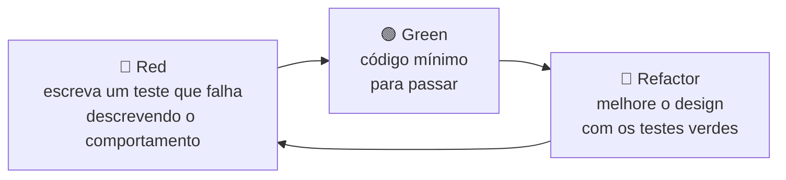
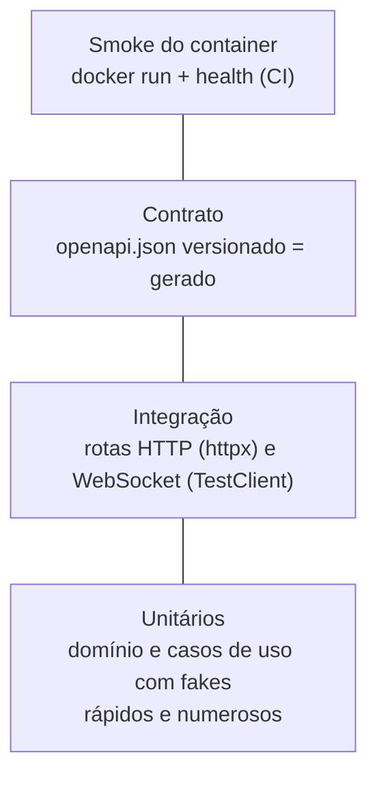

# 09 — Testes

Regra do projeto: **toda rota HTTP, mensagem WebSocket e caso de uso deve ter teste**. Trabalhamos com **TDD**: o teste é escrito antes do código de produção e entra no mesmo MR.

## 1. Ciclo TDD



## 2. Pirâmide



## 3. Matriz obrigatória — o que testar

| Artefato | Tipo de teste | Ferramenta | Obrigatório |
|----------|---------------|-----------|-------------|
| Entidade / value object | Unitário | pytest | ✅ |
| Caso de uso | Unitário com *fakes* das ports | pytest + pytest-asyncio | ✅ |
| Adapter de infraestrutura | Integração com o recurso real — repositórios contra o **DynamoDB Local** ([12](./12-persistencia-dynamodb.md#8-testes)) | pytest | ✅ |
| **Rota HTTP** | Integração: status, schema, erros | pytest + httpx `AsyncClient` | ✅ **toda rota** |
| **Mensagem WebSocket** | Integração: request → response, erros, `Origin` | Starlette `TestClient` (usa `httpx2`) | ✅ **todo `type`** |
| CORS | Integração: origem permitida e negada | pytest + httpx | ✅ |
| Contrato OpenAPI | `openapi.json` versionado = gerado | pytest | ✅ |
| Imagem Docker | Smoke: container sobe e health responde 200 | CI (`docker run` + `curl`) | ✅ |

> Os testes de tela e E2E do navegador pertencem ao frontend (`docs/11-testes.md` no repositório do **frontend**).

## 4. Convenções

| Item | Regra |
|------|-------|
| Local | `tests/{unit,integration,contract}/` espelhando `api/` |
| Nome do arquivo | `test_<modulo>.py` |
| Nome do teste | `test_<comportamento_esperado>_when_<condição>` |
| Estrutura | Arrange / Act / Assert separados por linha em branco |
| Dublês | *Fakes* que implementam as `Protocol` (sem `mock.patch` no domínio) — em `tests/fakes.py`. `pytest-mock` (`mocker`) só na fronteira com libs externas |
| Tempo | `freezegun` (`@freeze_time`) quando o código lê o relógio diretamente (ex.: logs); no domínio, `ClockPort` + `FakeClock` |
| Avisos | `filterwarnings = error`: todo aviso (ex.: deprecação) quebra o teste |
| Dados | Factories (`build_health_report(...)`) |

## 5. Cobertura mínima

**90%** (global, linhas e branches) — `coverage run -m pytest` + `coverage report` com `[tool.coverage.report] fail_under = 90`. Cobertura é **piso**, não meta: a regra principal continua sendo "todo comportamento tem teste".

## 6. Exemplos


### `tests/fakes.py` e `tests/conftest.py`

```python
# tests/fakes.py — dublês que implementam as ports (Protocol) do domínio
from datetime import UTC, datetime

from api.contexts.health.domain.entities import ComponentHealth
from api.contexts.health.domain.value_objects import HealthStatus

STARTED_AT = datetime(2026, 1, 1, tzinfo=UTC)


class FakeClock:
    def __init__(self, now: datetime) -> None:
        self._now = now

    def now(self) -> datetime:
        return self._now


class StubCheck:
    def __init__(self, name: str, status: HealthStatus) -> None:
        self.name = name
        self._status = status

    async def check(self) -> ComponentHealth:
        return ComponentHealth(name=self.name, status=self._status)
```

```python
# tests/conftest.py
from collections.abc import AsyncIterator, Iterator

import pytest
from fastapi import FastAPI
from fastapi.testclient import TestClient
from httpx import ASGITransport, AsyncClient

from api.app_run import create_app
from api.config import Settings

ALLOWED_ORIGIN = "http://localhost:3000"


@pytest.fixture
def settings() -> Settings:
    # _env_file=None: os testes não dependem do .env de quem roda.
    return Settings(_env_file=None, env="local", version="test", cors_origins=[ALLOWED_ORIGIN])


@pytest.fixture
def app(settings: Settings) -> FastAPI:
    return create_app(settings)


@pytest.fixture
async def client(app: FastAPI) -> AsyncIterator[AsyncClient]:
    async with AsyncClient(transport=ASGITransport(app=app), base_url="http://test") as http:
        yield http


@pytest.fixture
def ws_client(app: FastAPI) -> Iterator[TestClient]:
    with TestClient(app) as test_client:
        yield test_client
```

### Unitário — caso de uso

```python
from datetime import timedelta

import pytest

from api.core.scope import Scope
from api.contexts.health.application.get_health import AppInfo, GetHealthUseCase
from api.contexts.health.domain.value_objects import HealthStatus
from tests.fakes import STARTED_AT, FakeClock, StubCheck


async def test_returns_ok_when_there_are_no_checks() -> None:
    use_case = GetHealthUseCase(
        clock=FakeClock(STARTED_AT + timedelta(seconds=10)),
        app_info=AppInfo(version="1.0.0", started_at=STARTED_AT),
    )

    report = await use_case.execute(Scope.PUBLIC)

    assert report.status is HealthStatus.OK
    assert report.scope is Scope.PUBLIC
    assert report.uptime_seconds == 10


@pytest.mark.parametrize(
    ("statuses", "expected"),
    [
        ([HealthStatus.OK, HealthStatus.OK], HealthStatus.OK),
        ([HealthStatus.OK, HealthStatus.DEGRADED], HealthStatus.DEGRADED),
        ([HealthStatus.DEGRADED, HealthStatus.DOWN], HealthStatus.DOWN),
    ],
)
async def test_returns_worst_component_status(
    statuses: list[HealthStatus], expected: HealthStatus
) -> None:
    checks = [StubCheck(f"dep{i}", status) for i, status in enumerate(statuses)]
    use_case = GetHealthUseCase(
        clock=FakeClock(STARTED_AT),
        app_info=AppInfo(version="1.0.0", started_at=STARTED_AT),
        checks=checks,
    )

    report = await use_case.execute(Scope.ADMIN)

    assert report.status is expected
    assert len(report.components) == len(statuses)
```

### Integração — rota HTTP (os dois escopos)

```python
import pytest
from fastapi import FastAPI
from httpx import AsyncClient

from api.contexts.health.application.get_health import AppInfo, GetHealthUseCase
from api.contexts.health.domain.value_objects import HealthStatus
from api.contexts.health.presentation.dependencies import get_health_use_case
from tests.fakes import STARTED_AT, FakeClock, StubCheck

EXPECTED_FIELDS = {"status", "scope", "version", "uptimeSeconds", "checkedAt", "components"}


@pytest.mark.parametrize("scope", ["public", "admin"])
async def test_health_returns_ok_for_scope(client: AsyncClient, scope: str) -> None:
    response = await client.get(f"/api/v1/{scope}/health")

    assert response.status_code == 200
    body = response.json()
    assert set(body) == EXPECTED_FIELDS
    assert body["status"] == "ok"
    assert body["scope"] == scope
    assert body["version"] == "test"


async def test_health_returns_503_when_a_component_is_down(
    app: FastAPI, client: AsyncClient
) -> None:
    down_use_case = GetHealthUseCase(
        clock=FakeClock(STARTED_AT),
        app_info=AppInfo(version="test", started_at=STARTED_AT),
        checks=[StubCheck("database", HealthStatus.DOWN)],
    )
    app.dependency_overrides[get_health_use_case] = lambda: down_use_case

    response = await client.get("/api/v1/public/health")

    assert response.status_code == 503
    assert response.json()["status"] == "down"
```

### Integração — CORS

```python
import pytest
from httpx import AsyncClient

from tests.conftest import ALLOWED_ORIGIN


async def test_preflight_allows_configured_origin(client: AsyncClient) -> None:
    response = await client.options(
        "/api/v1/public/health",
        headers={"Origin": ALLOWED_ORIGIN, "Access-Control-Request-Method": "GET"},
    )

    assert response.status_code == 200
    assert response.headers["access-control-allow-origin"] == ALLOWED_ORIGIN


async def test_response_has_no_cors_header_for_unknown_origin(client: AsyncClient) -> None:
    response = await client.get(
        "/api/v1/public/health", headers={"Origin": "https://malicioso.example"}
    )

    assert "access-control-allow-origin" not in response.headers
```

### Integração — WebSocket

```python
import pytest
from fastapi.testclient import TestClient
from starlette.websockets import WebSocketDisconnect

from tests.conftest import ALLOWED_ORIGIN

ORIGIN = {"origin": ALLOWED_ORIGIN}


@pytest.mark.parametrize("scope", ["public", "admin"])
def test_ping_returns_pong_with_same_id(ws_client: TestClient, scope: str) -> None:
    with ws_client.websocket_connect(f"/api/v1/ws/{scope}", headers=ORIGIN) as ws:
        ws.send_json({"type": "health.ping", "id": "abc", "payload": {}})
        reply = ws.receive_json()

    assert reply["type"] == "health.pong"
    assert reply["id"] == "abc"
    assert reply["payload"]["scope"] == scope


def test_unknown_type_returns_error(ws_client: TestClient) -> None:
    with ws_client.websocket_connect("/api/v1/ws/public", headers=ORIGIN) as ws:
        ws.send_json({"type": "nope", "id": "1", "payload": {}})
        reply = ws.receive_json()

    assert reply == {
        "type": "error",
        "id": "1",
        "payload": {
            "code": "unknown_message_type",
            "message": "Tipo de mensagem não suportado: nope",
        },
    }


def test_invalid_json_returns_error(ws_client: TestClient) -> None:
    with ws_client.websocket_connect("/api/v1/ws/public", headers=ORIGIN) as ws:
        ws.send_text("não é json")
        reply = ws.receive_json()

    assert reply["payload"]["code"] == "invalid_message"


@pytest.mark.parametrize("headers", [{}, {"origin": "https://malicioso.example"}])
def test_rejects_connection_from_unknown_origin(
    ws_client: TestClient, headers: dict[str, str]
) -> None:
    with pytest.raises(WebSocketDisconnect) as exc_info:
        with ws_client.websocket_connect("/api/v1/ws/public", headers=headers):
            pass

    assert exc_info.value.code == 1008  # policy violation
```

### Contrato — OpenAPI versionado

```python
import json
from pathlib import Path

from fastapi import FastAPI

OPENAPI_PATH = Path(__file__).parents[2] / "openapi.json"  # openapi.json na raiz do repositório


def test_committed_openapi_matches_backend(app: FastAPI) -> None:
    committed = json.loads(OPENAPI_PATH.read_text(encoding="utf-8"))
    generated = app.openapi()

    # Compara só o contrato (paths + schemas); info.version varia por ambiente.
    assert generated["paths"] == committed["paths"], "Rode `make openapi`"
    assert generated["components"] == committed["components"], "Rode `make openapi`"
```

### Smoke da imagem (CI)

```bash
docker run -d --name bot-varejo-api-smoke -p 8000:8000 bot-varejo-api:ci
for i in $(seq 1 20); do curl -fsS http://localhost:8000/api/v1/public/health && break; sleep 1; done
curl -fsS http://localhost:8000/api/v1/admin/health
docker rm -f bot-varejo-api-smoke
```

## 7. Onde cada teste roda

| Etapa | Comando | Local | CI |
|-------|---------|-------|----|
| Unit + integração + contrato | `make test` (`coverage run -m pytest` + `coverage report`) | ✅ | ✅ |
| Smoke da imagem | job `backend:build` (sobe o container e chama os dois health) | — | ✅ |
