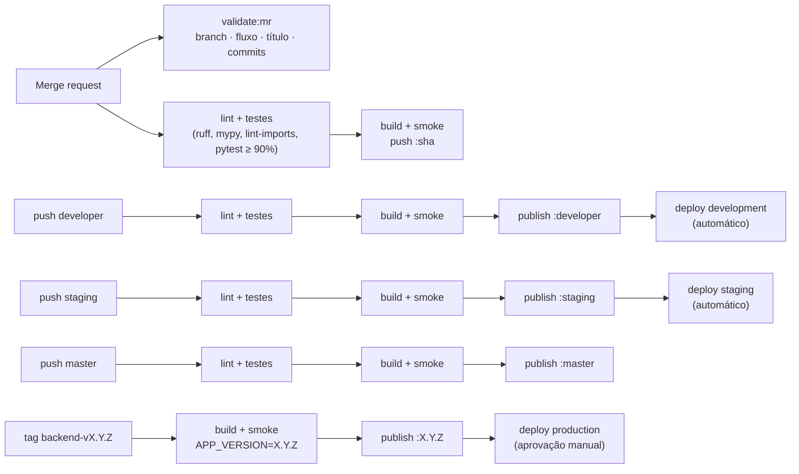

# 11 — CI e comandos (backend)

Pipeline do backend em `.gitlab-ci.yml`. Roda em merge requests, nas branches permanentes `developer`, `staging` e `master` e em tags `backend-v*` — cada branch publica no seu ambiente.

Padrão de branches, commits e MRs (inclui o job `validate:mr`): [CONTRIBUTING.md](../CONTRIBUTING.md).

## 1. Branches, ambientes e imagens

O pipeline segue o fluxo `developer → staging → master` ([CONTRIBUTING §1](../CONTRIBUTING.md#1-branches-e-fluxo-de-publicação)): **cada branch permanente publica no seu ambiente** e produção só recebe **versões com tag** da `master`.

| Evento | Jobs | Imagem publicada | Deploy |
|--------|------|------------------|--------|
| Merge request (qualquer destino) | `validate:mr`, lint, testes, build + smoke | `:<sha>` | — |
| Push em `developer` (merge de MR de trabalho) | lint, testes, build, publish, deploy | `:developer` | **development** — automático |
| Push em `staging` (promoção) | lint, testes, build, publish, deploy | `:staging` | **staging** — automático |
| Push em `master` (promoção ou hotfix) | lint, testes, build, publish | `:master` | — (aguarda a tag) |
| Tag `backend-vX.Y.Z` (na `master`) | build, publish, deploy | `:X.Y.Z` | **production** — **aprovação manual** |

| Ambiente | Branch | URL (convenção, a definir) | `APP_CORS_ORIGINS` |
|----------|--------|----------------------------|--------------------|
| development | `developer` | `https://api-dev.<dominio>` | `["https://app-dev.<dominio>"]` |
| staging | `staging` | `https://api-staging.<dominio>` | `["https://app-staging.<dominio>"]` |
| production | `master` (tag) | `https://api.<dominio>` | `["https://app.<dominio>"]` |



Imagens publicadas em `$CI_REGISTRY_IMAGE` (GitLab Container Registry). O job `validate:mr` está em [CONTRIBUTING §5.5](../CONTRIBUTING.md#55-gitlab-ciyml--job-validatemr).

## 2. `.gitlab-ci.yml`

```yaml
stages: [validate, test, build, publish, deploy]

workflow:
  rules:
    - if: $CI_PIPELINE_SOURCE == "merge_request_event"
    - if: $CI_COMMIT_BRANCH =~ /^(developer|staging|master)$/
    - if: $CI_COMMIT_TAG =~ /^backend-v\d+\.\d+\.\d+$/

variables:
  IMAGE: $CI_REGISTRY_IMAGE

# ---------- qualidade ---------------------------------------------------------
.python:
  image: python:3.13-slim
  variables:
    UV_CACHE_DIR: $CI_PROJECT_DIR/.uv-cache
  cache:
    key:
      files: [uv.lock]
    paths: [.uv-cache]
  before_script:
    - pip install --no-cache-dir uv   # fixar a versão na implementação
    - uv sync --frozen
  rules:
    - if: $CI_COMMIT_TAG
      when: never                     # tag = mesmo commit já validado na master
    - when: on_success

backend:lint:
  extends: .python
  stage: test
  script:
    - uv run ruff check .
    - uv run ruff format --check .
    - uv run mypy src tests
    - uv run lint-imports

backend:test:
  extends: .python
  stage: test
  services:
    - name: amazon/dynamodb-local:3.3.1
      alias: bot-varejo-dynamodb
  variables:
    APP_DYNAMODB_ENDPOINT_URL: http://bot-varejo-dynamodb:8000
    APP_AWS_REGION: sa-east-1
    AWS_ACCESS_KEY_ID: local
    AWS_SECRET_ACCESS_KEY: local
  script:
    - uv run pytest --junitxml=report.xml --cov-report=xml
  coverage: '/TOTAL.*\s+(\d+%)$/'
  artifacts:
    reports:
      junit: report.xml
      coverage_report:
        coverage_format: cobertura
        path: coverage.xml

# ---------- imagem ------------------------------------------------------------
.docker:
  image: docker:27
  services: [docker:27-dind]
  before_script:
    - echo "$CI_REGISTRY_PASSWORD" | docker login -u "$CI_REGISTRY_USER" --password-stdin "$CI_REGISTRY"

backend:build:
  extends: .docker
  stage: build
  script:
    # Tag → versão real; demais → versão de desenvolvimento rastreável (ex.: 0.0.0-developer.a1b2c3d)
    - VERSION="${CI_COMMIT_TAG#backend-v}"
    - VERSION="${VERSION:-0.0.0-${CI_COMMIT_REF_SLUG}.${CI_COMMIT_SHORT_SHA}}"
    - docker build --target runtime --build-arg APP_VERSION="$VERSION" -t "$IMAGE:$CI_COMMIT_SHORT_SHA" .
    - docker run -d --name smoke "$IMAGE:$CI_COMMIT_SHORT_SHA"
    - for i in $(seq 1 20); do docker exec smoke python -c "import urllib.request; urllib.request.urlopen('http://127.0.0.1:8000/api/v1/public/health')" && break; sleep 1; done
    - docker exec smoke python -c "import urllib.request; urllib.request.urlopen('http://127.0.0.1:8000/api/v1/admin/health')"
    - docker push "$IMAGE:$CI_COMMIT_SHORT_SHA"

backend:publish:
  extends: .docker
  stage: publish
  rules:
    - if: $CI_COMMIT_BRANCH =~ /^(developer|staging|master)$/
    - if: $CI_COMMIT_TAG =~ /^backend-v\d+\.\d+\.\d+$/
  script:
    - TARGET="${CI_COMMIT_TAG:-$CI_COMMIT_BRANCH}"
    - TARGET="${TARGET#backend-v}"          # backend-v1.2.3 → 1.2.3 · developer → developer
    - docker pull "$IMAGE:$CI_COMMIT_SHORT_SHA"
    - docker tag "$IMAGE:$CI_COMMIT_SHORT_SHA" "$IMAGE:$TARGET"
    - docker push "$IMAGE:$TARGET"

# ---------- deploy ------------------------------------------------------------
# O mecanismo de deploy (Kubernetes, ECS, VM…) é definido pela plataforma:
# scripts/deploy.sh recebe o ambiente e a imagem e encapsula esse mecanismo.
.deploy:
  stage: deploy
  image: alpine:3
  before_script:
    - apk add --no-cache bash git

deploy:development:
  extends: .deploy
  rules:
    - if: $CI_COMMIT_BRANCH == "developer"
  environment:
    name: development
    url: https://api-dev.<dominio>
  script:
    - ./scripts/deploy.sh development "$IMAGE:developer"

deploy:staging:
  extends: .deploy
  rules:
    - if: $CI_COMMIT_BRANCH == "staging"
  environment:
    name: staging
    url: https://api-staging.<dominio>
  script:
    - ./scripts/deploy.sh staging "$IMAGE:staging"

deploy:production:
  extends: .deploy
  rules:
    - if: $CI_COMMIT_TAG =~ /^backend-v\d+\.\d+\.\d+$/
      when: manual                    # aprovação humana antes de produção
  allow_failure: false
  environment:
    name: production
    url: https://api.<dominio>
  script:
    # Produção só aceita tags que estejam na master.
    - git fetch --quiet origin master
    - git merge-base --is-ancestor "$CI_COMMIT_SHA" origin/master || { echo "Tag fora da master"; exit 1; }
    - ./scripts/deploy.sh production "$IMAGE:${CI_COMMIT_TAG#backend-v}"
```

- `APP_VERSION` nunca fica vazio: fora de tag, a versão exibida no health é `0.0.0-<branch>.<sha>` — dá para saber exatamente o que está em cada ambiente.
- Variáveis de cada ambiente (`APP_CORS_ORIGINS`, `APP_ENV`, `APP_DOCS_ENABLED`…) são configuradas na plataforma de deploy/GitLab Environments, **não** no código.
- **Rollback:** reexecutar o job de deploy de um pipeline anterior do mesmo ambiente (Operate → Environments → *Re-deploy*) ou fazer deploy da tag anterior.

## 3. Makefile — atalhos

| Alvo | O que faz |
|------|-----------|
| `make setup` | `uv sync` (com grupo dev) + `pre-commit install` + `git config commit.template .gitmessage` |
| `make up` | `docker compose up --build` (imagem de runtime) |
| `make down` | `docker compose down` |
| `make dev` | `docker compose -f docker-compose.dev.yml up --build` (reload) |
| `make run` | `uv run uvicorn bot_varejo.main:create_app --factory --reload --port 8000` (sem Docker) |
| `make lint` | `ruff check` + `ruff format --check` + `lint-imports` |
| `make format` | `ruff format` + `ruff check --fix` |
| `make typecheck` | `mypy src tests` |
| `make test` | `pytest` com cobertura |
| `make openapi` | `uv run python -m bot_varejo.scripts.export_openapi openapi.json` |
| `make build` | `docker build --target runtime -t bot-varejo-api:local .` |
| `make db-init` | Cria as tabelas no DynamoDB Local (idempotente) |
| `make db-reset` | Apaga e recria as tabelas locais |

## 4. Comandos sem `make`

| Ação | Comando |
|------|--------------------------------|
| Instalar deps | `uv sync` |
| Rodar em dev | `uv run uvicorn bot_varejo.main:create_app --factory --reload --port 8000` |
| Testes | `uv run pytest` |
| Lint | `uv run ruff check .` |
| Formatar | `uv run ruff format .` |
| Tipos | `uv run mypy src tests` |
| Fronteiras DDD | `uv run lint-imports` |
| Exportar OpenAPI | `uv run python -m bot_varejo.scripts.export_openapi openapi.json` |
