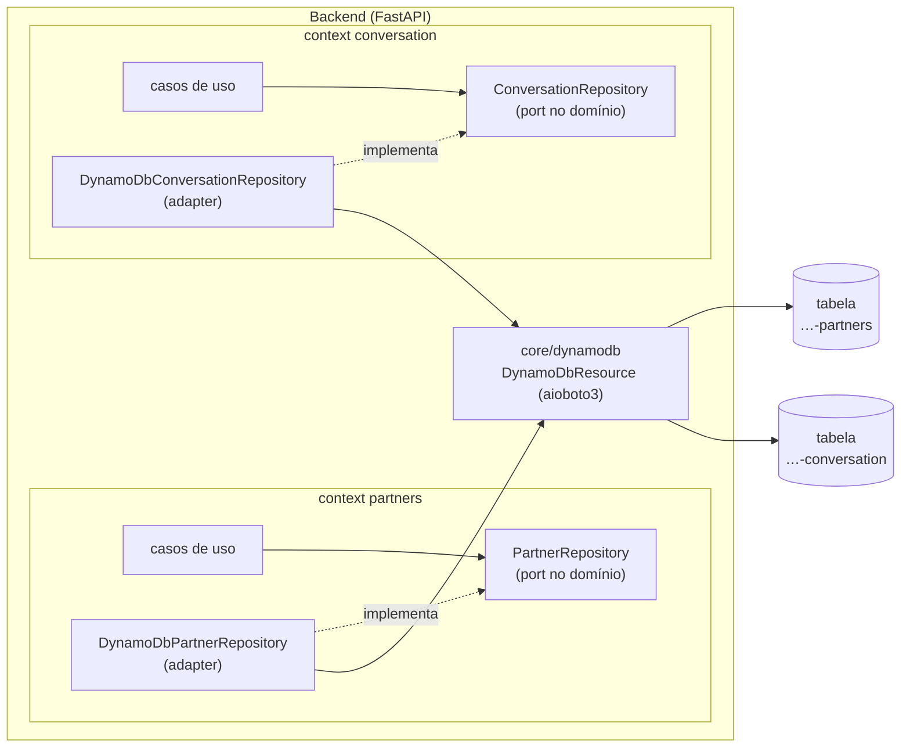

# 12 — Persistência (DynamoDB)

O banco de dados do backend é o **Amazon DynamoDB** ([ADR-0009](./adr/0009-dynamodb.md)). Este documento define como tabelas, chaves e repositórios são organizados e como o banco roda localmente e nos testes.

## 1. Visão geral



| Regra | Detalhe |
|-------|---------|
| Uma tabela por bounded context | `<APP_DYNAMODB_TABLE_PREFIX>-<context>` — ex.: `bot-varejo-production-partners` |
| Single-table dentro do context | Todas as entidades do context na mesma tabela, com chaves genéricas |
| Isolamento | Um context só acessa **a sua** tabela; dados de outro context vêm por caso de uso/evento, nunca por leitura direta |
| Domínio sem AWS | Ports (`…Repository`) no `domain`; aioboto3 só em `infrastructure` e `core/dynamodb` (import-linter proíbe `aioboto3`/`boto3`/`botocore` no domínio) |
| Acesso assíncrono | aioboto3 — um único resource/cliente aberto no *lifespan* da aplicação |

## 2. Esquema das tabelas

Todas as tabelas seguem o mesmo esquema de chaves:

| Atributo | Tipo | Uso |
|----------|------|-----|
| `PK` | String | Partition key — identifica o agregado (`PARTNER#<id>`, `CONVERSATION#<id>`) |
| `SK` | String | Sort key — item dentro do agregado (`METADATA`, `SERVICE#<id>`, `MESSAGE#<timestamp>#<id>`) |
| `GSI1PK` / `GSI1SK` | String | Índice secundário `GSI1` para o segundo padrão de acesso (e `GSI2…` quando necessário) |
| `entityType` | String | Tipo do item (`Partner`, `PartnerService`, `Message`…) — usado nos codecs |
| `version` | Number | Locking otimista |
| `schemaVersion` | Number | Versão do formato do item, para evolução sem migração em massa |
| `createdAt` / `updatedAt` | String | ISO 8601 UTC |
| `expiresAt` | Number | *(opcional)* epoch em segundos para TTL (ex.: sessões temporárias) |

Configuração padrão de toda tabela:

| Item | Valor |
|------|-------|
| Capacidade | `PAY_PER_REQUEST` (on-demand) |
| TTL | Atributo `expiresAt` (habilitado quando o context usar expiração) |
| Point-in-Time Recovery | Ligado em staging e production |
| Deletion protection | Ligado em staging e production |
| Criptografia | Padrão da AWS (at rest) |

## 3. Modelagem por padrões de acesso

No DynamoDB, **as chaves nascem dos padrões de acesso**, não das entidades. Todo repositório documenta, no próprio context, a tabela de acessos antes de implementar:

1. Listar os padrões de acesso (quem consulta, por qual chave, com qual ordenação).
2. Escolher `PK`/`SK` que atendam o acesso principal com `GetItem`/`Query`.
3. Criar `GSI` só para acessos que a chave primária não atende.
4. Nunca usar `Scan` em fluxos de requisição.

### Exemplo ilustrativo — context `partners`

| Padrão de acesso | Operação | Chave |
|------------------|----------|-------|
| Buscar parceiro por id | `GetItem` | `PK=PARTNER#<id>`, `SK=METADATA` |
| Listar serviços de um parceiro | `Query` | `PK=PARTNER#<id>`, `SK begins_with SERVICE#` |
| Listar parceiros por status | `Query` em `GSI1` | `GSI1PK=PARTNER_STATUS#<status>`, `GSI1SK=<nome>` |

| PK | SK | entityType | GSI1PK | GSI1SK | demais atributos |
|----|----|------------|--------|--------|------------------|
| `PARTNER#p1` | `METADATA` | `Partner` | `PARTNER_STATUS#active` | `Loja Exemplo` | `name`, `status`, `version`… |
| `PARTNER#p1` | `SERVICE#s1` | `PartnerService` | — | — | `name`, `price`… |

### Exemplo ilustrativo — context `conversation`

| Padrão de acesso | Operação | Chave |
|------------------|----------|-------|
| Buscar conversa | `GetItem` | `PK=CONVERSATION#<id>`, `SK=METADATA` |
| Mensagens de uma conversa em ordem | `Query` | `PK=CONVERSATION#<id>`, `SK begins_with MESSAGE#` (ordenado por timestamp) |
| Conversas de um cliente, mais recentes primeiro | `Query` em `GSI1` (`ScanIndexForward=false`) | `GSI1PK=CUSTOMER#<id>`, `GSI1SK=<updatedAt>` |

> Os contexts acima são exemplos da convenção; a modelagem real é feita quando cada context for implementado.

## 4. Estrutura no código

```text
src/bot_varejo/
├── core/dynamodb/
│   ├── __init__.py
│   ├── resource.py          # DynamoDbResource: sessão aioboto3, resource/cliente, nomes das tabelas
│   ├── tables.py            # definições das tabelas (chaves, GSIs, billing) — usadas pelo make db-init
│   ├── codecs.py            # conversões comuns (Decimal ↔ int, datetime ↔ ISO 8601)
│   ├── pagination.py        # cursor opaco (base64) ↔ LastEvaluatedKey
│   ├── errors.py            # ClientError → exceções do core (ConcurrencyError, NotFound…)
│   └── health.py            # DynamoDbHealthCheck (componente "database" do health)
├── contexts/partners/                       # exemplo
│   ├── domain/ports.py                      # PartnerRepository (Protocol)
│   └── infrastructure/dynamodb_partner_repository.py
└── scripts/
    └── create_tables.py     # make db-init: cria as tabelas no DynamoDB Local (idempotente)
```

### 4.1 `core/dynamodb/resource.py`

```python
from contextlib import AsyncExitStack

import aioboto3

from bot_varejo.core.config import Settings
from bot_varejo.core.dynamodb.types import DynamoDbClient, DynamoDbServiceResource, Table


class DynamoDbResource:
    """Abre um resource e um cliente aioboto3 no lifespan e os compartilha entre os repositórios."""

    def __init__(self, settings: Settings) -> None:
        self._settings = settings
        self._session = aioboto3.Session()
        self._stack = AsyncExitStack()
        self._resource: DynamoDbServiceResource | None = None
        self._client: DynamoDbClient | None = None

    async def start(self) -> None:
        options = {
            "region_name": self._settings.aws_region,
            "endpoint_url": self._settings.dynamodb_endpoint_url,  # None na AWS
        }
        self._resource = await self._stack.enter_async_context(self._session.resource("dynamodb", **options))
        self._client = await self._stack.enter_async_context(self._session.client("dynamodb", **options))

    async def close(self) -> None:
        await self._stack.aclose()

    def table_name(self, context: str) -> str:
        return f"{self._settings.dynamodb_table_prefix}-{context}"

    async def table(self, context: str) -> Table:
        assert self._resource is not None, "DynamoDbResource.start() não foi chamado"
        return await self._resource.Table(self.table_name(context))

    @property
    def client(self) -> DynamoDbClient:
        assert self._client is not None, "DynamoDbResource.start() não foi chamado"
        return self._client
```

> `core/dynamodb/types.py` reexporta os tipos dos stubs `types-aioboto3[dynamodb]` (dependência de desenvolvimento), para o `mypy --strict` checar as chamadas ao DynamoDB.

### 4.2 Ciclo de vida (`main.py`)

```python
from collections.abc import AsyncIterator
from contextlib import asynccontextmanager


def create_app(settings: Settings | None = None) -> FastAPI:
    settings = settings or Settings()
    container = build_container(settings)

    @asynccontextmanager
    async def lifespan(_: FastAPI) -> AsyncIterator[None]:
        await container.dynamodb.start()
        try:
            yield
        finally:
            await container.dynamodb.close()

    app = FastAPI(..., lifespan=lifespan)
    app.state.container = container
    ...
```

### 4.3 Port (domínio) e adapter (infraestrutura)

```python
# contexts/partners/domain/ports.py
from typing import Protocol

from bot_varejo.contexts.partners.domain.entities import Partner, PartnerId


class PartnerRepository(Protocol):
    async def get(self, partner_id: PartnerId) -> Partner | None: ...
    async def save(self, partner: Partner) -> None: ...
```

```python
# contexts/partners/infrastructure/dynamodb_partner_repository.py
from botocore.exceptions import ClientError

from bot_varejo.core.dynamodb.errors import ConcurrencyError
from bot_varejo.core.dynamodb.resource import DynamoDbResource
from bot_varejo.contexts.partners.domain.entities import Partner, PartnerId
from bot_varejo.contexts.partners.infrastructure.codecs import partner_from_item, partner_to_item

CONTEXT = "partners"


class DynamoDbPartnerRepository:
    """Implementa PartnerRepository. Único ponto do context que conhece o DynamoDB."""

    def __init__(self, db: DynamoDbResource) -> None:
        self._db = db

    async def get(self, partner_id: PartnerId) -> Partner | None:
        table = await self._db.table(CONTEXT)
        response = await table.get_item(Key={"PK": f"PARTNER#{partner_id}", "SK": "METADATA"})
        item = response.get("Item")
        return partner_from_item(item) if item else None

    async def save(self, partner: Partner) -> None:
        table = await self._db.table(CONTEXT)
        try:
            await table.put_item(
                Item=partner_to_item(partner),
                # locking otimista: cria se não existe, ou atualiza só se ninguém mudou antes
                ConditionExpression="attribute_not_exists(PK) OR version = :expected",
                ExpressionAttributeValues={":expected": partner.version - 1},
            )
        except ClientError as exc:
            if exc.response["Error"]["Code"] == "ConditionalCheckFailedException":
                raise ConcurrencyError(f"Parceiro {partner.id} alterado por outra operação") from exc
            raise
```

O adapter é registrado no `container.py` e injetado nos casos de uso — que dependem só da port.

### 4.4 Health check do banco

```python
# core/dynamodb/health.py
from collections.abc import Sequence

from botocore.exceptions import BotoCoreError, ClientError

from bot_varejo.core.dynamodb.resource import DynamoDbResource
from bot_varejo.contexts.health.domain.entities import ComponentHealth
from bot_varejo.contexts.health.domain.value_objects import HealthStatus


class DynamoDbHealthCheck:
    """Implementa HealthCheckPort: verifica se as tabelas dos contexts estão acessíveis e ativas."""

    name = "database"

    def __init__(self, db: DynamoDbResource, contexts: Sequence[str]) -> None:
        self._db = db
        self._contexts = tuple(contexts)

    async def check(self) -> ComponentHealth:
        try:
            for context in self._contexts:
                description = await self._db.client.describe_table(TableName=self._db.table_name(context))
                if description["Table"]["TableStatus"] != "ACTIVE":
                    return ComponentHealth(name=self.name, status=HealthStatus.DEGRADED, detail=f"{context}: tabela não ativa")
        except (ClientError, BotoCoreError):
            return ComponentHealth(name=self.name, status=HealthStatus.DOWN, detail="DynamoDB indisponível")
        return ComponentHealth(name=self.name, status=HealthStatus.OK)
```

Registrado no container em `GetHealthUseCase(checks=(DynamoDbHealthCheck(db, contexts=[...]),))` quando o primeiro context com tabela existir. Com isso, `components` do [health](./06-contratos-api.md#schema-healthresponse) passa a trazer `database`, e o health responde `503` se o banco estiver `down`.

## 5. Regras de uso

| Regra | Por quê |
|-------|---------|
| Nada de `Scan` em fluxos de requisição | Custo e latência proporcionais ao tamanho da tabela |
| Escritas com `ConditionExpression` (locking otimista por `version`) | Evita sobrescrever alterações concorrentes |
| `TransactWriteItems` só dentro da tabela do próprio context | Mantém o isolamento entre contexts |
| Paginação com cursor opaco (`LastEvaluatedKey` em base64) | O cliente da API não conhece o formato das chaves |
| Conversão `Decimal` ↔ `int`/`Decimal` nos codecs | O DynamoDB devolve números como `Decimal` |
| Itens até 400 KB; conteúdo grande fora do item | Limite do DynamoDB |
| Evolução de formato via `schemaVersion` + leitura tolerante; backfill por script idempotente | Não há migrações de schema |
| Nomes de atributos em camelCase (`createdAt`, `entityType`); chaves e índices em maiúsculas (`PK`, `SK`, `GSI1PK`) | Padrão único em todas as tabelas |

## 6. Configuração

| Variável | Exemplo local | Na AWS | Descrição |
|----------|---------------|--------|-----------|
| `APP_AWS_REGION` | `sa-east-1` | região da conta (a definir) | Região do DynamoDB |
| `APP_DYNAMODB_ENDPOINT_URL` | `http://dynamodb:8000` | *(vazio)* | Endpoint do DynamoDB Local; vazio usa o endpoint da AWS |
| `APP_DYNAMODB_TABLE_PREFIX` | `bot-varejo-local` | `bot-varejo-<ambiente>` | Prefixo dos nomes das tabelas |
| `AWS_ACCESS_KEY_ID` / `AWS_SECRET_ACCESS_KEY` | `local` / `local` | **não usar** | Na AWS as credenciais vêm da **role IAM** do serviço; localmente qualquer valor serve |

Permissões IAM do serviço: `dynamodb:GetItem`, `PutItem`, `UpdateItem`, `DeleteItem`, `Query`, `BatchGetItem`, `BatchWriteItem`, `TransactWriteItems`, `ConditionCheckItem` e `DescribeTable`, **restritas** às tabelas com o prefixo do ambiente (e seus índices).

## 7. Ambiente local

Serviço adicional nos arquivos de compose:

```yaml
  dynamodb:
    image: amazon/dynamodb-local:latest   # fixar a versão na implementação
    command: ["-jar", "DynamoDBLocal.jar", "-sharedDb", "-dbPath", "/home/dynamodblocal/data"]
    ports:
      - "${DYNAMODB_PORT:-8001}:8000"      # 8001 no host (8000 é a API)
    volumes:
      - dynamodb-data:/home/dynamodblocal/data

  api:
    environment:
      APP_DYNAMODB_ENDPOINT_URL: http://dynamodb:8000
      APP_DYNAMODB_TABLE_PREFIX: bot-varejo-local
      APP_AWS_REGION: sa-east-1
      AWS_ACCESS_KEY_ID: local
      AWS_SECRET_ACCESS_KEY: local
    depends_on: [dynamodb]

volumes:
  dynamodb-data:
```

| Comando | O que faz |
|---------|-----------|
| `make db-init` | Cria as tabelas definidas em `core/dynamodb/tables.py` no DynamoDB Local (idempotente; habilita TTL quando configurado) |
| `make db-reset` | Apaga e recria as tabelas locais |

Para inspecionar os dados localmente: `aws dynamodb scan --table-name bot-varejo-local-<context> --endpoint-url http://localhost:8001` (o `Scan` é aceitável só em ferramentas locais).

## 8. Testes

| Camada | Como testa | Banco |
|--------|------------|-------|
| Domínio e casos de uso | Unitário com **repositórios fake em memória** que implementam a port | Nenhum |
| Adapters DynamoDB | Integração: operações reais, locking otimista, paginação, codecs | **DynamoDB Local** |
| Rotas | Integração com os casos de uso reais e repositórios fake (ou DynamoDB Local quando o teste for do fluxo completo) | Conforme o teste |

Fixture de integração: cria as tabelas com um **prefixo único por execução** (ex.: `test-<uuid>`) antes dos testes do adapter e as remove no final — testes isolados mesmo rodando em paralelo.

```python
# tests/integration/conftest.py (trecho)
@pytest.fixture(scope="session")
async def dynamodb(settings_for_tests: Settings) -> AsyncIterator[DynamoDbResource]:
    db = DynamoDbResource(settings_for_tests)            # prefixo test-<uuid>
    await db.start()
    await create_tables(db)                              # mesmas definições do make db-init
    try:
        yield db
    finally:
        await drop_tables(db)
        await db.close()
```

No CI, o job de testes sobe o DynamoDB Local como *service* ([11 — CI](./11-ci.md)).
