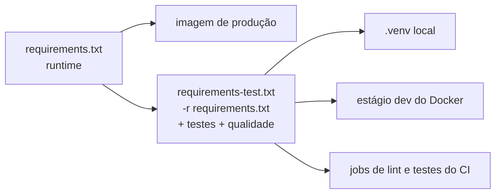

# 13 — Dependências

As dependências ficam em dois arquivos na raiz do projeto, instalados com **pip** ([ADR-0004](./adr/0004-pip-requirements.md)). O `pyproject.toml` só configura as ferramentas ([10](./10-padroes-codigo.md#configuração-das-ferramentas-pyprojecttoml)).

| Arquivo | Conteúdo | Instalado em |
|---------|----------|--------------|
| `requirements.txt` | Dependências de **runtime** — tudo o que a aplicação importa | Imagem de produção (estágio `builder`), dev, CI |
| `requirements-test.txt` | `-r requirements.txt` + testes + qualidade | Dev (`.venv` e estágio `dev` do Docker), CI — **nunca** na imagem de produção |



## 1. Runtime — `requirements.txt`

| Lib | Versão | Para quê | Onde pode ser importada |
|-----|--------|----------|-------------------------|
| `fastapi` | 0.137.1 | Framework HTTP/WebSocket, OpenAPI | `app_run.py`, `core/`, `routes/`, `presentation/` |
| `starlette` | 1.3.1 | Base do FastAPI (middlewares ASGI, WebSocket). Fixada à parte para o FastAPI não puxar outra versão | `core/` (middlewares) |
| `uvicorn[standard]` | 0.27.1 | Servidor ASGI. O extra `standard` traz `websockets`, `httptools`, `uvloop` e `watchfiles` (`--reload`) | Só na linha de comando (Dockerfile, Makefile) |
| `pydantic` | 2.11.3 | Schemas de entrada/saída e validação | `core/schemas.py`, `presentation/`, `core/websocket/` — **nunca** no `domain` |
| `pydantic-settings` | 2.14.2 | `Settings` lido das variáveis `APP_*` | `config.py` |
| `python-dotenv` | 1.2.2 | Leitura do `.env` pelo `pydantic-settings` (rodando fora do Docker) | Indireto (usado pelo `pydantic-settings`) |
| `python-multipart` | 0.0.32 | Formulários multipart (`UploadFile`, `Form`) no FastAPI | Indireto (usado pelo FastAPI) |
| `filetype` | 1.2.0 | Descobre o tipo real de um arquivo enviado pelos bytes, sem confiar na extensão | `presentation/` ou `infrastructure/` de quem recebe upload |
| `httpx` | 0.28.1 | Cliente HTTP async para APIs de parceiros e integrações; também o `AsyncClient` dos testes de rota | `infrastructure/` (adapters) |
| `tenacity` | 9.1.2 | Retry com backoff para chamadas externas instáveis | `infrastructure/` (adapters) |
| `aioboto3` | 15.0.0 | Acesso async ao DynamoDB ([12](./12-persistencia-dynamodb.md)). Traz `aiobotocore` e `boto3`/`botocore` em versões compatíveis entre si | `core/dynamodb/`, `infrastructure/` — **nunca** no `domain` |
| `urllib3` | 2.7.0 | Dependência transitiva (do `botocore`) fixada por segurança | Não importar diretamente |

## 2. Testes e qualidade — `requirements-test.txt`

| Lib | Versão | Para quê |
|-----|--------|----------|
| `pytest` | 9.1.1 | Runner dos testes |
| `pytest-asyncio` | 1.4.0 | Testes `async def` (`asyncio_mode = "auto"`) |
| `pytest-mock` | 3.15.1 | Fixture `mocker` — só na fronteira com libs externas; no domínio usamos *fakes* ([09](./09-testes.md#4-convenções)) |
| `freezegun` | 1.5.3 | Congela o relógio quando o código lê a hora diretamente (ex.: logs) |
| `coverage` | 7.9.2 | Cobertura de linhas e branches (`coverage run -m pytest`, mínimo 90%) |
| `httpx2` | 2.13.1 | Cliente usado pelo `TestClient` do Starlette 1.x (testes de WebSocket) |
| `ruff` | 0.16.9 | Lint e formatação |
| `mypy` | 2.3.1 | Checagem de tipos (`--strict`, plugin do Pydantic) |
| `import-linter` | 2.15 | Fronteiras das camadas DDD (`lint-imports`) |
| `pre-commit` | 4.6.2 | Hooks locais de commit (commitlint, ruff, mypy) |

## 3. Regras

| Regra | Por quê |
|-------|---------|
| Toda versão fixada com `==` | Build reproduzível: o que passou no CI é o que vai para produção |
| Lib de runtime em `requirements.txt`; de teste/ferramenta em `requirements-test.txt` | A imagem de produção só leva o necessário |
| Dependência transitiva só é fixada quando precisa de controle (segurança, compatibilidade), com comentário do motivo | Evita arquivo inflado e conflitos de resolução |
| Lib de infraestrutura (AWS, HTTP, parceiros) só em `infrastructure/` ou `core/` | Domínio sem framework nem AWS — verificado pelo import-linter ([03](./03-arquitetura-ddd.md)) |
| Sem lib "por via das dúvidas" | Cada dependência precisa de um uso no código |

## 4. Adicionar ou atualizar uma dependência

1. Branch `build/CPBS-123-descricao` (ou dentro da feature que precisa da lib).
2. Adicionar/alterar a linha no arquivo certo, com versão fixada e, se não for óbvio, um comentário de uso.
3. Instalar e validar localmente:

   ```bash
   .venv/bin/pip install -r requirements-test.txt
   PYTHONPATH=. .venv/bin/coverage run -m pytest && .venv/bin/coverage report
   ```

4. Recriar o container de dev: `docker compose -f docker-compose.dev.yml up --build` (deps ficam na imagem).
5. Atualizar a tabela deste documento.
6. Commit `build(deps): adiciona <lib> para <motivo>` (escopo `deps` — [CONTRIBUTING §2.3](../CONTRIBUTING.md#23-escopos)).

Para ver versões disponíveis: `pip index versions <lib>`. Para conferir conflitos antes de alterar: `pip install --dry-run -r requirements-test.txt`.
