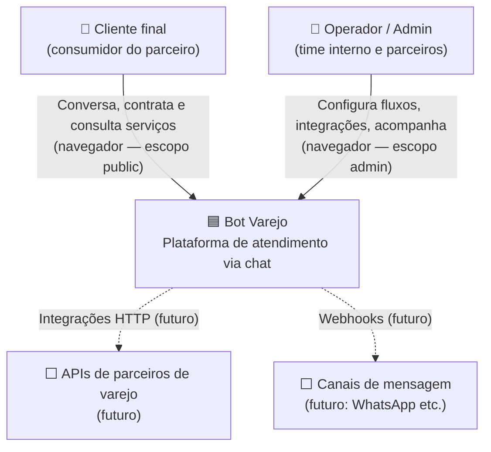
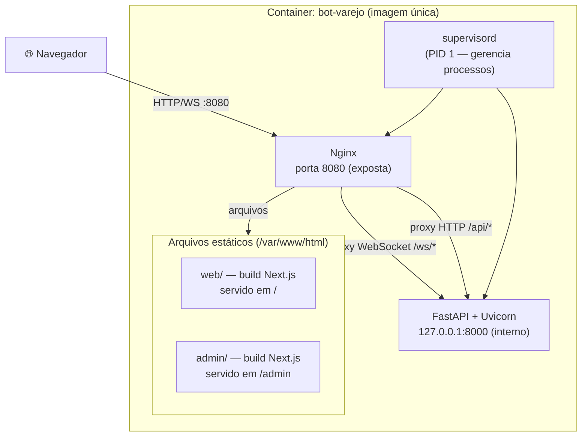
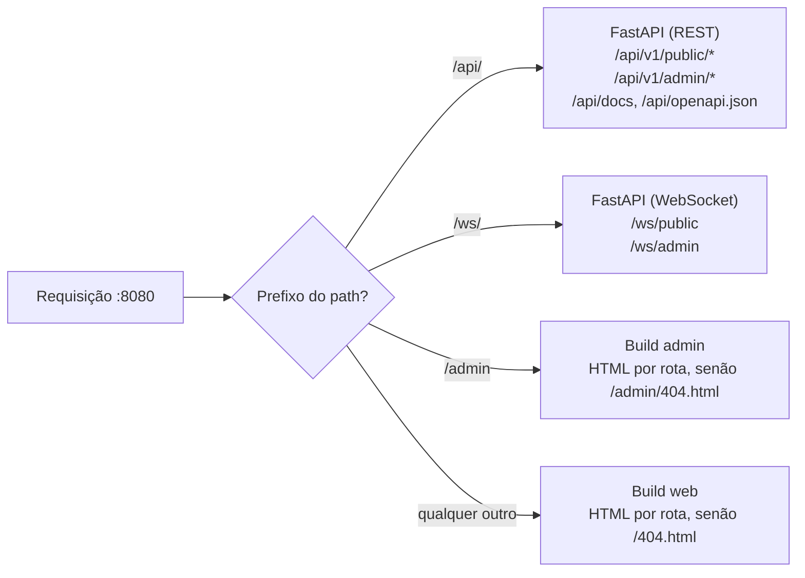
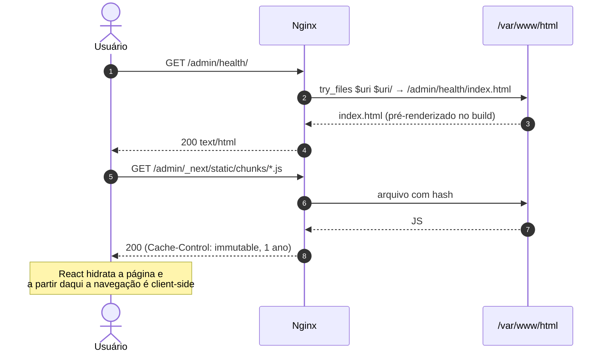
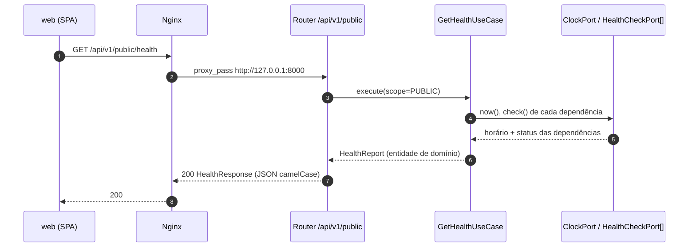
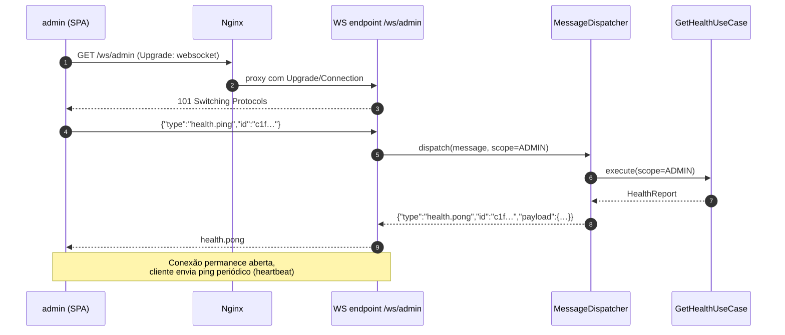
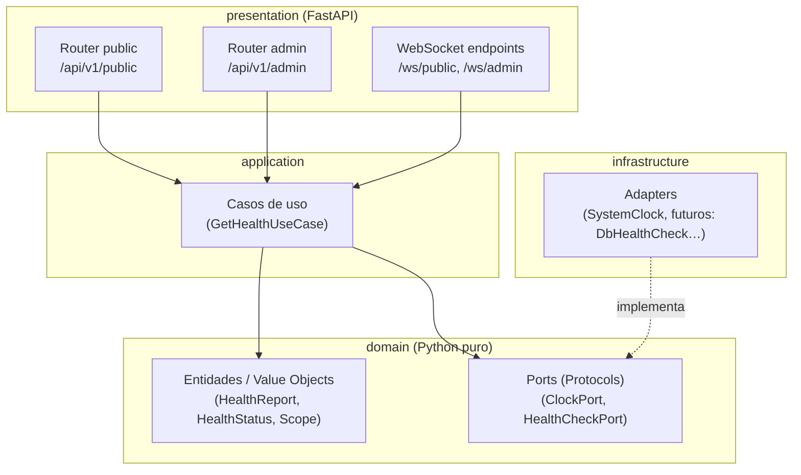
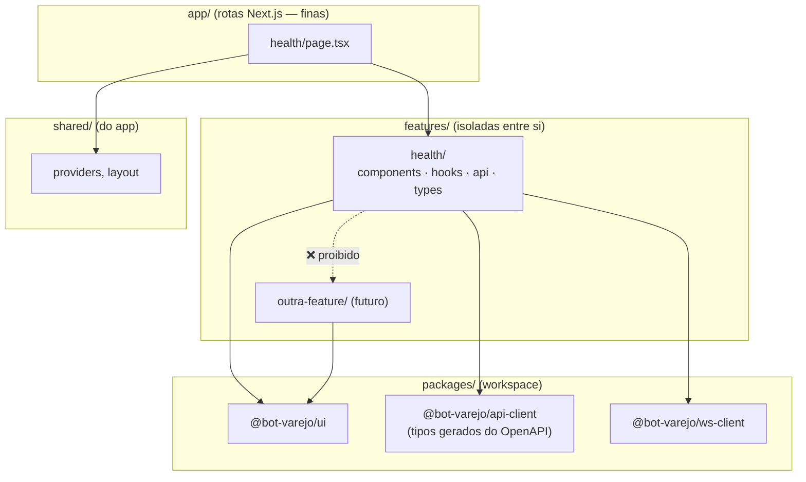
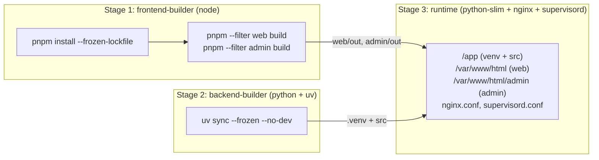
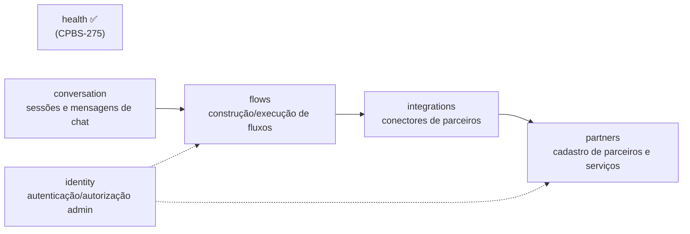

# 01 — Arquitetura

Os diagramas seguem a ideia do modelo **C4** (Contexto → Containers → Componentes), escritos em Mermaid.

## 1. Diagrama de contexto

Quem usa o sistema e com o que ele conversa (hoje e no futuro).

> Linhas tracejadas = fora do escopo da CPBS-275.

## 2. Diagrama de containers

O que roda, onde, e como se comunica. Tudo dentro de **uma única imagem Docker**.

### Responsabilidades

| Container / processo | Responsabilidade | Não é responsável por |
|----------------------|------------------|------------------------|
| **Nginx** | Porta de entrada única; roteia por prefixo de path; serve os builds estáticos (um HTML por rota + 404 de cada app); faz *upgrade* de WebSocket; headers de segurança e cache | Regras de negócio |
| **FastAPI/Uvicorn** | APIs REST (`/api/*`), WebSocket (`/ws/*`), OpenAPI/Swagger | Servir HTML/JS/CSS |
| **web** (build) | Interface do cliente final (escopo public) | Chamar serviços externos direto — tudo passa pela API |
| **admin** (build) | Interface administrativa (escopo admin) | Idem |
| **supervisord** | Subir e reiniciar Nginx e Uvicorn; logs em stdout/stderr | — |

## 3. Roteamento (visão lógica)

Todo o tráfego entra pelo Nginx e é decidido pelo **prefixo do path**. Detalhes em [03 — Nginx](./03-nginx-roteamento.md).

## 4. Fluxos de requisição

### 4.1 Carregamento da SPA

### 4.2 Health check via HTTP (escopo public)

### 4.3 Health check via WebSocket (escopo admin)

## 5. Arquitetura interna do backend (componentes)

Detalhada em [backend/](./backend/README.md). Visão resumida:

**Regra de dependência:** setas apontam sempre para dentro (`presentation → application → domain`). `infrastructure` implementa as *ports* do domínio e é injetada na composição (`main.py`/dependências).

## 6. Arquitetura interna dos frontends

Detalhada em [frontend-comum/](./frontend-comum/README.md) (regras dos dois fronts); particularidades de cada app em [web/](./web/README.md) e [admin/](./admin/README.md).

## 7. Pipeline de build da imagem

## 8. Evolução prevista (não implementar agora)

Para que a fundação já nasça preparada, os *bounded contexts* futuros ficam registrados:

Cada um será um pacote em `backend/src/bot_varejo/contexts/<nome>/` com as mesmas quatro camadas, e uma pasta em `features/` nos fronts que o consomem.
