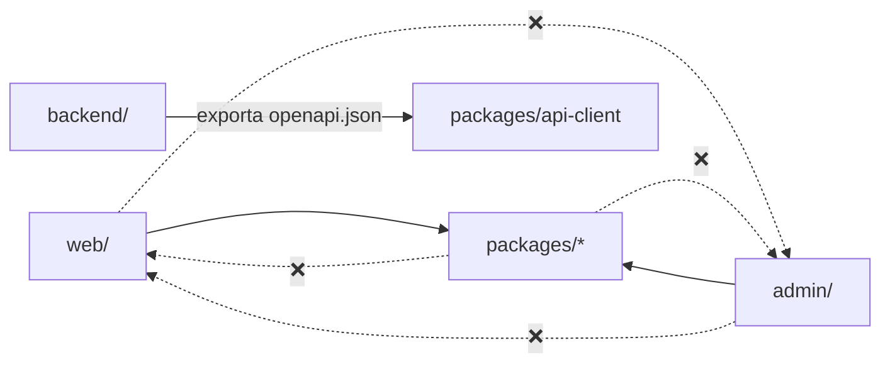

# 02 — Estrutura do repositório

Monorepo com **pnpm workspaces** (frontends + pacotes compartilhados) e um projeto Python gerenciado por **uv** (backend). Ver [ADR-0001](./adr/0001-monorepo.md).

## Visão geral

```text
bot-varejo/
├── backend/                     # API FastAPI (DDD) — ver docs/backend/
├── web/                         # Frontend escopo PUBLIC (Next.js SPA) — servido em /
├── admin/                       # Frontend escopo ADMIN (Next.js SPA) — servido em /admin
├── packages/                    # Código TypeScript compartilhado entre web e admin
│   ├── api-client/              #   cliente HTTP tipado, gerado do OpenAPI
│   ├── ws-client/               #   cliente WebSocket tipado (reconexão, heartbeat)
│   ├── ui/                      #   design system (componentes React + Tailwind)
│   └── config/                  #   configs compartilhadas (eslint, tsconfig, tailwind, vitest)
├── infra/
│   ├── docker/
│   │   └── Dockerfile           # imagem única multi-stage
│   ├── nginx/
│   │   ├── nginx.conf           # usado na imagem (produção e compose padrão)
│   │   ├── nginx.dev.conf       # usado no compose de desenvolvimento (hot reload)
│   │   └── snippets/            # proxy-headers, proxy-ws, security-headers
│   └── supervisord/
│       └── supervisord.conf     # sobe nginx + uvicorn no container
├── docs/                        # esta documentação
│   ├── backend/                 #   docs do backend
│   ├── web/                     #   docs do front public
│   ├── admin/                   #   docs do front admin
│   ├── frontend-comum/          #   docs comuns aos dois fronts (packages, padrões TS)
│   ├── adr/                     #   Architecture Decision Records
│   └── *.md                     #   docs transversais
├── .gitlab/
│   └── merge_request_templates/ # templates de MR: Default, Bugfix, Hotfix, Docs
├── scripts/
│   └── check-branch-name.sh     # valida o padrão de nome de branch (hook pre-push e CI)
├── .gitlab-ci.yml               # pipeline do GitLab CI
├── commitlint.config.mjs        # regras de mensagem de commit (Conventional Commits + Refs: CPBS-xxx)
├── .gitmessage                  # template de mensagem de commit (git config commit.template)
├── docker-compose.yml           # sobe a imagem única (igual à produção)
├── docker-compose.dev.yml       # desenvolvimento com hot reload
├── Makefile                     # atalhos: make dev, make test, make lint…
├── package.json                 # scripts raiz do workspace (lint/test/build de todos os fronts)
├── pnpm-workspace.yaml          # declara web, admin e packages/*
├── pnpm-lock.yaml
├── .editorconfig
├── .env.example                 # todas as variáveis de ambiente documentadas
├── .gitignore
├── .dockerignore
├── .pre-commit-config.yaml      # hooks: lint/format (pre-commit), commitlint (commit-msg), branch (pre-push)
├── .nvmrc                       # versão do Node (24)
├── .python-version              # versão do Python (3.13)
└── README.md                    # passo a passo para rodar localmente
```

## Estrutura detalhada por parte

| Parte | Documento |
|-------|-----------|
| `backend/` | [backend/01-estrutura.md](./backend/01-estrutura.md) |
| `web/` | [web/01-estrutura.md](./web/01-estrutura.md) |
| `admin/` | [admin/01-estrutura.md](./admin/01-estrutura.md) |
| `packages/` | [frontend-comum/03-pacotes-compartilhados.md](./frontend-comum/03-pacotes-compartilhados.md) |
| `infra/` | [03 — Nginx](./03-nginx-roteamento.md) · [04 — Docker](./04-docker-deploy.md) |
| `docs/` | [README da documentação](./README.md) |

## Regras de dependência entre pastas



| De → Para | Permitido? | Motivo |
|-----------|-----------|--------|
| `web` → `admin` (e vice-versa) | ❌ | Apps independentes; o que for comum sobe para `packages/` |
| `web`/`admin` → `packages/*` | ✅ | Reuso (DRY) |
| `packages/*` → `web`/`admin` | ❌ | Pacote não conhece quem o consome |
| `packages/ui` → `packages/api-client` | ❌ | UI é apresentacional, sem dados |
| `backend` → qualquer pasta de front | ❌ | Única ligação é o `openapi.json` gerado |

Essas regras são **garantidas por lint** (ver [frontend-comum — feature-based](./frontend-comum/02-arquitetura-feature-based.md#fronteiras-garantidas-por-lint)), não só por convenção.

## Arquivos gerados (não editar à mão)

| Arquivo | Gerado por | Comando |
|---------|-----------|---------|
| `packages/api-client/openapi.json` | backend | `make openapi` |
| `packages/api-client/src/schema.d.ts` | openapi-typescript | `make openapi` |
| `web/out/`, `admin/out/` | `next build` | `pnpm build` (ignorado no git) |
| `backend/.venv/` | uv | `uv sync` (ignorado no git) |
