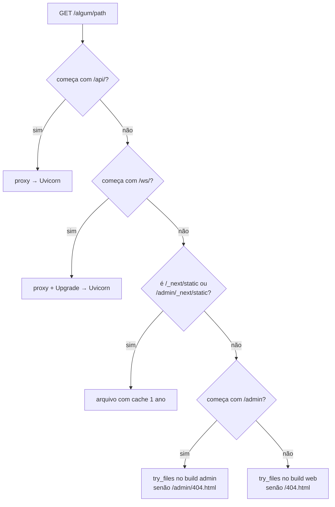
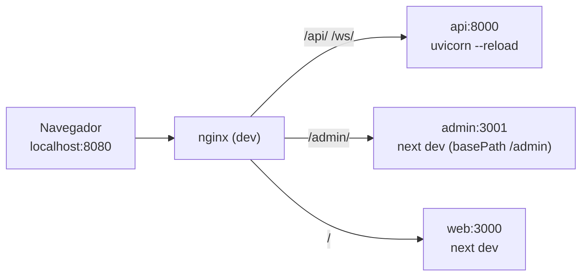

# 03 — Nginx e roteamento

O Nginx é a **única porta de entrada** (porta `8080` no container). Ele decide para onde vai cada requisição pelo **prefixo do path** ([ADR-0003](./adr/0003-roteamento-por-prefixo-de-path.md)).

## 1. Tabela de rotas

| Ordem | Location | Destino | Observações |
|-------|----------|---------|-------------|
| 1 | `/api/` | `upstream api` (Uvicorn `127.0.0.1:8000`) | REST, Swagger (`/api/docs`), OpenAPI (`/api/openapi.json`) |
| 2 | `/ws/` | `upstream api` com *Upgrade* | WebSocket — timeout de leitura longo |
| 3 | `~ ^/(admin/)?_next/static/` | arquivos | Assets com hash → cache de 1 ano, `immutable` |
| 4 | `= /admin` | `301 /admin/` | Normaliza a barra final |
| 5 | `/admin/` | `/var/www/html/admin/` | Build do admin; 404 → `/admin/404.html` |
| 6 | `/` | `/var/www/html/` | Build do web; 404 → `/404.html` |



## 2. Como as rotas das SPAs são resolvidas

Com `output: 'export'` + `trailingSlash: true`, o Next gera **um HTML por rota**:

```text
/var/www/html/
├── index.html                 ← web  "/"
├── health/index.html          ← web  "/health/"
├── 404.html                   ← web  página não encontrada
├── _next/static/...           ← assets do web
└── admin/
    ├── index.html             ← admin "/admin/"
    ├── health/index.html      ← admin "/admin/health/"
    ├── 404.html
    └── _next/static/...       ← assets do admin (basePath)
```

Por isso usamos `try_files $uri $uri/ =404` + `error_page 404` para a página 404 do próprio app — em vez de mandar tudo para `index.html`. Assim uma URL inexistente mostra "não encontrado" em vez de renderizar a home na URL errada. Rotas com parâmetro dinâmico (ex.: um fluxo por id) usam query string (`/admin/flows/?id=123`), que cai no HTML estático da rota.

## 3. `infra/nginx/nginx.conf` (imagem / produção)

```nginx
worker_processes auto;
pid /tmp/nginx.pid;                       # roda como usuário não-root
error_log /dev/stderr warn;

events {
    worker_connections 1024;
}

http {
    include       /etc/nginx/mime.types;
    default_type  application/octet-stream;

    # Diretórios temporários graváveis por não-root
    client_body_temp_path /tmp/client_body;
    proxy_temp_path       /tmp/proxy;
    fastcgi_temp_path     /tmp/fastcgi;
    uwsgi_temp_path       /tmp/uwsgi;
    scgi_temp_path        /tmp/scgi;

    log_format json escape=json '{"time":"$time_iso8601","requestId":"$request_id",'
        '"method":"$request_method","uri":"$request_uri","status":$status,'
        '"bytes":$body_bytes_sent,"durationMs":$request_time,"ua":"$http_user_agent"}';
    access_log /dev/stdout json;

    sendfile           on;
    server_tokens      off;
    absolute_redirect  off;               # redirects relativos: funciona atrás de qualquer porta/proxy
    client_max_body_size 10m;

    gzip on;
    gzip_types text/css application/javascript application/json image/svg+xml;

    map $http_upgrade $connection_upgrade {
        default upgrade;
        ''      close;
    }

    upstream api {
        server 127.0.0.1:8000;
        keepalive 16;
    }

    server {
        listen 8080;
        root   /var/www/html;
        index  index.html;

        # --- API REST ---------------------------------------------------
        location /api/ {
            proxy_pass         http://api;
            proxy_http_version 1.1;
            proxy_set_header   Connection "";
            include            /etc/nginx/snippets/proxy-headers.conf;
        }

        # --- WebSocket --------------------------------------------------
        location /ws/ {
            proxy_pass         http://api;
            proxy_http_version 1.1;
            proxy_set_header   Upgrade    $http_upgrade;
            proxy_set_header   Connection $connection_upgrade;
            include            /etc/nginx/snippets/proxy-headers.conf;
            proxy_read_timeout 1h;
            proxy_send_timeout 1h;
        }

        # --- Assets com hash (web e admin) -------------------------------
        location ~ ^/(admin/)?_next/static/ {
            include    /etc/nginx/snippets/security-headers.conf;
            add_header Cache-Control "public, max-age=31536000, immutable" always;
            try_files  $uri =404;
        }

        # --- Admin ------------------------------------------------------
        location = /admin {
            return 301 /admin/;
        }

        location /admin/ {
            include    /etc/nginx/snippets/security-headers.conf;
            add_header Cache-Control "no-cache" always;
            try_files  $uri $uri/ =404;
            error_page 404 /admin/404.html;
        }

        # --- Web (public) -----------------------------------------------
        location / {
            include    /etc/nginx/snippets/security-headers.conf;
            add_header Cache-Control "no-cache" always;
            try_files  $uri $uri/ =404;
            error_page 404 /404.html;
        }
    }
}
```

### `infra/nginx/snippets/proxy-headers.conf`

```nginx
proxy_set_header Host              $host;
proxy_set_header X-Real-IP         $remote_addr;
proxy_set_header X-Forwarded-For   $proxy_add_x_forwarded_for;
proxy_set_header X-Forwarded-Proto $scheme;
proxy_set_header X-Request-ID      $request_id;
```

### `infra/nginx/snippets/security-headers.conf`

```nginx
add_header X-Content-Type-Options "nosniff" always;
add_header X-Frame-Options        "DENY" always;
add_header Referrer-Policy        "strict-origin-when-cross-origin" always;
add_header Permissions-Policy     "camera=(), microphone=(), geolocation=()" always;
```

> ⚠️ **Pegadinha do Nginx:** um `add_header` dentro de uma `location` **anula** todos os `add_header` herdados do `server`. Por isso os headers de segurança ficam num *snippet* incluído em cada `location` que define headers próprios.

> Content-Security-Policy será adicionada quando houver definição de domínios de terceiros (fora de escopo).

## 4. `infra/nginx/nginx.dev.conf` (desenvolvimento com hot reload)

No dev, o Nginx roda em container próprio e aponta para os **dev servers** do Next e para o Uvicorn com `--reload`. A mesma origem (`localhost:8080`) é mantida, então o código do front é idêntico ao de produção.



```nginx
# trecho relevante — upstreams são os nomes de serviço do docker-compose.dev.yml
upstream api   { server api:8000; }
upstream web   { server web:3000; }
upstream admin { server admin:3001; }

map $http_upgrade $connection_upgrade { default upgrade; '' close; }

server {
    listen 8080;
    absolute_redirect off;

    location /api/   { proxy_pass http://api;   include /etc/nginx/snippets/proxy-ws.conf; }
    location /ws/    { proxy_pass http://api;   include /etc/nginx/snippets/proxy-ws.conf; proxy_read_timeout 1h; }
    location /admin  { proxy_pass http://admin; include /etc/nginx/snippets/proxy-ws.conf; }  # inclui HMR
    location /       { proxy_pass http://web;   include /etc/nginx/snippets/proxy-ws.conf; }  # inclui HMR
}
```

`proxy-ws.conf` = `proxy_http_version 1.1` + headers `Upgrade`/`Connection` + `proxy-headers.conf` — necessário também para o HMR do Next (`/_next/webpack-hmr` e `/admin/_next/webpack-hmr`).

## 5. Testes do roteamento

| Teste | Onde | Verifica |
|-------|------|----------|
| `nginx -t` | CI (build da imagem) | Sintaxe válida |
| Smoke E2E | Playwright contra `docker compose up` | `/` → web, `/admin/` → admin, `/api/v1/*/health` → 200, `/ws/*` → pong, `/nao-existe` → 404 do web, `/admin/nao-existe` → 404 do admin, `/admin` → 301 `/admin/` |
