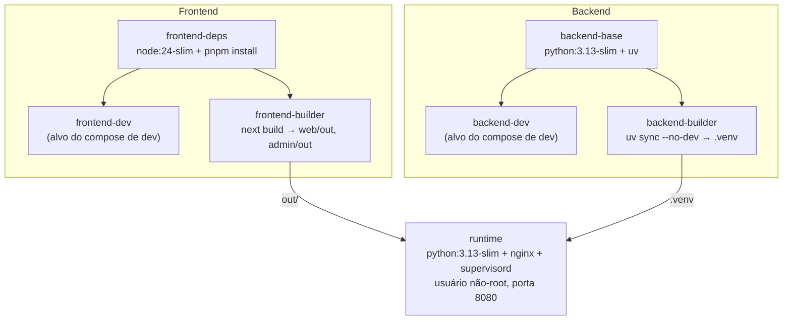
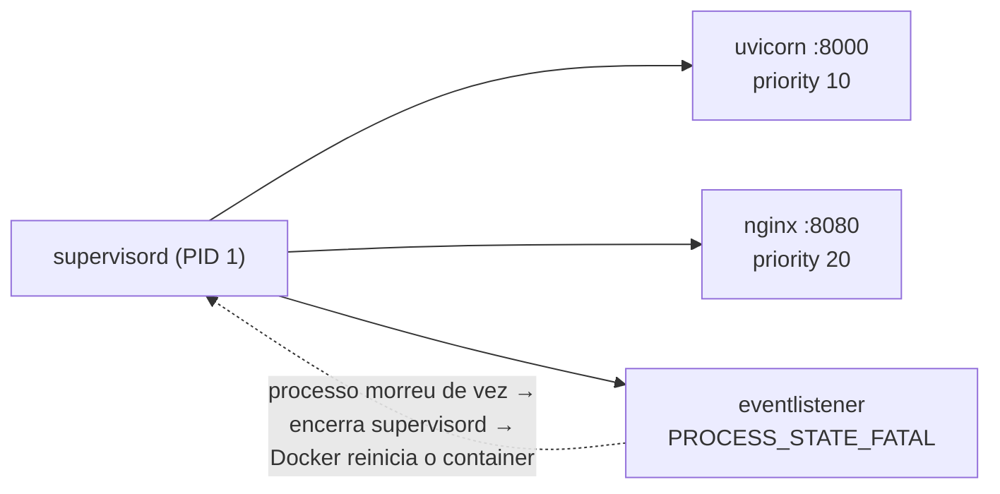
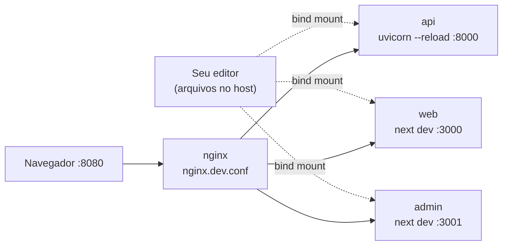
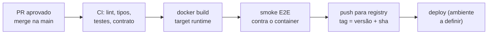

# 04 — Docker e deploy

Requisito da CPBS-275: **uma única aplicação/deploy** em **uma única imagem Docker**. A imagem contém Nginx (estáticos + roteamento) e Uvicorn (FastAPI), gerenciados por **supervisord** ([ADR-0002](./adr/0002-imagem-unica-nginx-uvicorn.md)).

## 1. Dockerfile multi-stage



### `infra/docker/Dockerfile`

```dockerfile
# syntax=docker/dockerfile:1
ARG NODE_VERSION=24
ARG PYTHON_VERSION=3.13

# ---------- Frontend ----------------------------------------------------------
FROM node:${NODE_VERSION}-slim AS frontend-deps
ENV PNPM_HOME=/pnpm PATH=/pnpm:$PATH
RUN corepack enable
WORKDIR /repo
# Só manifests primeiro → cache de dependências entre builds
COPY package.json pnpm-lock.yaml pnpm-workspace.yaml ./
COPY web/package.json web/
COPY admin/package.json admin/
COPY packages/config/package.json packages/config/
COPY packages/ui/package.json packages/ui/
COPY packages/api-client/package.json packages/api-client/
COPY packages/ws-client/package.json packages/ws-client/
RUN --mount=type=cache,id=pnpm,target=/pnpm/store pnpm install --frozen-lockfile

FROM frontend-deps AS frontend-dev
COPY packages ./packages
COPY web ./web
COPY admin ./admin

FROM frontend-deps AS frontend-builder
COPY packages ./packages
COPY web ./web
COPY admin ./admin
RUN pnpm --filter web build && pnpm --filter admin build

# ---------- Backend -----------------------------------------------------------
FROM python:${PYTHON_VERSION}-slim AS backend-base
# Fixar a tag exata do uv na implementação (nunca usar :latest em produção)
COPY --from=ghcr.io/astral-sh/uv:latest /uv /uvx /bin/
ENV UV_COMPILE_BYTECODE=1 UV_LINK_MODE=copy UV_PYTHON_DOWNLOADS=never
WORKDIR /app

FROM backend-base AS backend-dev
COPY backend/pyproject.toml backend/uv.lock ./
RUN --mount=type=cache,target=/root/.cache/uv uv sync --frozen --no-install-project
ENV PATH=/app/.venv/bin:$PATH PYTHONPATH=/app/src

FROM backend-base AS backend-builder
COPY backend/pyproject.toml backend/uv.lock ./
RUN --mount=type=cache,target=/root/.cache/uv uv sync --frozen --no-dev --no-install-project
COPY backend/src ./src
RUN --mount=type=cache,target=/root/.cache/uv uv sync --frozen --no-dev --no-editable

# ---------- Runtime (imagem final) --------------------------------------------
FROM python:${PYTHON_VERSION}-slim AS runtime
ARG APP_VERSION=0.1.0
ENV APP_VERSION=${APP_VERSION} \
    PATH=/app/.venv/bin:$PATH \
    PYTHONUNBUFFERED=1

RUN apt-get update \
 && apt-get install -y --no-install-recommends nginx supervisor curl \
 && rm -rf /var/lib/apt/lists/* /etc/nginx/sites-enabled/default \
 && useradd --system --uid 10001 --no-create-home app \
 && chown -R app:app /var/lib/nginx /var/log/nginx

COPY --from=backend-builder --chown=app:app /app/.venv /app/.venv
COPY --from=frontend-builder /repo/web/out   /var/www/html
COPY --from=frontend-builder /repo/admin/out /var/www/html/admin
COPY infra/nginx/nginx.conf             /etc/nginx/nginx.conf
COPY infra/nginx/snippets               /etc/nginx/snippets
COPY infra/supervisord/supervisord.conf /etc/supervisor/supervisord.conf
RUN nginx -t

USER app
EXPOSE 8080
HEALTHCHECK --interval=30s --timeout=3s --start-period=10s --retries=3 \
  CMD curl -fsS http://127.0.0.1:8080/api/v1/public/health || exit 1
CMD ["supervisord", "-c", "/etc/supervisor/supervisord.conf"]
```

Pontos importantes:

- O **HEALTHCHECK passa pelo Nginx** → valida Nginx **e** API de uma vez.
- Rodamos como usuário **não-root** (`app`, uid 10001); por isso Nginx escuta na `8080` e usa `/tmp` para pid e arquivos temporários.
- `web/out` é copiado **antes** de `admin/out` para dentro de `/var/www/html/admin` — o `web` nunca pode ter rota `/admin`.
- `.dockerignore` exclui `**/node_modules`, `**/.next`, `**/out`, `**/.venv`, `.git`, `docs/`.

## 2. supervisord



### `infra/supervisord/supervisord.conf`

```ini
[supervisord]
nodaemon=true
logfile=/dev/null
logfile_maxbytes=0
pidfile=/tmp/supervisord.pid

[program:api]
command=uvicorn bot_varejo.main:create_app --factory --host 127.0.0.1 --port 8000 --proxy-headers --forwarded-allow-ips=127.0.0.1
directory=/app
priority=10
autorestart=true
startsecs=2
stdout_logfile=/dev/stdout
stdout_logfile_maxbytes=0
stderr_logfile=/dev/stderr
stderr_logfile_maxbytes=0

[program:nginx]
command=nginx -g "daemon off;"
priority=20
autorestart=true
stdout_logfile=/dev/stdout
stdout_logfile_maxbytes=0
stderr_logfile=/dev/stderr
stderr_logfile_maxbytes=0

; Se um processo entrar em FATAL (não consegue reiniciar), derruba o container
; para que o orquestrador (Docker/K8s) o recrie — evita container "vivo pela metade".
[eventlistener:exit_on_fatal]
command=sh -c 'printf "READY\n"; while read -r line; do kill -QUIT $PPID; done'
events=PROCESS_STATE_FATAL
stdout_logfile=/dev/null
stderr_logfile=/dev/stderr
stderr_logfile_maxbytes=0
```

> **Workers:** 1 processo Uvicorn nesta fase. Quando houver estado de WebSocket compartilhado (chat), escalar exigirá *pub/sub* (ex.: Redis) ou *sticky sessions* — registrado como decisão futura.

## 3. Docker Compose

Dois arquivos, dois propósitos:

| Arquivo | Propósito | Comando |
|---------|-----------|---------|
| `docker-compose.yml` | Sobe **a imagem única**, idêntica à produção. É o critério de aceitação | `docker compose up --build` |
| `docker-compose.dev.yml` | Desenvolvimento com **hot reload** (Nginx + Uvicorn `--reload` + `next dev`) | `docker compose -f docker-compose.dev.yml up --build` |

### 3.1 `docker-compose.yml`

```yaml
name: bot-varejo

services:
  app:
    build:
      context: .
      dockerfile: infra/docker/Dockerfile
      target: runtime
      args:
        APP_VERSION: ${APP_VERSION:-0.1.0}
    image: bot-varejo:local
    ports:
      - "${HTTP_PORT:-8080}:8080"
    env_file:
      - path: .env
        required: false
    restart: unless-stopped
```

### 3.2 `docker-compose.dev.yml`



```yaml
name: bot-varejo-dev

x-frontend: &frontend
  build:
    context: .
    dockerfile: infra/docker/Dockerfile
    target: frontend-dev
  volumes:
    - ./web/src:/repo/web/src
    - ./web/public:/repo/web/public
    - ./admin/src:/repo/admin/src
    - ./admin/public:/repo/admin/public
    - ./packages/ui/src:/repo/packages/ui/src
    - ./packages/api-client/src:/repo/packages/api-client/src
    - ./packages/ws-client/src:/repo/packages/ws-client/src

services:
  nginx:
    image: nginx:stable-alpine
    ports:
      - "${HTTP_PORT:-8080}:8080"
    volumes:
      - ./infra/nginx/nginx.dev.conf:/etc/nginx/conf.d/default.conf:ro
      - ./infra/nginx/snippets:/etc/nginx/snippets:ro
    depends_on: [api, web, admin]

  api:
    build:
      context: .
      dockerfile: infra/docker/Dockerfile
      target: backend-dev
    command: uvicorn bot_varejo.main:create_app --factory --reload --reload-dir /app/src --host 0.0.0.0 --port 8000
    volumes:
      - ./backend/src:/app/src
    env_file:
      - path: .env
        required: false

  web:
    <<: *frontend
    command: pnpm --filter web dev --hostname 0.0.0.0 --port 3000

  admin:
    <<: *frontend
    command: pnpm --filter admin dev --hostname 0.0.0.0 --port 3001
```

> Só as pastas de código-fonte são montadas (para não sobrescrever os `node_modules` do container). Mudou `package.json`, `pyproject.toml`, `next.config.ts` ou algo em `packages/config`? Rode de novo com `--build`.

## 4. Portas

| Porta | Onde | Exposta no host? |
|-------|------|------------------|
| 8080 | Nginx (imagem e dev) | ✅ (`HTTP_PORT`) |
| 8000 | Uvicorn | ❌ (só `127.0.0.1` no container; na rede interna no dev) |
| 3000 | `next dev` web | ❌ (só dev, via Nginx) |
| 3001 | `next dev` admin | ❌ (só dev, via Nginx) |

## 5. Variáveis de ambiente

Documentadas também em `.env.example`.

| Variável | Padrão | Usada por | Descrição |
|----------|--------|-----------|-----------|
| `APP_ENV` | `local` | backend | `local` · `dev` · `staging` · `production` |
| `APP_VERSION` | `0.1.0` | backend, build | Versão exibida no health e no OpenAPI |
| `APP_LOG_LEVEL` | `INFO` | backend | `DEBUG` · `INFO` · `WARNING` · `ERROR` |
| `APP_DOCS_ENABLED` | `true` | backend | Liga `/api/docs`, `/api/redoc`, `/api/openapi.json` |
| `HTTP_PORT` | `8080` | compose | Porta publicada no host |

> Frontends **não** precisam de variáveis de URL: usam a mesma origem (`/api`, `/ws`). Variáveis `NEXT_PUBLIC_*`, se surgirem, são **embutidas no build** — mudar exige rebuild da imagem.

## 6. Pipeline de entrega (visão)



Detalhes em [07 — Fluxo de trabalho e CI](./07-fluxo-trabalho-ci.md). Infra de produção (TLS, domínio, orquestrador) está fora do escopo da CPBS-275.
