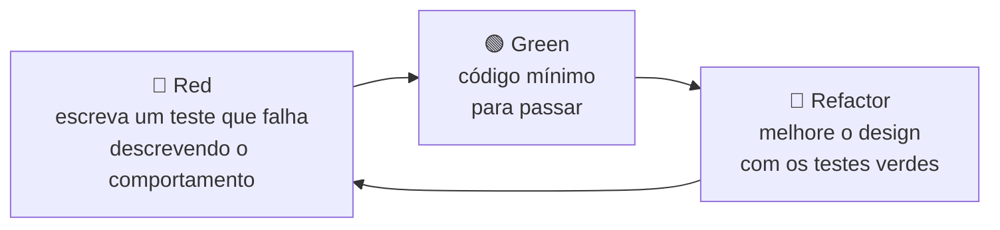
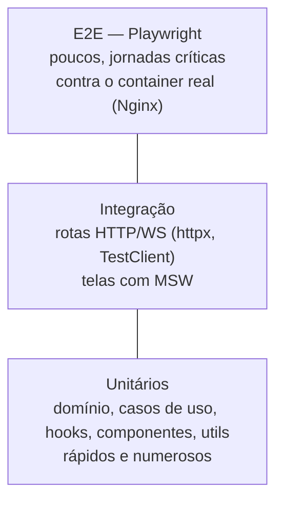

# 05 — Estratégia de testes

Regra do projeto: **toda feature, rota e tela deve ter teste**. Trabalhamos com **TDD**: o teste é escrito antes do código de produção e é parte do mesmo PR.

## 1. Ciclo TDD

## 2. Pirâmide

## 3. Matriz obrigatória — o que testar

| Artefato | Tipo de teste | Ferramenta | Obrigatório |
|----------|---------------|-----------|-------------|
| Entidade / value object | Unitário | pytest | ✅ |
| Caso de uso | Unitário com *fakes* das ports | pytest + pytest-asyncio | ✅ |
| Adapter de infraestrutura | Integração com o recurso real (ou container) | pytest | ✅ |
| **Rota HTTP** | Integração: status, schema, erros | pytest + httpx `AsyncClient` | ✅ **toda rota** |
| **Mensagem WebSocket** | Integração: request → response, erros | Starlette `TestClient` | ✅ **todo `type`** |
| Contrato OpenAPI | Contrato: `openapi.json` versionado = gerado | pytest | ✅ |
| Função `api/` do front | Unitário com MSW | Vitest + MSW | ✅ |
| Hook | Unitário (`renderHook`) | Vitest + Testing Library | ✅ |
| Componente de feature | Componente (render + interação) | Vitest + Testing Library | ✅ |
| Componente de `packages/ui` | Componente + acessibilidade básica | Vitest + Testing Library | ✅ |
| **Tela (rota Next)** | Render da `page.tsx` com providers | Vitest + Testing Library | ✅ **toda tela** |
| Jornada crítica | E2E via Nginx | Playwright | ✅ para cada tela nova (smoke) |
| Roteamento Nginx | Smoke E2E | Playwright / `curl` no CI | ✅ |

## 4. Convenções

| Item | Backend | Frontend |
|------|---------|----------|
| Local | `backend/tests/{unit,integration,contract}/` espelhando `src/` | `__tests__/` ao lado do código; E2E em `<app>/e2e/` |
| Nome do arquivo | `test_<modulo>.py` | `<Arquivo>.test.ts(x)`; E2E `<fluxo>.spec.ts` |
| Nome do teste | `test_<comportamento_esperado>_when_<condição>` | `it('exibe … quando …')` em pt-BR |
| Estrutura | Arrange / Act / Assert separados por linha em branco | idem |
| Dublês | *Fakes* que implementam as `Protocol` (sem `mock.patch` no domínio) | MSW para HTTP; `vi.mock` só para isolar hooks de WS |
| Dados | Factories (`build_health_report(...)`) | Factories (`buildHealth({...})`) em `src/test/factories/` |
| Seletores (front) | — | Por papel/texto acessível (`getByRole`); `data-testid` só quando não houver alternativa |

## 5. Cobertura mínima

| Projeto | Mínimo | Configuração |
|---------|--------|--------------|
| Backend | 90% linhas (global) | `[tool.coverage.report] fail_under = 90` |
| Frontends e packages | 80% linhas/branches | `coverage.thresholds` no `vitest.config.ts` |

Cobertura é **piso**, não meta: a regra principal continua sendo "todo comportamento tem teste".

## 6. Exemplos e infraestrutura por parte

| Parte | Documento |
|-------|-----------|
| Backend | [backend/07-testes.md](./backend/07-testes.md) — fakes, fixtures, unitário, rota, WebSocket, contrato |
| Frontends (comum) | [frontend-comum/06-testes.md](./frontend-comum/06-testes.md) — Vitest, MSW, `renderWithProviders`, factories, Playwright |
| Web | [web/03-testes.md](./web/03-testes.md) |
| Admin | [admin/03-testes.md](./admin/03-testes.md) |

## 7. Onde cada teste roda

| Etapa | Comando | Local | CI |
|-------|---------|-------|----|
| Unit + integração backend | `make test-backend` | ✅ | ✅ |
| Unit + componente front | `make test-frontend` | ✅ | ✅ |
| Contrato OpenAPI | incluído em `make test-backend` | ✅ | ✅ |
| E2E | `make e2e` (sobe `docker compose` antes) | ✅ | ✅ (após build da imagem) |
