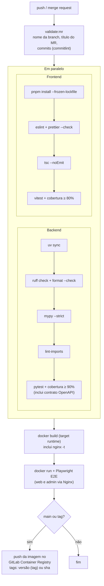

# 07 — Fluxo de trabalho e CI

Plataforma: **GitLab** (repositório, merge requests e GitLab CI — `.gitlab-ci.yml`).

## 1. Branches, commits e merge requests

Padrão completo em **[08 — Branches, commits e merge requests](./08-branches-commits-mr.md)**. Resumo:

| Item | Padrão |
|------|--------|
| Modelo | Trunk-based: `main` protegida + branches curtas |
| Branch | `<tipo>/CPBS-<numero>-<descricao>` — ex.: `feat/CPBS-275-fundacao-projeto` |
| Commit | Conventional Commits em pt-BR + rodapé `Refs: CPBS-<numero>` |
| Merge request | Título no formato de commit, template de `.gitlab/merge_request_templates/`, ≥ 1 aprovação, pipeline verde |
| Merge | Squash + fast-forward na `main` |
| Versão | Tag SemVer `vX.Y.Z` na `main` |

## 2. Pipeline de CI (GitLab CI)

Stages: `validate` → `test` → `build` → `e2e` → `publish`.

O job `validate:mr` está descrito em [08 §5.4](./08-branches-commits-mr.md#54-gitlab-ciyml--job-validatemr).

## 3. Makefile — atalhos padronizados

| Alvo | O que faz |
|------|-----------|
| `make setup` | `uv sync` no backend + `pnpm install` na raiz + `pre-commit install` (hooks de pre-commit, commit-msg e pre-push) + `git config commit.template .gitmessage` |
| `make up` | `docker compose up --build` (imagem única) |
| `make down` | `docker compose down` |
| `make dev` | `docker compose -f docker-compose.dev.yml up --build` (hot reload) |
| `make lint` | ruff + eslint + prettier --check + lint-imports |
| `make format` | ruff format + prettier --write |
| `make typecheck` | mypy + tsc em todos os pacotes |
| `make test` | `test-backend` + `test-frontend` |
| `make test-backend` | pytest com cobertura |
| `make test-frontend` | vitest em todos os pacotes |
| `make e2e` | sobe `docker compose` e roda Playwright de web e admin |
| `make openapi` | exporta `openapi.json` do backend e regenera `schema.d.ts` |
| `make build` | `docker build` da imagem final |
