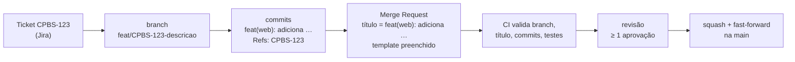
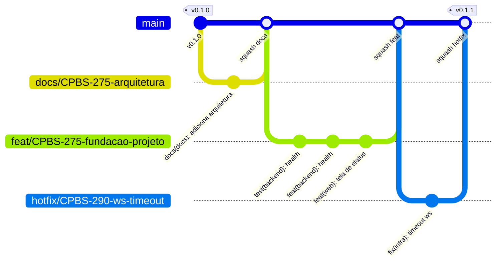
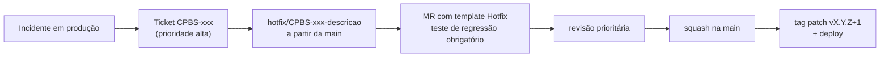
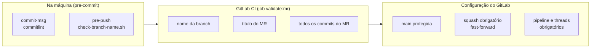

# 08 — Branches, commits e merge requests

Padrão obrigatório para todo o repositório (backend, web, admin, packages, infra e docs). Plataforma: **GitLab** ([ADR-0011](./adr/0011-padrao-branches-commits-mr.md)).

Resumo em uma linha: **branch** `tipo/CPBS-123-descricao` → **commits** Conventional Commits com `Refs: CPBS-123` → **MR** com título no formato de commit + template → *squash* na `main`.



## 1. Modelo de branches

**Trunk-based development**: a `main` é sempre estável e implantável; todo trabalho acontece em branches curtas que voltam para a `main` via MR.



### 1.1 Branches permanentes

| Branch | Regra |
|--------|-------|
| `main` | **Protegida.** Ninguém faz push direto; só entra via MR aprovado com pipeline verde. Force push proibido. Cada merge gera uma versão candidata a deploy |

Não usamos `develop`, `release/*` nem Git Flow: versões são **tags** na `main` (ver §4).

### 1.2 Nome das branches de trabalho

```text
<tipo>/<TICKET>-<descricao-curta>
```

| Parte | Regra | Exemplo |
|-------|-------|---------|
| `tipo` | Um dos tipos da tabela abaixo | `feat` |
| `TICKET` | Chave do Jira, **obrigatória**, em maiúsculas | `CPBS-275` |
| `descricao-curta` | 2 a 5 palavras, kebab-case, minúsculas, sem acentos | `fundacao-projeto` |
| Tamanho total | Máximo 60 caracteres | — |

Regex validada no hook local e no CI:

```text
^(feat|fix|hotfix|docs|test|refactor|perf|build|ci|chore)/CPBS-[0-9]+-[a-z0-9]+(-[a-z0-9]+)*$
```

| Tipo | Quando usar | Exemplo |
|------|-------------|---------|
| `feat` | Nova funcionalidade | `feat/CPBS-275-fundacao-projeto` |
| `fix` | Correção de bug (fluxo normal) | `fix/CPBS-301-ws-reconexao` |
| `hotfix` | Correção **urgente** de algo em produção | `hotfix/CPBS-290-ws-timeout` |
| `docs` | Somente documentação / ADR | `docs/CPBS-275-arquitetura` |
| `test` | Somente testes | `test/CPBS-305-e2e-admin` |
| `refactor` | Refatoração sem mudar comportamento | `refactor/CPBS-320-dispatcher-ws` |
| `perf` | Melhoria de performance | `perf/CPBS-330-cache-assets` |
| `build` | Docker, dependências, build | `build/CPBS-310-atualiza-next` |
| `ci` | Pipeline | `ci/CPBS-311-cache-pnpm` |
| `chore` | Manutenção geral | `chore/CPBS-312-limpa-scripts` |

✅ `feat/CPBS-275-fundacao-projeto`
❌ `feature/fundacao` (tipo inválido, sem ticket) · ❌ `feat/cpbs-275-Fundação` (ticket minúsculo, maiúscula, acento) · ❌ `oseas/teste` (sem padrão)

### 1.3 Regras de vida da branch

1. **Sempre** criar a partir da `main` atualizada: `git switch main && git pull && git switch -c feat/CPBS-123-descricao`.
2. **Uma branch = um ticket.** Ticket grande? Quebre em sub-tickets e MRs menores.
3. **Vida curta:** ideal até 3 dias. Branch parada fica desatualizada e gera conflito.
4. **Atualizar com rebase**, não com merge da `main`: `git fetch && git rebase origin/main`. Depois do rebase: `git push --force-with-lease` (nunca `--force` puro, e nunca na `main`).
5. **Apagar após o merge** (opção "Delete source branch" marcada por padrão no GitLab).

### 1.4 Hotfix



Mesmo fluxo de sempre, mas com template **Hotfix**, revisão prioritária e plano de rollback descrito no MR.

## 2. Commits — Conventional Commits

### 2.1 Formato

```text
<tipo>(<escopo>): <descrição>
                                        ← linha em branco
[corpo opcional: POR QUE a mudança foi feita]
                                        ← linha em branco
Refs: CPBS-123
[BREAKING CHANGE: descrição, se houver]
```

| Parte | Regra |
|-------|-------|
| `tipo` | Obrigatório — tabela §2.2 |
| `escopo` | Esperado (aviso se ausente) — tabela §2.3 |
| `descrição` | Obrigatória; **pt-BR**, verbo no presente (completa a frase "este commit…": *adiciona*, *corrige*, *remove*); começa com **minúscula**; **sem ponto final** |
| Cabeçalho | Máximo **72 caracteres** |
| Corpo | Opcional; explica o **porquê** e o contexto, não o "o quê" (o diff já mostra); linhas até 100 caracteres |
| `Refs: CPBS-123` | **Obrigatório** em todo commit — liga o commit ao ticket |
| `BREAKING CHANGE:` | Obrigatório quando quebra contrato (API, mensagem WS, pacote compartilhado). Também marcar `!` no cabeçalho |

### 2.2 Tipos

| Tipo | Uso | Gera versão |
|------|-----|-------------|
| `feat` | Nova funcionalidade para o usuário/consumidor | minor |
| `fix` | Correção de bug | patch |
| `perf` | Melhoria de performance | patch |
| `refactor` | Mudança de código sem alterar comportamento | — |
| `test` | Adiciona/ajusta testes, sem mudar produção | — |
| `docs` | Somente documentação | — |
| `style` | Formatação pura (sem mudança de lógica) | — |
| `build` | Dockerfile, dependências, build do Next/uv | — |
| `ci` | Pipeline do GitLab | — |
| `chore` | Manutenção que não se encaixa acima | — |
| `revert` | Reverte um commit anterior | — |

Qualquer tipo com `!` (ex.: `feat(backend)!:`) ou rodapé `BREAKING CHANGE:` gera versão **major**.

### 2.3 Escopos

| Escopo | Pasta / assunto |
|--------|-----------------|
| `backend` | `backend/` |
| `web` | `web/` |
| `admin` | `admin/` |
| `ui` | `packages/ui/` |
| `api-client` | `packages/api-client/` |
| `ws-client` | `packages/ws-client/` |
| `config` | `packages/config/` |
| `infra` | `infra/`, `docker-compose*.yml` |
| `docs` | `docs/` |
| `deps` | Atualização de dependências |
| `repo` | Arquivos da raiz, mudanças que atravessam várias partes |

Mudou backend **e** web no mesmo commit? Prefira **dois commits**. Se for inseparável (ex.: mudança de contrato + `make openapi`), use o escopo da origem da mudança (`backend`) e explique no corpo.

### 2.4 Exemplos

✅ Bons:

```text
feat(backend): adiciona health check por escopo

Expõe GET /api/v1/{public,admin}/health usando o mesmo caso de uso,
para que o Nginx e os fronts validem a comunicação ponta a ponta.

Refs: CPBS-275
```

```text
fix(ws-client): reconecta após queda de rede com backoff exponencial

Refs: CPBS-301
```

```text
feat(backend)!: renomeia campo uptime para uptimeSeconds no health

BREAKING CHANGE: consumidores do health devem ler `uptimeSeconds`.
Refs: CPBS-340
```

```text
test(admin): cobre tela de status com MSW

Refs: CPBS-275
```

❌ Ruins:

| Mensagem | Problema |
|----------|----------|
| `ajustes` | Sem tipo, sem escopo, sem ticket, não diz nada |
| `feat: Adicionado health.` | Maiúscula, particípio, ponto final, sem escopo e sem `Refs` |
| `fix(front): corrige bug` | Escopo inexistente; descrição vaga |
| `wip` | Commits de trabalho em andamento devem ser reescritos antes do MR (`git rebase -i` localmente, ou deixar o squash resolver) |

### 2.5 Boas práticas

- **Um commit = uma mudança lógica.** Facilita revisão e `git revert`.
- **TDD no histórico:** é bem-vindo o par `test(...)` → `feat(...)`, mostrando o teste antes da implementação.
- **Nada quebrado:** cada commit deveria passar em lint e testes.
- **Sem arquivos gerados** fora os previstos (`openapi.json`, `schema.d.ts`) e **sem segredos** — nunca.
- Template de commit disponível em `.gitmessage` (ativado pelo `make setup`: `git config commit.template .gitmessage`).

## 3. Merge Requests

### 3.1 Regras

| Regra | Valor |
|-------|-------|
| **Título** | Mesmo formato do cabeçalho de commit: `feat(backend): adiciona health check por escopo` (vira a mensagem do squash na `main`) |
| Em andamento | Prefixo `Draft:` no título — não pode ser mergeado |
| Template | Escolher o template do tipo de mudança (§3.2) e preencher **todas** as seções; o que não se aplica recebe "N/A" com motivo |
| Tamanho | Ideal **até ~400 linhas** alteradas (sem contar arquivos gerados). Maior que isso: quebrar |
| Aprovações | Mínimo **1**, de alguém que não seja o autor. Mudanças em `infra/`, contrato de API ou ADR: **2** (ver nota em §5.5 sobre o plano do GitLab) |
| Pipeline | Verde obrigatório (inclui validação de branch, título e commits) |
| Threads | Todas resolvidas antes do merge |
| Método de merge | **Squash** + **fast-forward** — histórico linear na `main`, 1 commit por MR |
| Branch de origem | Apagada após o merge |
| Autor | Faz o merge após aprovação (quem abriu é responsável por acompanhar o deploy) |

### 3.2 Templates disponíveis

Ficam em `.gitlab/merge_request_templates/` e aparecem no seletor **"Description → Choose a template"** ao criar o MR. O `Default.md` é aplicado automaticamente.

| Template | Arquivo | Usar para branches |
|----------|---------|--------------------|
| **Default** (feature/geral) | [`Default.md`](../.gitlab/merge_request_templates/Default.md) | `feat`, `refactor`, `perf`, `test`, `build`, `ci`, `chore` |
| **Bugfix** | [`Bugfix.md`](../.gitlab/merge_request_templates/Bugfix.md) | `fix` |
| **Hotfix** | [`Hotfix.md`](../.gitlab/merge_request_templates/Hotfix.md) | `hotfix` |
| **Docs** | [`Docs.md`](../.gitlab/merge_request_templates/Docs.md) | `docs` |

Seções comuns a todos: **ticket**, **contexto**, **o que mudou**, **partes afetadas** (backend/web/admin/packages/infra/docs), **como testar**, **checklist**. Cada template acrescenta o que é próprio do tipo (ex.: causa raiz no Bugfix, rollback no Hotfix).

Os templates terminam com *quick actions* do GitLab (`/assign me`, `/label ~...`) que se aplicam sozinhas ao criar o MR.

### 3.3 Labels

Criar no projeto do GitLab (Manage → Labels):

| Label | Cor sugerida | Aplicada por |
|-------|--------------|--------------|
| `feature` | azul | template Default |
| `bug` | vermelho | template Bugfix |
| `hotfix` | vermelho escuro | template Hotfix |
| `documentation` | cinza | template Docs |
| `backend`, `web`, `admin`, `packages`, `infra` | verde | autor, conforme partes afetadas |
| `breaking-change` | laranja | autor, quando houver `BREAKING CHANGE` |

### 3.4 Checklist de revisão (para quem revisa)

- [ ] O título e os commits seguem o padrão; o ticket faz sentido com a mudança.
- [ ] O código segue os padrões ([gerais](./06-padroes-gerais.md), [Python](./backend/08-padroes-python.md), [TypeScript](./frontend-comum/05-padroes-typescript.md)).
- [ ] Arquitetura respeitada: camadas DDD no backend, isolamento de features no front, nada de `web` ↔ `admin`.
- [ ] Toda rota/feature/tela nova ou alterada tem teste, e os testes testam comportamento (não implementação).
- [ ] Contrato mudou? `openapi.json` e `schema.d.ts` atualizados, [Contratos de API](./backend/05-contratos-api.md) atualizado, *breaking change* sinalizada.
- [ ] Documentação e ADR atualizados quando necessário.
- [ ] Sem segredos, logs de debug, código comentado ou TODO sem ticket.

Comentários de revisão: prefixar com **`bloqueante:`**, **`sugestão:`** ou **`dúvida:`** para deixar claro o que impede o merge.

## 4. Versionamento e tags

- **SemVer** (`vMAJOR.MINOR.PATCH`) em tags anotadas na `main`: `git tag -a v0.2.0 -m "v0.2.0"`.
- A versão é derivada dos commits desde a última tag (tabela §2.2): `feat` → minor, `fix`/`perf` → patch, breaking → major.
- Enquanto estivermos em `0.x`, breaking changes sobem o **minor**.
- A tag dispara o build da imagem com essa versão (`APP_VERSION`), ver [07 — Fluxo de trabalho e CI](./07-fluxo-trabalho-ci.md).
- Futuro (opcional): gerar `CHANGELOG.md` automaticamente a partir dos Conventional Commits.

## 5. Como o padrão é garantido

Três camadas — local (feedback rápido), CI (garantia) e configuração do GitLab (bloqueio).



### 5.1 `commitlint.config.mjs` (raiz)

Dependências na raiz do workspace: `@commitlint/cli` e `@commitlint/config-conventional`.

```js
const TYPES = ['feat', 'fix', 'perf', 'refactor', 'test', 'docs', 'style', 'build', 'ci', 'chore', 'revert'];
const SCOPES = [
  'backend', 'web', 'admin', 'ui', 'api-client', 'ws-client', 'config', 'infra', 'docs', 'deps', 'repo',
];

// O título do MR é validado com as mesmas regras, exceto o rodapé Refs (o ticket já está na branch).
const isMrTitle = process.env.COMMITLINT_MR_TITLE === '1';

export default {
  extends: ['@commitlint/config-conventional'],
  parserPreset: { parserOpts: { issuePrefixes: ['CPBS-'] } },
  rules: {
    'type-enum': [2, 'always', TYPES],
    'scope-enum': [2, 'always', SCOPES],
    'scope-empty': [1, 'never'],
    'header-max-length': [2, 'always', 72],
    'body-max-line-length': [2, 'always', 100],
    'references-empty': [isMrTitle ? 0 : 2, 'never'],
  },
};
```

### 5.2 `scripts/check-branch-name.sh`

```bash
#!/usr/bin/env bash
# Valida o nome da branch. Uso: check-branch-name.sh [nome]  (padrão: branch atual)
set -euo pipefail

branch="${1:-$(git rev-parse --abbrev-ref HEAD)}"
pattern='^(feat|fix|hotfix|docs|test|refactor|perf|build|ci|chore)/CPBS-[0-9]+-[a-z0-9]+(-[a-z0-9]+)*$'
max_length=60

if [[ "$branch" == "main" ]]; then
  exit 0
fi

if [[ "$branch" =~ $pattern ]] && (( ${#branch} <= max_length )); then
  exit 0
fi

echo "✖ Nome de branch inválido: '$branch'" >&2
echo "  Esperado: <tipo>/CPBS-<numero>-<descricao-em-kebab-case> (máx. $max_length caracteres)" >&2
echo "  Exemplo:  feat/CPBS-275-fundacao-projeto" >&2
echo "  Ver: docs/08-branches-commits-mr.md" >&2
exit 1
```

### 5.3 `.pre-commit-config.yaml` (trecho)

```yaml
default_install_hook_types: [pre-commit, commit-msg, pre-push]

repos:
  - repo: local
    hooks:
      - id: commitlint
        name: commitlint (mensagem de commit)
        entry: pnpm exec commitlint --edit
        language: system
        stages: [commit-msg]

      - id: branch-name
        name: nome da branch
        entry: scripts/check-branch-name.sh
        language: script
        pass_filenames: false
        always_run: true
        stages: [pre-push]
```

Instalados pelo `make setup` (`pre-commit install`).

### 5.4 `.gitlab-ci.yml` — job `validate:mr`

```yaml
stages: [validate, test, build, e2e, publish]

validate:mr:
  stage: validate
  image: node:24-slim
  rules:
    - if: $CI_PIPELINE_SOURCE == "merge_request_event"
  variables:
    GIT_DEPTH: 0          # histórico completo para validar todos os commits do MR
  before_script:
    - apt-get update && apt-get install -y --no-install-recommends git
    - corepack enable
    - pnpm install --frozen-lockfile
  script:
    - ./scripts/check-branch-name.sh "$CI_MERGE_REQUEST_SOURCE_BRANCH_NAME"
    - title="${CI_MERGE_REQUEST_TITLE#Draft: }"
    - echo "$title" | COMMITLINT_MR_TITLE=1 pnpm exec commitlint
    - pnpm exec commitlint --from "$CI_MERGE_REQUEST_DIFF_BASE_SHA" --to "$CI_COMMIT_SHA"
```

### 5.5 Configurações do projeto no GitLab

| Onde (GitLab) | Configuração |
|---------------|--------------|
| Settings → Repository → Protected branches | `main`: *Allowed to merge* = Maintainers (ou Developers + Maintainers); *Allowed to push and merge* = **No one**; *Allowed to force push* = **desligado** |
| Settings → Merge requests → Merge method | **Fast-forward merge** |
| Settings → Merge requests → Squash commits | **Require** |
| Settings → Merge requests → Squash commit message template | `%{title}` + linha em branco + `%{all_commits}` (preserva os `Refs: CPBS-xxx` no histórico) |
| Settings → Merge requests → Merge checks | ✅ *Pipelines must succeed* · ✅ *All threads must be resolved* |
| Settings → Merge requests → Merge options | ✅ *Delete source branch by default* |
| Settings → Merge requests → Approvals | Mínimo 1; autor não pode aprovar o próprio MR |
| Settings → Repository → Push rules *(se o plano tiver)* | Branch name regex = a do §1.2; Commit message regex opcional — reforço no servidor além do CI |
| Settings → Integrations → Jira *(se usado)* | Ativar para que `CPBS-xxx` em branch, commit e MR crie o link automaticamente no ticket |

> **Nota sobre o plano do GitLab:** aprovações **obrigatórias**, regras de aprovação por caminho (ex.: 2 aprovações para `infra/`, via `CODEOWNERS`) e *Push rules* são recursos dos planos pagos (Premium/Ultimate). No plano Free, essas regras valem **por convenção** (checklist de revisão) e a garantia técnica fica com o CI (`validate:mr`) + branch protegida + *Pipelines must succeed*.

## 6. Cola rápida

```bash
# começar
git switch main && git pull
git switch -c feat/CPBS-123-minha-feature

# commitar (abre o editor com o template .gitmessage)
git add -p
git commit

# atualizar com a main
git fetch && git rebase origin/main
git push --force-with-lease

# abrir o MR: título "feat(web): adiciona ..." + template Default
```
