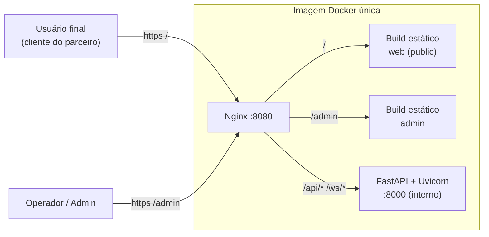

# Documentação — Bot Varejo

> Task de origem: **CPBS-275** — fundação do projeto de atendimento de serviços de parceiros de varejo via chat.

Esta pasta é a fonte de verdade sobre **como** e **por que** o projeto é estruturado. Toda decisão de arquitetura, padrão ou convenção deve estar registrada aqui antes (ou junto) do código que a implementa.

## Organização

```text
docs/
├── README.md                  ← você está aqui
├── 00…08-*.md                 ← transversal: visão, arquitetura, infra, testes, padrões, fluxo, git
├── backend/                   ← tudo sobre backend/   (API FastAPI)
├── web/                       ← tudo sobre web/       (front escopo public)
├── admin/                     ← tudo sobre admin/     (front escopo admin)
├── frontend-comum/            ← o que vale para web E admin (packages/, padrões TS, testes)
├── adr/                       ← registro de decisões de arquitetura
└── glossario.md
```

## Transversal (o sistema como um todo)

| # | Documento | Conteúdo |
|---|-----------|----------|
| 00 | [Visão geral e escopo](./00-visao-geral.md) | Contexto, objetivo da CPBS-275, critérios de aceitação, fora de escopo |
| 01 | [Arquitetura](./01-arquitetura.md) | Diagramas de contexto, containers, runtime, fluxos de requisição |
| 02 | [Estrutura do repositório](./02-estrutura-repositorio.md) | Visão geral do monorepo e regras de dependência entre pastas |
| 03 | [Nginx e roteamento](./03-nginx-roteamento.md) | Tabela de rotas, configuração, proxy WS |
| 04 | [Docker e deploy](./04-docker-deploy.md) | Imagem única multi-stage, supervisord, docker compose, variáveis |
| 05 | [Estratégia de testes](./05-estrategia-testes.md) | TDD, pirâmide, matriz obrigatória, cobertura |
| 06 | [Padrões gerais de código](./06-padroes-gerais.md) | Convenções da API, boas práticas gerais, formatação |
| 07 | [Fluxo de trabalho e CI](./07-fluxo-trabalho-ci.md) | Pipeline do GitLab CI, Makefile |
| 08 | [Branches, commits e merge requests](./08-branches-commits-mr.md) | Padrão de branch, Conventional Commits, regras e templates de MR, versionamento, validações |
| — | [ADRs](./adr/README.md) | Decisões de arquitetura |
| — | [Glossário](./glossario.md) | Termos de domínio e técnicos |

## Por parte do sistema

| Parte | Pasta no repo | Documentação | Principais documentos |
|-------|---------------|--------------|------------------------|
| **Backend** | `backend/` | [backend/](./backend/README.md) | [DDD](./backend/02-arquitetura-ddd.md) · [Context health](./backend/03-context-health.md) · [WebSocket](./backend/04-websocket.md) · [Contratos de API](./backend/05-contratos-api.md) · [Testes](./backend/07-testes.md) · [Padrões Python](./backend/08-padroes-python.md) |
| **Web** (public) | `web/` | [web/](./web/README.md) | [Estrutura](./web/01-estrutura.md) · [Feature health](./web/02-feature-health.md) · [Testes](./web/03-testes.md) |
| **Admin** | `admin/` | [admin/](./admin/README.md) | [Estrutura](./admin/01-estrutura.md) · [Feature health](./admin/02-feature-health.md) · [Testes](./admin/03-testes.md) |
| **Frontend comum** | `packages/` + regras dos dois fronts | [frontend-comum/](./frontend-comum/README.md) | [Static export](./frontend-comum/01-nextjs-static-export.md) · [Feature-based](./frontend-comum/02-arquitetura-feature-based.md) · [Pacotes](./frontend-comum/03-pacotes-compartilhados.md) · [Padrões TS](./frontend-comum/05-padroes-typescript.md) · [Testes](./frontend-comum/06-testes.md) |

## Resumo em uma imagem



## Como manter esta documentação

1. Mudou algo **só de uma parte**? Atualize a pasta dela (`backend/`, `web/`, `admin/`). Se afeta os dois fronts, `frontend-comum/`.
2. Mudou algo que **cruza partes** (roteamento, Docker, contrato entre front e back)? Atualize o documento transversal **e** o da parte.
3. Mudou uma decisão? Crie um novo ADR (não edite o antigo — marque-o como *Substituído*).
4. Novo endpoint ou mensagem WS? Atualize [backend/05-contratos-api.md](./backend/05-contratos-api.md).
5. Nova tela? Atualize a tabela "Telas" do README do app ([web](./web/README.md#telas-rotas) / [admin](./admin/README.md#telas-rotas)).
6. Diagramas são escritos em **Mermaid** dentro do próprio Markdown, para serem versionados e revisados em PR como código.
