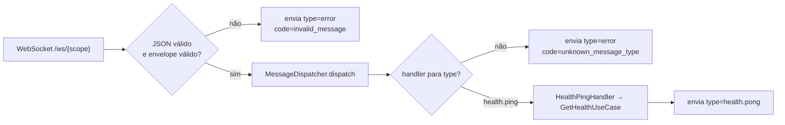

# Backend — WebSocket

## Desenho

- Um endpoint por escopo: `/ws/public` e `/ws/admin`.
- Mensagens em JSON com **envelope único** (`type`, `id`, `payload`) — ver [Contratos de API — WebSocket](./05-contratos-api.md#protocolo-websocket).
- Um `MessageDispatcher` roteia por `type` para *handlers* registrados no container (**Open/Closed**: nova mensagem = novo handler, sem tocar no loop).
- Handlers chamam **os mesmos casos de uso** do HTTP — nada de lógica duplicada.



## `core/websocket/messages.py`

```python
from typing import Any

from pydantic import Field

from bot_varejo.core.schemas import BaseSchema


class WsMessage(BaseSchema):
    type: str
    id: str | None = None
    payload: dict[str, Any] = Field(default_factory=dict)


def ws_error(code: str, message: str, *, request_id: str | None = None) -> WsMessage:
    return WsMessage(type="error", id=request_id, payload={"code": code, "message": message})
```

## `core/websocket/dispatcher.py`

```python
from collections.abc import Awaitable, Callable

from bot_varejo.core.scope import Scope
from bot_varejo.core.websocket.messages import WsMessage, ws_error

WsHandler = Callable[[WsMessage, Scope], Awaitable[WsMessage]]


class MessageDispatcher:
    def __init__(self) -> None:
        self._handlers: dict[str, WsHandler] = {}

    def register(self, message_type: str, handler: WsHandler) -> None:
        if message_type in self._handlers:
            raise ValueError(f"Handler já registrado para '{message_type}'")
        self._handlers[message_type] = handler

    async def dispatch(self, message: WsMessage, scope: Scope) -> WsMessage:
        handler = self._handlers.get(message.type)
        if handler is None:
            return ws_error(
                "unknown_message_type",
                f"Tipo de mensagem não suportado: {message.type}",
                request_id=message.id,
            )
        return await handler(message, scope)
```

## `contexts/health/presentation/ws_handlers.py`

```python
from bot_varejo.core.scope import Scope
from bot_varejo.core.websocket.messages import WsMessage
from bot_varejo.contexts.health.application.get_health import GetHealthUseCase
from bot_varejo.contexts.health.presentation.schemas import HealthResponse


class HealthPingHandler:
    def __init__(self, use_case: GetHealthUseCase) -> None:
        self._use_case = use_case

    async def __call__(self, message: WsMessage, scope: Scope) -> WsMessage:
        report = await self._use_case.execute(scope)
        return WsMessage(
            type="health.pong",
            id=message.id,
            payload=HealthResponse.from_domain(report).model_dump(mode="json", by_alias=True),
        )
```

## `api/websocket.py`

```python
import logging
from typing import Annotated

from fastapi import APIRouter, Depends, WebSocket, WebSocketDisconnect
from pydantic import ValidationError

from bot_varejo.container import Container, get_container
from bot_varejo.core.scope import Scope
from bot_varejo.core.websocket.messages import WsMessage, ws_error

logger = logging.getLogger(__name__)
ws_router = APIRouter()


async def serve_socket(websocket: WebSocket, scope: Scope, container: Container) -> None:
    await websocket.accept()
    try:
        while True:
            raw = await websocket.receive_text()
            try:
                message = WsMessage.model_validate_json(raw)
            except ValidationError:
                reply = ws_error("invalid_message", "Envelope inválido")
            else:
                reply = await container.ws_dispatcher.dispatch(message, scope)
            await websocket.send_text(reply.model_dump_json(by_alias=True))
    except WebSocketDisconnect:
        logger.info("ws.disconnected", extra={"scope": scope.value})


@ws_router.websocket("/ws/public")
async def public_socket(
    websocket: WebSocket, container: Annotated[Container, Depends(get_container)]
) -> None:
    await serve_socket(websocket, Scope.PUBLIC, container)


@ws_router.websocket("/ws/admin")
async def admin_socket(
    websocket: WebSocket, container: Annotated[Container, Depends(get_container)]
) -> None:
    await serve_socket(websocket, Scope.ADMIN, container)
```

> WebSocket **não aparece no OpenAPI** (limitação da especificação). O protocolo é documentado em [Contratos de API — WebSocket](./05-contratos-api.md#protocolo-websocket) e os tipos TS ficam em `@bot-varejo/ws-client`.
