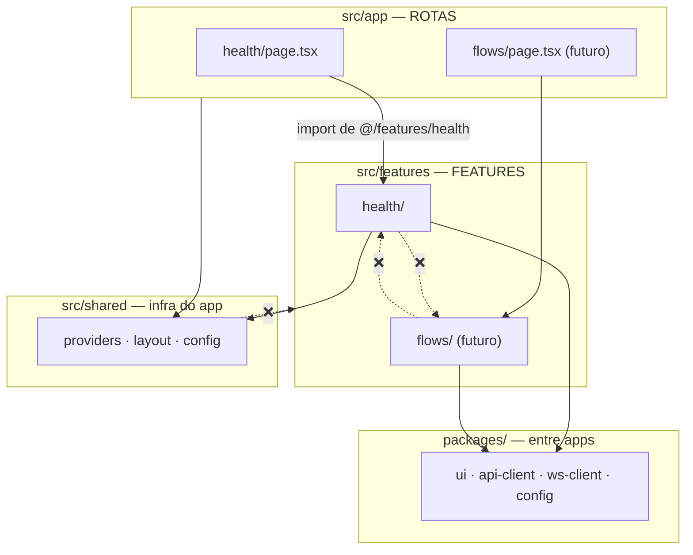

# Frontend comum — Arquitetura feature-based

Objetivo declarado: **mexer em uma feature sem interferir nas demais**.



## Regras

| # | Regra | Por quê |
|---|-------|---------|
| 1 | `app/` só **compõe**: importa componentes de features e layout. Zero lógica, zero fetch | Rota é fina; comportamento é testado na feature |
| 2 | Uma feature **não importa outra feature** | Isolamento; comunicação entre features acontece na rota (composição) ou via estado de servidor (TanStack Query keys) |
| 3 | Import externo de uma feature **só pelo `index.ts`** dela | O `index.ts` é a API pública; o resto é detalhe interno livre para refatorar |
| 4 | `shared/` não importa `features/` | Evita dependência circular |
| 5 | Código útil para **os dois apps** sobe para `packages/` | DRY entre apps |
| 6 | Todo arquivo de feature tem teste ao lado (`__tests__/`) | "Toda feature, rota, tela deve ter teste" |
| 7 | Componentes de `packages/ui` são **apresentacionais** (sem fetch, sem estado de servidor) | Reuso e testabilidade |

> **Regra de três para promover features:** quando uma feature for idêntica nos dois apps, primeiro mantemos duplicada (health é pequena e cada app fala com o seu escopo). No segundo caso real de duplicação relevante, extraímos para `packages/feature-<nome>`.

## Anatomia de uma feature

```text
features/<nome-da-feature>/
├── index.ts          # API pública — exporta só o que as rotas usam
├── api/              # funções que falam com o backend (usam @bot-varejo/api-client)
├── hooks/            # hooks React (TanStack Query, WS, estado local)
├── components/       # componentes específicos da feature
├── types.ts          # tipos da feature (derivados do OpenAPI quando possível)
├── utils/            # funções puras (opcional)
└── __tests__/        # testes de tudo acima
```

## Fronteiras garantidas por lint

```js
// packages/config/eslint/boundaries.mjs (ilustrativo — sintaxe final conforme versão do plugin)
export const boundariesConfig = {
  settings: {
    'boundaries/elements': [
      { type: 'app', pattern: 'src/app/**' },
      { type: 'feature', pattern: 'src/features/*', capture: ['featureName'] },
      { type: 'shared', pattern: 'src/shared/**' },
    ],
  },
  rules: {
    'boundaries/element-types': ['error', {
      default: 'disallow',
      rules: [
        { from: 'app', allow: ['feature', 'shared'] },
        { from: 'feature', allow: ['shared', ['feature', { featureName: '${from.featureName}' }]] },
        { from: 'shared', allow: ['shared'] },
      ],
    }],
    'boundaries/entry-point': ['error', {
      default: 'allow',
      rules: [{ target: 'feature', disallow: '**', allow: 'index.ts' }],
    }],
    'no-restricted-imports': ['error', {
      patterns: [
        { group: ['../../*'], message: 'Use o alias @/ em vez de caminhos relativos longos.' },
        { group: ['web/*', 'admin/*'], message: 'Apps não importam um do outro. Use packages/.' },
      ],
    }],
  },
};
```
