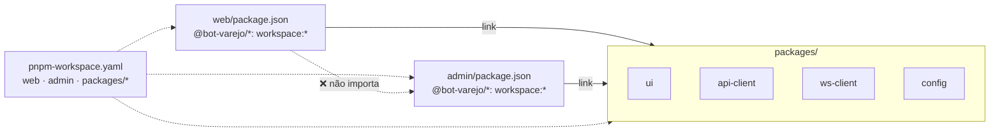
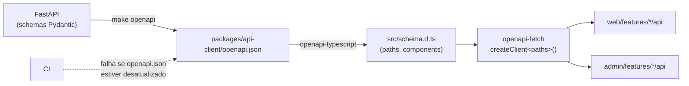

# Frontend comum — Pacotes compartilhados (`packages/`)

## Estrutura

```text
packages/
├── api-client/
│   ├── package.json              # name: "@bot-varejo/api-client"
│   ├── openapi.json              # exportado do backend (versionado)
│   ├── src/
│   │   ├── index.ts              # export { apiClient, ApiError, type components }
│   │   ├── schema.d.ts           # GERADO por openapi-typescript — não editar
│   │   ├── client.ts             # instância openapi-fetch (baseUrl relativa)
│   │   └── errors.ts             # ApiError tipado
│   └── __tests__/client.test.ts
├── ws-client/
│   ├── package.json              # name: "@bot-varejo/ws-client"
│   ├── src/
│   │   ├── index.ts
│   │   ├── createWsClient.ts     # conexão, reconexão exponencial, heartbeat
│   │   ├── buildWsUrl.ts         # ws(s)://host/ws/{scope} a partir de window.location
│   │   └── types.ts              # WsMessage<TType, TPayload>
│   └── __tests__/
├── ui/
│   ├── package.json              # name: "@bot-varejo/ui"
│   ├── src/
│   │   ├── index.ts
│   │   ├── Button/
│   │   │   ├── Button.tsx
│   │   │   └── Button.test.tsx
│   │   ├── Card/
│   │   └── StatusDot/
│   └── README.md
└── config/
    ├── package.json              # name: "@bot-varejo/config"
    ├── eslint/index.mjs          # regras base + boundaries
    ├── tsconfig/base.json        # strict: true, noUncheckedIndexedAccess…
    ├── tailwind/theme.css        # tokens (cores, fontes) compartilhados
    ├── prettier/index.mjs
    └── vitest/base.ts
```

## Responsabilidades

| Pacote | Conteúdo | Depende de |
|--------|----------|------------|
| `@bot-varejo/config` | ESLint, Prettier, `tsconfig` base, tema Tailwind, config base do Vitest | — |
| `@bot-varejo/ui` | Design system: `Button`, `Card`, `StatusDot`… (React + Tailwind) | `config` |
| `@bot-varejo/api-client` | Cliente HTTP tipado gerado do OpenAPI do backend | `config` |
| `@bot-varejo/ws-client` | Cliente WebSocket tipado com reconexão e heartbeat | `config` |

Os pacotes são consumidos **como código-fonte TypeScript** (via `transpilePackages`), sem etapa de build própria — KISS.

## Como web e admin consomem os pacotes

`web` e `admin` são **dois projetos Next.js independentes** (cada um com seu `package.json`, `next.config.ts`, build e testes) que vivem no mesmo **workspace pnpm**. O código compartilhado **não é copiado** nem publicado em registry: cada app declara os pacotes como dependência `workspace:*` e o pnpm cria um link para a pasta local em `packages/`.



### 1. `pnpm-workspace.yaml` (raiz) — declara os projetos do workspace

```yaml
packages:
  - web
  - admin
  - packages/*
```

### 2. `web/package.json` — o app declara os pacotes que usa

```json
{
  "name": "web",
  "private": true,
  "scripts": {
    "dev": "next dev",
    "build": "next build",
    "test": "vitest run",
    "e2e": "playwright test",
    "lint": "eslint .",
    "typecheck": "tsc --noEmit"
  },
  "dependencies": {
    "@bot-varejo/api-client": "workspace:*",
    "@bot-varejo/ui": "workspace:*",
    "@bot-varejo/ws-client": "workspace:*",
    "@tanstack/react-query": "...",
    "next": "...",
    "react": "...",
    "react-dom": "..."
  },
  "devDependencies": {
    "@bot-varejo/config": "workspace:*"
  }
}
```

O `admin/package.json` é igual, só muda `"name": "admin"`. As versões das libs externas (`"..."`) ficam fixadas no `pnpm-lock.yaml` na hora da implementação.

> `workspace:*` quer dizer "use a versão local deste pacote que está no workspace". Uma alteração em `packages/ui` aparece **na hora** nos dois apps, sem publicar versão.

### 3. `packages/ui/package.json` — o pacote expõe o código-fonte

```json
{
  "name": "@bot-varejo/ui",
  "version": "0.0.0",
  "private": true,
  "type": "module",
  "exports": {
    ".": "./src/index.ts"
  },
  "peerDependencies": {
    "react": "*"
  },
  "devDependencies": {
    "@bot-varejo/config": "workspace:*"
  }
}
```

- `exports` aponta direto para `src/index.ts`, então **só é importável o que o `index.ts` exporta** (API pública do pacote, igual às features).
- `react` é `peerDependency`: o pacote usa o React **do app**, evitando duas cópias do React no bundle.
- `api-client` e `ws-client` seguem o mesmo formato.

### 4. `packages/config/package.json` — configs compartilhadas

```json
{
  "name": "@bot-varejo/config",
  "version": "0.0.0",
  "private": true,
  "type": "module",
  "exports": {
    "./eslint": "./eslint/index.mjs",
    "./prettier": "./prettier/index.mjs",
    "./vitest": "./vitest/base.ts",
    "./tsconfig/*": "./tsconfig/*",
    "./tailwind/*": "./tailwind/*"
  }
}
```

Uso nos apps:

```jsonc
// web/tsconfig.json
{
  "extends": "@bot-varejo/config/tsconfig/base.json",
  "compilerOptions": { "paths": { "@/*": ["./src/*"] } },
  "include": ["src", "e2e", "next-env.d.ts"]
}
```

```js
// web/eslint.config.mjs
import baseConfig from '@bot-varejo/config/eslint';

export default [...baseConfig];
```

```css
/* web/src/app/globals.css */
@import 'tailwindcss';
@import '@bot-varejo/config/tailwind/theme.css';
@source '../../../packages/ui/src';
```

### 5. `next.config.ts` — o Next compila o código dos pacotes

```ts
transpilePackages: ['@bot-varejo/ui', '@bot-varejo/api-client', '@bot-varejo/ws-client'],
```

Como os pacotes expõem `.ts`/`.tsx` sem build próprio, o Next precisa transpilar esse código junto com o app. Configuração completa em [01 — Next.js static export](./01-nextjs-static-export.md).

### 6. Uso no código do app

```ts
// web/src/features/health/components/HealthStatusCard.tsx
import { Card, StatusDot } from '@bot-varejo/ui';          // pacote do workspace
import { useHealth } from '../hooks/useHealth';            // interno da feature
```

Nunca importar por caminho relativo (`../../../packages/ui/src/Card`): sempre pelo nome do pacote.

### 7. Instalação

Um único `pnpm install` **na raiz** instala tudo e cria os links dos dois apps para os pacotes. Para rodar um comando em um app só: `pnpm --filter web <script>` / `pnpm --filter admin <script>`.

### Onde colocar código novo

| Situação | Onde fica |
|----------|-----------|
| Só um app usa | `web/src/features/...` ou `admin/src/features/...` |
| Os dois apps usam do mesmo jeito | `packages/<pacote>` |
| Na dúvida | Começa no app; sobe para `packages/` quando o segundo app realmente precisar (regra de três, ver [feature-based](./02-arquitetura-feature-based.md)) |

## Fluxo de geração do cliente HTTP



Mudou um schema no backend? Rode `make openapi`: o TypeScript passa a acusar erro em todo lugar do front que usa o contrato antigo.

## `packages/api-client/src/client.ts`

```ts
import createClient from 'openapi-fetch';

import type { paths } from './schema';

// Mesma origem do Nginx: URLs relativas, sem CORS.
const resolveBaseUrl = (): string =>
  typeof window === 'undefined' ? '' : window.location.origin;

export const createApiClient = (baseUrl: string = resolveBaseUrl()) =>
  createClient<paths>({ baseUrl });

export const apiClient = createApiClient();
```

## `packages/ws-client/src/buildWsUrl.ts`

```ts
export type WsScope = 'public' | 'admin';

export const buildWsUrl = (scope: WsScope, location: Location = window.location): string => {
  const protocol = location.protocol === 'https:' ? 'wss:' : 'ws:';
  return `${protocol}//${location.host}/ws/${scope}`;
};
```

## `packages/ws-client/src/types.ts`

```ts
export interface WsMessage<TType extends string = string, TPayload = Record<string, unknown>> {
  type: TType;
  id?: string | null;
  payload: TPayload;
}

export interface WsClient {
  send: <TType extends string, TPayload>(message: WsMessage<TType, TPayload>) => void;
  subscribe: (listener: (message: WsMessage) => void) => () => void;
  close: () => void;
}
```

`createWsClient({ url, heartbeatMs, maxRetries })` implementa reconexão com *backoff* exponencial e expõe `onStatusChange('connecting' | 'open' | 'closed')`.
