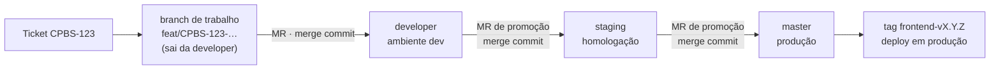
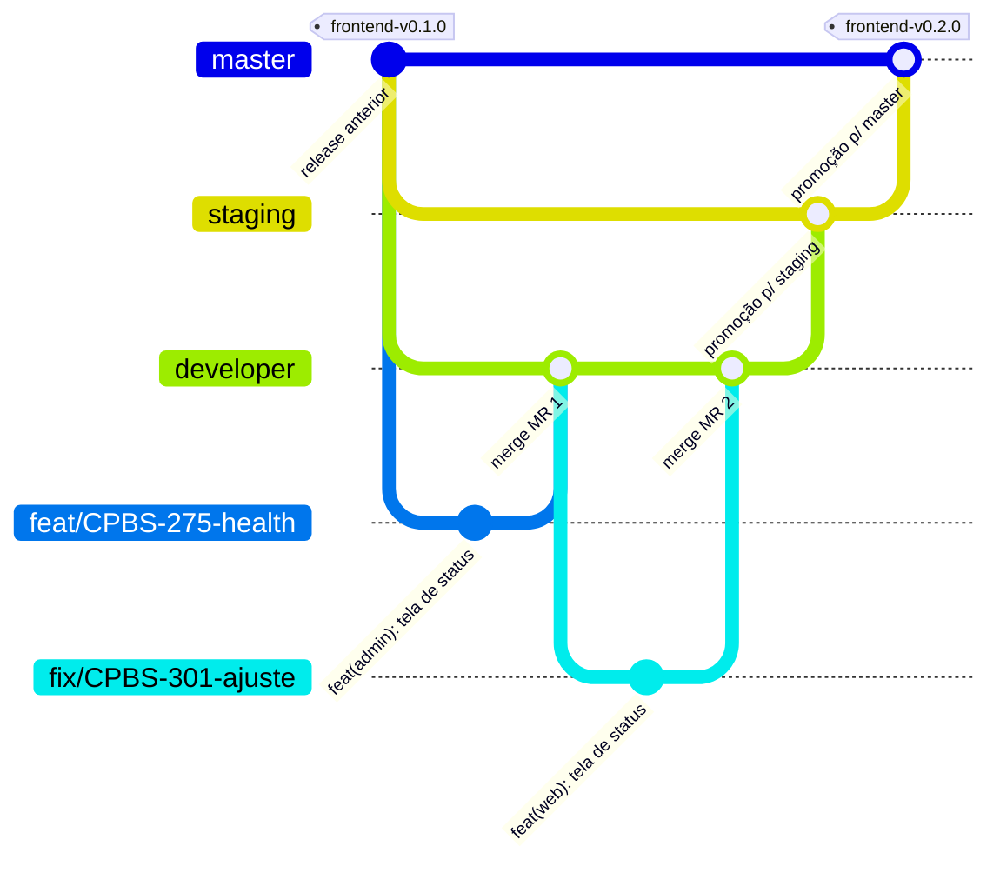
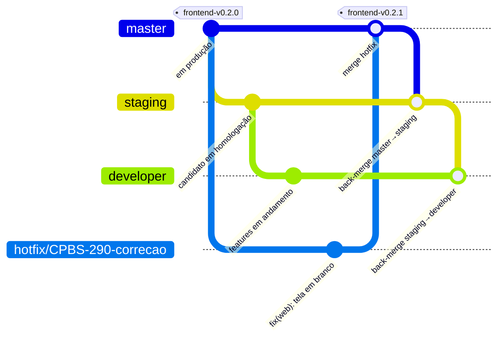
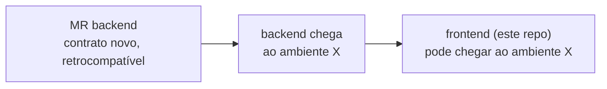
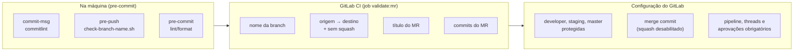

# Contribuindo — Frontend

> Projeto: **Frontend** — App Next.js — áreas web (`/`) e admin (`/admin`) (Node 24 · Next.js · TypeScript).

Plataforma: **GitLab** (merge requests, GitLab CI, Container Registry, Environments) · Tickets: **Jira** (`CPBS-xxx`).

Resumo: **branch de trabalho** `tipo/CPBS-123-descricao` criada da `developer` → **commits** Conventional Commits com `Refs: CPBS-123` → **MR para `developer`** (merge commit) → **promoção** `developer → staging → master` (MRs de release, merge commit) → **tag** `frontend-vX.Y.Z` na `master` → produção.



## 1. Branches e fluxo de publicação

### 1.1 Branches permanentes (protegidas)

O repositório tem **três branches permanentes**, cada uma ligada a um ambiente. **Todas são travadas**: ninguém faz push direto, force push é proibido e elas não podem ser apagadas. Só recebem código por **merge request** aprovado com pipeline verde.

| Branch | Ambiente | Recebe | Quem pode fazer merge |
|--------|----------|--------|------------------------|
| `developer` | **development** (`app-dev.<dominio>`) | MRs das branches de trabalho · back-merge da `staging` | Developers + Maintainers |
| `staging` | **staging / homologação** (`app-staging.<dominio>`) | **Somente** promoção da `developer` · back-merge da `master` | Maintainers |
| `master` | **production** (`app.<dominio>`) | **Somente** promoção da `staging` · `hotfix/*` | Maintainers |

- **Branch padrão do repositório: `developer`** — é o destino padrão dos MRs e a base de todas as branches de trabalho.
- `master` é sempre o que está (ou vai para) produção; `staging` é o candidato a release; `developer` é a integração contínua do time.
- Domínios de cada ambiente: a definir (os nomes acima são a convenção proposta).

### 1.2 Fluxo de publicação: `developer → staging → master`



| Etapa | O que acontece | Ambiente atualizado |
|-------|----------------|---------------------|
| 1. Desenvolvimento | Branch de trabalho criada da `developer`; MR para `developer` (merge commit — todos os commits da branch entram na `developer`) | **development** (deploy automático após o merge) |
| 2. Promoção para homologação | MR **`developer → staging`** (template *Release*, merge commit) | **staging** (deploy automático após o merge) |
| 3. Homologação | QA/validação em staging. Problema encontrado? Correção vai **na `developer`** e sobe numa nova promoção — nunca direto na `staging` | — |
| 4. Promoção para produção | MR **`staging → master`** (template *Release*, merge commit) | — |
| 5. Release | Tag **`frontend-vX.Y.Z`** criada na `master` → pipeline publica a imagem versionada | **production** (deploy com **aprovação manual** no pipeline) |

### 1.3 Matriz origem → destino

Qualquer combinação fora desta tabela é **bloqueada pelo CI** (`scripts/check-mr-flow.sh`, §5.3).

| Origem | Destino | Tipo de MR | Método | Template |
|--------|---------|------------|--------|----------|
| `feat/*` `fix/*` `docs/*` `test/*` `refactor/*` `perf/*` `build/*` `ci/*` `chore/*` | `developer` | Trabalho | merge commit | Default / Bugfix / Docs |
| `developer` | `staging` | Promoção | merge commit | Release |
| `staging` | `master` | Promoção | merge commit | Release |
| `hotfix/*` | `master` | Hotfix | merge commit | Hotfix |
| `master` | `staging` | Back-merge (pós-hotfix) | merge commit | Release |
| `staging` | `developer` | Back-merge (pós-hotfix) | merge commit | Release |

**Não usamos squash** em nenhum MR: todos são integrados com **merge commit**. Assim cada commit da branch de trabalho — com seu `Refs: CPBS-xxx` — é preservado, e as três branches compartilham **exatamente os mesmos commits**: o que está em produção é, commit a commit, o que foi validado em staging.

### 1.4 Nome das branches de trabalho

```text
<tipo>/<TICKET>-<descricao-curta>
```

| Parte | Regra | Exemplo |
|-------|-------|---------|
| `tipo` | Um dos tipos da tabela abaixo | `feat` |
| `TICKET` | Chave do Jira, **obrigatória**, em maiúsculas | `CPBS-275` |
| `descricao-curta` | 2 a 5 palavras, kebab-case, minúsculas, sem acentos | `fundacao-projeto` |
| Tamanho total | Máximo 60 caracteres | — |

Regex validada no hook local e no CI (as permanentes `developer`, `staging` e `master` são aceitas à parte):

```text
^(feat|fix|hotfix|docs|test|refactor|perf|build|ci|chore)/CPBS-[0-9]+-[a-z0-9]+(-[a-z0-9]+)*$
```

| Tipo | Quando usar | Sai de | Volta para |
|------|-------------|--------|------------|
| `feat` | Nova funcionalidade | `developer` | `developer` |
| `fix` | Correção de bug (fluxo normal, inclusive bug achado em staging) | `developer` | `developer` |
| `hotfix` | Correção **urgente** de algo em **produção** | `master` | `master` (+ back-merge) |
| `docs` | Somente documentação / ADR | `developer` | `developer` |
| `test` | Somente testes | `developer` | `developer` |
| `refactor` | Refatoração sem mudar comportamento | `developer` | `developer` |
| `perf` | Melhoria de performance | `developer` | `developer` |
| `build` | Docker, dependências, build | `developer` | `developer` |
| `ci` | Pipeline | `developer` | `developer` |
| `chore` | Manutenção geral | `developer` | `developer` |

✅ `feat/CPBS-275-fundacao-projeto` · ✅ `hotfix/CPBS-290-ws-timeout`
❌ `feature/fundacao` (tipo inválido, sem ticket) · ❌ `feat/cpbs-275-Fundação` (ticket minúsculo, maiúscula, acento) · ❌ `fulano/teste` (sem padrão)

### 1.5 Regras de vida da branch de trabalho

1. **Sempre** criar a partir da `developer` atualizada: `git switch developer && git pull && git switch -c feat/CPBS-123-descricao` (hotfix: a partir da `master`).
2. **Uma branch = um ticket.** Ticket grande? Quebre em sub-tickets e MRs menores.
3. **Vida curta:** ideal até 3 dias. Branch parada fica desatualizada e gera conflito.
4. **Atualizar com rebase** na branch de origem: `git fetch && git rebase origin/developer` (hotfix: `origin/master`). Depois: `git push --force-with-lease` (nunca `--force` puro; nunca em branch permanente).
5. **Apagar após o merge** (opção "Delete source branch" marcada por padrão no GitLab). Branches permanentes nunca são apagadas — o GitLab não remove branches protegidas.

### 1.6 Promoção (release)

Feita por um **Maintainer** (responsável pelo release).

**`developer → staging`**

1. Conferir que o pipeline da `developer` está verde e que o ambiente **development** está saudável.
2. Abrir MR `developer → staging` com o template **Release**, título `chore(release): promove developer para staging`.
3. Listar os MRs/tickets incluídos: `git log --oneline --no-merges origin/staging..origin/developer`.
4. Confirmar dependências entre projetos (§3.5) e variáveis de ambiente novas já configuradas em **staging**.
5. Merge **sem apagar a branch de origem** → deploy automático em **staging**.
6. Validação/QA em staging. Bug encontrado → `fix/*` a partir da `developer` → nova promoção.

**`staging → master`**

1. Validação em staging concluída e registrada no MR.
2. Abrir MR `staging → master` com o template **Release**, título `chore(release): promove staging para master (frontend-vX.Y.Z)`.
3. Calcular a versão (§4) e conferir variáveis de ambiente de **production**.
4. Merge → criar a tag **`frontend-vX.Y.Z`** no commit de merge da `master` → pipeline da tag publica a imagem e aguarda a **aprovação manual** do deploy em **production**.
5. Validação pós-deploy (health, telas/fluxos críticos) e comunicação do release.

Enquanto uma versão está em homologação, a `developer` continua recebendo MRs normalmente; eles entram na **próxima** promoção.

### 1.7 Hotfix



1. Ticket de prioridade alta; branch `hotfix/CPBS-xxx-descricao` **a partir da `master`**.
2. Correção **mínima** + teste de regressão; MR `hotfix/* → master` com o template **Hotfix**.
3. Merge → tag de patch `frontend-vX.Y.Z+1` → deploy em **production** (aprovação manual).
4. **Back-merge obrigatório** no mesmo dia: MR `master → staging` e depois `staging → developer` (template **Release**, merge commit, título `chore(release): back-merge master para staging` / `… staging para developer`). Sem isso a correção some na próxima promoção.

## 2. Commits — Conventional Commits

### 2.1 Formato

```text
<tipo>(<escopo>): <descrição>
                                        ← linha em branco
[corpo opcional: POR QUE a mudança foi feita]
                                        ← linha em branco
Refs: CPBS-123
[BREAKING CHANGE: descrição, se houver]
```

| Parte | Regra |
|-------|-------|
| `tipo` | Obrigatório — tabela §2.2 |
| `escopo` | Esperado (aviso se ausente) — tabela §2.3 |
| `descrição` | Obrigatória; **pt-BR**, verbo no presente (completa a frase "este commit…": *adiciona*, *corrige*, *remove*); começa com **minúscula**; **sem ponto final** |
| Cabeçalho | Máximo **72 caracteres** |
| Corpo | Opcional; explica o **porquê** e o contexto, não o "o quê" (o diff já mostra); linhas até 100 caracteres |
| `Refs: CPBS-123` | **Obrigatório** em todo commit de trabalho — liga o commit ao ticket |
| `BREAKING CHANGE:` | Obrigatório quando quebra contrato ou comportamento esperado por quem consome. Também marcar `!` no cabeçalho |

Template de mensagem: [`.gitmessage`](./.gitmessage) — ativado por `make setup` (`pnpm install` + `pre-commit install` + `git config commit.template .gitmessage`).

Os commits de merge gerados pelo GitLab em todos os MRs (`Merge branch 'feat/…' into 'developer'`) são aceitos automaticamente pelo commitlint.

### 2.2 Tipos

| Tipo | Uso | Gera versão |
|------|-----|-------------|
| `feat` | Nova funcionalidade para o usuário/consumidor | minor |
| `fix` | Correção de bug | patch |
| `perf` | Melhoria de performance | patch |
| `refactor` | Mudança de código sem alterar comportamento | — |
| `test` | Adiciona/ajusta testes, sem mudar produção | — |
| `docs` | Somente documentação | — |
| `style` | Formatação pura (sem mudança de lógica) | — |
| `build` | Dockerfile, dependências, build | — |
| `ci` | Pipeline do GitLab | — |
| `chore` | Manutenção; `chore(release)` nos títulos de promoção/back-merge | — |
| `revert` | Reverte um commit anterior | — |

Qualquer tipo com `!` ou rodapé `BREAKING CHANGE:` gera versão **major** (em `0.x`, **minor**).

### 2.3 Escopos

| Escopo | Quando usar |
|--------|-------------|
| `web` | Área web: `src/app/(web)`, `src/areas/web` |
| `admin` | Área admin: `src/app/admin`, `src/areas/admin` |
| `frontend` | Transversal: `src/features/` comuns, `src/shared/`, configs, Docker, docs |
| `ci` | Pipeline (`.gitlab-ci.yml`) |
| `deps` | Atualização de dependências (`package.json` / `pnpm-lock.yaml`) |
| `repo` | Arquivos de repositório: `README.md`, `CONTRIBUTING.md`, `.gitmessage`, templates, hooks |
| `release` | **Somente** título de MR de promoção e de back-merge (§1.6 e §1.7) |

Mudou web **e** admin por causa de algo comum (ex.: um componente de `shared/ui`)? Use `frontend`.

### 2.4 Exemplos

✅ Bons:

```text
feat(admin): adiciona tela de status da plataforma

Mostra o health do escopo admin via HTTP e WebSocket para validar
a comunicação com a API ponta a ponta.

Refs: CPBS-275
```

```text
fix(frontend): reconecta websocket após queda de rede com backoff exponencial

Refs: CPBS-301
```

```text
feat(frontend)!: exige API_URL e WS_URL em runtime

BREAKING CHANGE: o container não sobe sem API_URL e WS_URL definidas.
Refs: CPBS-345
```

```text
test(web): cobre tela de status com MSW

Refs: CPBS-275
```

✅ Título de MR de promoção (não precisa de `Refs`):

```text
chore(release): promove developer para staging
chore(release): promove staging para master (frontend-v0.2.0)
```

❌ Ruins:

| Mensagem | Problema |
|----------|----------|
| `ajustes` | Sem tipo, sem escopo, sem ticket, não diz nada |
| `feat: Adicionado health.` | Maiúscula, particípio, ponto final, sem escopo e sem `Refs` |
| `feat(backend): ...` neste repositório | Escopo de outro projeto — mudanças da API vão no repositório do backend |
| `feat(web): adiciona tela de status no web e no admin` | Mistura áreas — use `frontend` se a mudança é comum, ou dois commits |
| `feat(release): ...` em MR de trabalho | `release` é exclusivo de promoção/back-merge |
| `wip`, `ajuste`, `fix review` | Sem squash, todo commit vai para o histórico: reescreva commits temporários antes de abrir o MR (`git rebase -i origin/developer`) |

### 2.5 Boas práticas

- **Um commit = uma mudança lógica.** Facilita revisão e `git revert`.
- **Sem squash, o histórico é o que você commitar:** todos os commits da branch vão para `developer`, `staging` e `master`. Antes de abrir o MR, revise-os (`git log origin/developer..HEAD`) e reescreva mensagens fora do padrão ou commits temporários com `git rebase -i origin/developer`.
- **Durante a revisão:** ajustes pedidos entram como **novos commits** no padrão (ex.: `fix(backend): trata origem ausente no handshake`), sem reescrever o que já foi revisado.
- **TDD no histórico:** é bem-vindo o par `test(...)` → `feat(...)`, mostrando o teste antes da implementação.
- **Nada quebrado:** cada commit deveria passar em lint e testes.
- **Sem arquivos gerados** fora os previstos (`openapi.json`, `schema.d.ts`) e **sem segredos** — nunca.

## 3. Merge Requests

### 3.1 Regras

| Regra | MR de trabalho (→ `developer`) | MR de promoção / back-merge | MR de hotfix (→ `master`) |
|-------|-------------------------------|-----------------------------|---------------------------|
| **Título** | Cabeçalho de commit: `feat(admin): adiciona tela de status` | `chore(release): promove <origem> para <destino>` | Cabeçalho de commit: `fix(...)` |
| Template | Default / Bugfix / Docs | **Release** | **Hotfix** |
| Apagar branch de origem | Sim | **Não** (branch permanente) | Sim |
| Aprovações | ≥ 1 (não o autor) | ≥ 1 **Maintainer**; para `master`: **2** | **2**, incluindo 1 Maintainer |
| Quem faz o merge | Autor, após aprovação | Maintainer responsável pelo release | Maintainer |

Regras comuns a todos:

| Regra | Valor |
|-------|-------|
| Método de merge | **Merge commit** em todos os MRs — squash **desabilitado** no projeto |
| Commits | Todos no padrão da §2 (validados pelo CI); nada de `wip` |
| Em andamento | Prefixo `Draft:` no título — não pode ser mergeado |
| Preenchimento | **Todas** as seções do template; o que não se aplica recebe "N/A" com motivo |
| Tamanho (trabalho) | Ideal **até ~400 linhas** alteradas (sem contar arquivos gerados). Maior que isso: quebrar |
| Escopo do MR | Só mudanças **deste projeto** |
| Pipeline | Verde obrigatório (inclui validação de branch, fluxo, título e commits) |
| Threads | Todas resolvidas antes do merge |

### 3.2 Templates

Em [`.gitlab/merge_request_templates/`](./.gitlab/merge_request_templates) — aparecem no seletor **"Description → Choose a template"** ao criar o MR; o `Default.md` é aplicado automaticamente.

| Template | Arquivo | Usar para |
|----------|---------|-----------|
| **Default** (feature/geral) | [`Default.md`](./.gitlab/merge_request_templates/Default.md) | `feat`, `refactor`, `perf`, `test`, `build`, `ci`, `chore` → `developer` |
| **Bugfix** | [`Bugfix.md`](./.gitlab/merge_request_templates/Bugfix.md) | `fix` → `developer` |
| **Docs** | [`Docs.md`](./.gitlab/merge_request_templates/Docs.md) | `docs` → `developer` |
| **Hotfix** | [`Hotfix.md`](./.gitlab/merge_request_templates/Hotfix.md) | `hotfix/*` → `master` |
| **Release** | [`Release.md`](./.gitlab/merge_request_templates/Release.md) | Promoções (`developer → staging`, `staging → master`) e back-merges |

| Seção | O que o template do frontend pede |
|-------|-----------------------------------|
| Partes afetadas | Área web, área admin, features comuns, `shared/`, configs/Docker |
| Telas | Tabela de rotas novas/alteradas |
| Integração com a API | `pnpm openapi`, dependência de MR do backend |
| Configuração | Novas variáveis de runtime |
| Evidências | Prints/GIF das telas |
| Checklist | eslint + fronteiras, prettier, tsc, vitest ≥ 80%, E2E de tela nova, modo SPA |
| Validação de hotfix | `/healthz` + telas de status |
| Release | MRs/tickets incluídos, backend necessário já no ambiente de destino, variáveis configuradas, rollback |

Todos terminam com *quick actions* (`/assign me`, `/label ~tipo ~frontend`) aplicadas ao criar o MR.

### 3.3 Labels

Criar no projeto do GitLab (Manage → Labels):

| Label | Cor sugerida | Aplicada por |
|-------|--------------|--------------|
| `feature` | azul | template Default |
| `bug` | vermelho | template Bugfix |
| `hotfix` | vermelho escuro | template Hotfix |
| `documentation` | cinza | template Docs |
| `release` | dourado | template Release |
| `frontend` | verde | todos os templates deste projeto |
| `contract-change` | roxo | autor, quando o MR muda/consome contrato novo da API |
| `breaking-change` | laranja | autor, quando houver `BREAKING CHANGE` |

### 3.4 Checklist de revisão (para quem revisa)

- [ ] O título e os commits seguem o padrão; o ticket faz sentido com a mudança.
- [ ] Origem e destino respeitam a matriz da §1.3.
- [ ] O código segue os [padrões do frontend](./docs/12-padroes-codigo.md) (camelCase, componentes, hooks).
- [ ] Fronteiras respeitadas: web ↛ admin, admin ↛ web, feature ↛ feature, import de feature só pelo `index.ts`.
- [ ] Modo SPA: sem fetch de negócio em Server Components, sem Server Actions, sem `NEXT_PUBLIC_*`/URL fixa da API.
- [ ] Toda feature, hook e tela nova/alterada tem teste; tela nova tem E2E.
- [ ] Consumo de contrato novo? `pnpm openapi` rodado e o endpoint **já existe** no backend do ambiente de destino.
- [ ] Acessibilidade básica e tabelas de telas/features das áreas atualizadas.
- [ ] Documentação (`docs/`) e ADR atualizados quando necessário.
- [ ] Sem segredos, logs de debug, código comentado ou TODO sem ticket.

Comentários de revisão: prefixar com **`bloqueante:`**, **`sugestão:`** ou **`dúvida:`** para deixar claro o que impede o merge.

### 3.5 Mudanças que envolvem o Backend

Features que dependem de mudança na **API** seguem esta ordem **em cada ambiente**, porque os dois projetos são implantados separadamente:



- O frontend só é promovido para um ambiente (`developer → staging → master`) quando o backend de que ele depende **já está** naquele ambiente.
- Rode `pnpm openapi` contra a API com o contrato novo e commite `openapi.json` + `schema.d.ts`.
- Cada MR cita o outro na seção **"MRs relacionados"** do template.
- Contrato de referência: `docs/06-contratos-api.md` no repositório do **backend**.

## 4. Versionamento e tags

- **SemVer**, com tags anotadas **somente na `master`**, no formato **`frontend-vMAJOR.MINOR.PATCH`** (ex.: `frontend-v0.2.0`). O prefixo identifica o projeto nas tags, nas imagens e nas integrações.
- A versão é derivada dos commits desde a última tag (tabela §2.2): `feat` → minor, `fix`/`perf` → patch, breaking → major. Em `0.x`, breaking sobe o **minor**. Hotfix → patch.
- Criada pelo Maintainer responsável pelo release, **depois** do merge na `master` e com pipeline verde: tag anotada no commit de merge, enviada com `git push origin <tag>`.
- A tag dispara o publish da imagem `frontend:MAJOR.MINOR.PATCH` e o deploy em **production** com aprovação manual (ver [docs/13-ci.md](./docs/13-ci.md)).
- `developer` e `staging` **não recebem tags de versão**: suas imagens são publicadas como `:developer` / `:staging` (+ `:<sha>`).
- Futuro (opcional): `CHANGELOG.md` gerado a partir dos Conventional Commits.

## 5. Como o padrão é garantido

Três camadas — local (feedback rápido), CI (garantia) e configuração do GitLab (bloqueio).



Os arquivos abaixo ficam **na raiz do repositório**.

### 5.1 `commitlint.config.mjs`

O commitlint roda pelo `pre-commit` (que instala o Node e as dependências sozinho) e, no CI, via `npx`.

```js
const TYPES = ['feat', 'fix', 'perf', 'refactor', 'test', 'docs', 'style', 'build', 'ci', 'chore', 'revert'];
const SCOPES = ['frontend', 'web', 'admin', 'ci', 'deps', 'repo', 'release'];

// Título de MR: mesmas regras, exceto o rodapé Refs (o ticket já está na branch;
// promoções e back-merges não têm ticket único).
const isMrTitle = process.env.COMMITLINT_MR_TITLE === '1';

export default {
  extends: ['@commitlint/config-conventional'],
  parserPreset: { parserOpts: { issuePrefixes: ['CPBS-'] } },
  rules: {
    'type-enum': [2, 'always', TYPES],
    'scope-enum': [2, 'always', SCOPES],
    'scope-empty': [1, 'never'],
    'header-max-length': [2, 'always', 72],
    'body-max-line-length': [2, 'always', 100],
    'references-empty': [isMrTitle ? 0 : 2, 'never'],
  },
};
```

### 5.2 `scripts/check-branch-name.sh`

```bash
#!/usr/bin/env bash
# Valida o nome da branch. Uso: check-branch-name.sh [nome]  (padrão: branch atual)
set -euo pipefail

branch="${1:-$(git rev-parse --abbrev-ref HEAD)}"
pattern='^(feat|fix|hotfix|docs|test|refactor|perf|build|ci|chore)/CPBS-[0-9]+-[a-z0-9]+(-[a-z0-9]+)*$'
max_length=60

case "$branch" in
  developer|staging|master) exit 0 ;;   # branches permanentes
esac

if [[ "$branch" =~ $pattern ]] && (( ${#branch} <= max_length )); then
  exit 0
fi

echo "✖ Nome de branch inválido: '$branch'" >&2
echo "  Esperado: <tipo>/CPBS-<numero>-<descricao-em-kebab-case> (máx. $max_length caracteres)" >&2
echo "  Exemplo:  feat/CPBS-275-fundacao-projeto" >&2
echo "  Ver: CONTRIBUTING.md §1.4" >&2
exit 1
```

### 5.3 `scripts/check-mr-flow.sh`

Aplica a matriz da §1.3 em todo MR e recusa MR com squash.

```bash
#!/usr/bin/env bash
# Valida origem → destino do MR e recusa squash (variáveis predefinidas do GitLab CI).
set -euo pipefail

source="$CI_MERGE_REQUEST_SOURCE_BRANCH_NAME"
target="$CI_MERGE_REQUEST_TARGET_BRANCH_NAME"
squash="${CI_MERGE_REQUEST_SQUASH_ON_MERGE:-false}"
work='^(feat|fix|docs|test|refactor|perf|build|ci|chore)/'

fail() { echo "✖ $1" >&2; echo "  Ver: CONTRIBUTING.md §1.3" >&2; exit 1; }

[[ "$squash" != "true" ]] || fail "Squash não é usado neste repositório — desmarque a opção no MR"

case "$target" in
  developer)
    [[ "$source" =~ $work || "$source" == "staging" ]] \
      || fail "developer só recebe branches de trabalho ou back-merge da staging (origem: $source)" ;;
  staging)
    [[ "$source" == "developer" || "$source" == "master" ]] \
      || fail "staging só recebe promoção da developer ou back-merge da master (origem: $source)" ;;
  master)
    [[ "$source" == "staging" || "$source" =~ ^hotfix/ ]] \
      || fail "master só recebe promoção da staging ou hotfix/* (origem: $source)" ;;
  *)
    fail "Destino inválido: $target — MRs de trabalho vão para developer" ;;
esac

echo "✔ Fluxo válido: $source → $target"
```

> O squash já fica **desabilitado** nas configurações do projeto (§5.6); a checagem no script é uma segunda barreira caso a configuração seja alterada.

### 5.4 `.pre-commit-config.yaml`

```yaml
default_install_hook_types: [pre-commit, commit-msg, pre-push]

repos:
  # Mensagem de commit
  - repo: https://github.com/alessandrojcm/commitlint-pre-commit-hook
    rev: v9.x.x   # fixar a versão na implementação
    hooks:
      - id: commitlint
        stages: [commit-msg]
        additional_dependencies: ['@commitlint/config-conventional']

  - repo: local
    hooks:
      # Nome da branch
      - id: branch-name
        name: nome da branch
        entry: scripts/check-branch-name.sh
        language: script
        pass_filenames: false
        always_run: true
        stages: [pre-push]

      # Qualidade do frontend
      - id: prettier
        name: prettier
        entry: pnpm prettier --write
        language: system
        files: \.(ts|tsx|js|mjs|css|json|md|yml|yaml)$
      - id: eslint
        name: eslint (inclui fronteiras)
        entry: pnpm eslint --fix
        language: system
        files: \.(ts|tsx|js|mjs)$
```

### 5.5 `.gitlab-ci.yml` — job `validate:mr`

Somado aos jobs de lint/teste/build/publish/deploy descritos em [docs/13-ci.md](./docs/13-ci.md):

```yaml
validate:mr:
  stage: validate
  image: node:24-slim
  rules:
    - if: $CI_PIPELINE_SOURCE == "merge_request_event"
  variables:
    GIT_DEPTH: 0          # histórico completo para validar todos os commits do MR
  before_script:
    - apt-get update && apt-get install -y --no-install-recommends git
    - npm install --no-save @commitlint/cli @commitlint/config-conventional
  script:
    - ./scripts/check-branch-name.sh "$CI_MERGE_REQUEST_SOURCE_BRANCH_NAME"
    - ./scripts/check-mr-flow.sh
    - title="${CI_MERGE_REQUEST_TITLE#Draft: }"
    - echo "$title" | COMMITLINT_MR_TITLE=1 npx commitlint
    - npx commitlint --from "$CI_MERGE_REQUEST_DIFF_BASE_SHA" --to "$CI_COMMIT_SHA"
```

### 5.6 Configurações do projeto no GitLab

| Onde (GitLab) | Configuração |
|---------------|--------------|
| Settings → Repository → Branch defaults | **Default branch: `developer`** |
| Settings → Repository → Protected branches | `developer`: *Allowed to merge* = Developers + Maintainers · `staging`: Maintainers · `master`: Maintainers. Nas três: *Allowed to push and merge* = **No one**; *Allowed to force push* = **desligado** |
| Settings → Repository → Protected tags | `frontend-v*`: só Maintainers criam |
| Settings → Merge requests → Merge method | **Merge commit** (todos os MRs; preserva cada commit e o mesmo histórico entre ambientes) |
| Settings → Merge requests → Squash commits when merging | **Do not allow** (squash desabilitado) |
| Settings → Merge requests → Merge commit message template | Padrão do GitLab (`Merge branch '%{source_branch}' into '%{target_branch}'` + título + referência do MR). Começa com `Merge`, então o commitlint o ignora |
| Settings → Merge requests → Merge checks | ✅ *Pipelines must succeed* · ✅ *All threads must be resolved* |
| Settings → Merge requests → Merge options | ✅ *Delete source branch by default* (branches protegidas nunca são apagadas) |
| Settings → Merge requests → Approvals | Regras da §3.1; autor não pode aprovar o próprio MR |
| Operate → Environments | `development`, `staging`, `production`; `production` protegido (deploy só por Maintainers) |
| Container Registry | Imagens em `$CI_REGISTRY_IMAGE` (`:developer`, `:staging`, `:master`, `:X.Y.Z`, `:<sha>`) |
| Settings → Repository → Push rules *(se o plano tiver)* | Branch name regex = a do §1.4 (+ permanentes) |
| Settings → Integrations → Jira *(se usado)* | Ativar para que `CPBS-xxx` em branch, commit e MR crie o link no ticket |

> **Plano do GitLab:** aprovações **obrigatórias**, regras de aprovação por branch de destino/caminho, *Protected environments* com aprovação de deploy e *Push rules* são recursos pagos (Premium/Ultimate). No plano Free, essas regras valem **por convenção** (checklist de revisão) e a garantia técnica fica com o CI (`validate:mr`), as branches protegidas e o job de deploy de produção `when: manual` restrito às tags protegidas.

## 6. Cola rápida

```bash
# começar uma tarefa
git switch developer && git pull
git switch -c feat/CPBS-123-minha-feature

# commitar (abre o editor com o template .gitmessage)
git add -p
git commit

# atualizar com a developer
git fetch && git rebase origin/developer
git push --force-with-lease

# abrir o MR → developer: título "feat(admin): adiciona ..." + template Default

# hotfix
git switch master && git pull
git switch -c hotfix/CPBS-456-correcao
# MR → master com template Hotfix; depois back-merge master → staging → developer

# release (Maintainer): MR developer → staging e staging → master com template Release;
# após o merge na master, criar a tag anotada frontend-vX.Y.Z e enviar com git push origin <tag>
```
