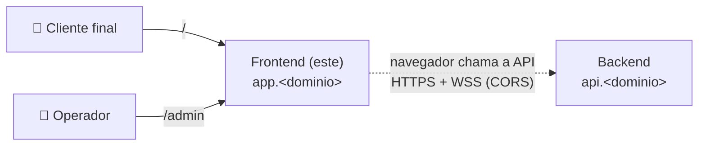

# Bot Varejo — Frontend

App **Next.js** (servidor padrão, usado como SPA) com duas áreas:

| Área | URL | Público | Escopo da API |
|------|-----|---------|---------------|
| **web** | `/` | Cliente final do parceiro | `public` |
| **admin** | `/admin` | Operadores, time interno, parceiros | `admin` |

**Stack:** Node 24 · Next.js · React · TypeScript · Tailwind CSS · TanStack Query. Consome o **backend** (repositório próprio) em outro domínio.

> 📚 Documentação completa: [`docs/`](./docs/README.md) · Branch/commit/MR: [CONTRIBUTING.md](./CONTRIBUTING.md) · Templates de MR: [`.gitlab/`](./.gitlab/merge_request_templates)
>
> ⚠️ **Status:** fase de documentação. Os comandos abaixo descrevem o funcionamento **alvo** e passam a valer quando a implementação for concluída.

## O sistema

O Bot Varejo tem dois projetos, implantados de forma independente:

| Projeto | Domínio | Papel |
|---------|---------|-------|
| **Frontend** (este) | `app.<dominio>` | App Next.js: web em `/` (escopo `public`) e admin em `/admin` (escopo `admin`) |
| Backend | `api.<dominio>` | APIs REST (`/api/v1/public`, `/api/v1/admin`) e WebSocket (`/api/v1/ws/public`, `/api/v1/ws/admin`) |



- **Um processo por container** (`node server.js`); TLS e domínio ficam na plataforma de deploy.
- A única ligação com o backend é o **contrato** HTTP/WebSocket, consumido via `pnpm openapi` ([docs/07-integracao-api.md](./docs/07-integracao-api.md)).
- O backend tem repositório, documentação e deploy próprios.

## Pré-requisitos

| Ferramenta | Versão | Para quê |
|------------|--------|----------|
| Docker + Docker Compose v2 | Compose ≥ 2.24 | Rodar o app |
| Node.js | 24 LTS (ver `.nvmrc`) | Desenvolver sem Docker |
| pnpm | via `corepack enable` | Dependências |
| make | qualquer | Atalhos |

> O front precisa da **API rodando** para as telas de status funcionarem.

## Rodando localmente

### 1. Suba a API

Escolha uma opção:

```bash
# a) pelo repositório do backend (recomendado se for mexer nos dois)
docker compose up --build        # executado no repositório do backend

# b) pela imagem publicada do backend, sem clonar o repositório dele
docker compose --profile api up  # executado aqui: sobe front + API juntos
```

### 2. Suba o frontend

```bash
cp .env.example .env            # opcional: API_URL / WS_URL
docker compose up --build       # imagem de runtime (igual à produção) — ou: make up
# desenvolvimento com hot reload:
docker compose -f docker-compose.dev.yml up --build   # ou: make dev
# sem Docker:
corepack enable && pnpm install
API_URL=http://localhost:8000 WS_URL=ws://localhost:8000 pnpm dev
```

### URLs

| URL | O quê |
|-----|-------|
| http://localhost:3000/ | Área web |
| http://localhost:3000/health | Status da API (escopo public) |
| http://localhost:3000/admin | Área admin |
| http://localhost:3000/admin/health | Status da API (escopo admin) |
| http://localhost:3000/healthz | Liveness do servidor do front |

Nas telas de status, **API (HTTP)** e **Tempo real (WebSocket)** devem aparecer como `ok`.

## Testes e qualidade

```bash
make setup        # pnpm install + hooks do pre-commit + template de commit
make lint         # eslint (inclui fronteiras web/admin/features) + prettier
make typecheck    # tsc --noEmit
make test         # vitest + cobertura (≥ 80%)
make e2e          # Playwright (front e API no ar)
make openapi      # atualiza os tipos a partir do /api/openapi.json da API
```

## Variáveis de ambiente

| Variável | Padrão | Descrição |
|----------|--------|-----------|
| `API_URL` | `http://localhost:8000` | Base REST da API (como o navegador enxerga) — **runtime** |
| `WS_URL` | `ws://localhost:8000` | Base WebSocket da API — **runtime** |
| `FRONT_PORT` | `3000` | Porta publicada no host |
| `BACKEND_IMAGE` | `registry.gitlab.com/<grupo>/<repo-backend>` | Repositório da imagem do backend (profile `api`) |
| `BACKEND_TAG` | `developer` | Versão do backend no profile `api` (`developer`, `staging`, `master`, `X.Y.Z`) |
| `OPENAPI_URL` | `http://localhost:8000/api/openapi.json` | Origem do contrato para `make openapi` |

## Solução de problemas

| Sintoma | Causa provável | Solução |
|---------|----------------|---------|
| Erro de CORS no console | Origem do front não liberada no backend | No backend: `APP_CORS_ORIGINS='["http://localhost:3000"]'` |
| WebSocket `closed` na tela de status | API fora do ar ou `Origin` não permitido | Subir a API; conferir `APP_CORS_ORIGINS` |
| Erro "Variável de ambiente obrigatória não definida" | `API_URL`/`WS_URL` ausentes | Definir no `.env` ou no ambiente |
| Tipos da API desatualizados | `openapi.json` antigo | `make openapi` com a API rodando |
| Mudança em `package.json` não aparece no dev | Deps instaladas no build | Subir com `--build` |

## Contribuindo

Leia o [CONTRIBUTING.md](./CONTRIBUTING.md). Resumo:

```text
branch:    feat/CPBS-123-descricao-curta                        ← sai da developer
commit:    feat(admin): adiciona tela de status      ← escopos: web admin frontend | ci deps repo
           (linha em branco)
           Refs: CPBS-123
MR:        → developer · merge commit (sem squash) · template de .gitlab/ · ≥ 1 aprovação · pipeline verde
publicar:  developer → staging → master   (MRs de promoção, template Release)
tag:       frontend-vX.Y.Z na master → deploy em production (aprovação manual)
```

- Template de commit: [`.gitmessage`](./.gitmessage) (`git config commit.template .gitmessage`, feito pelo `make setup`).
- Templates de MR: [`.gitlab/merge_request_templates/`](./.gitlab/merge_request_templates) — Default, Bugfix, Docs, Hotfix, Release.
- Branches permanentes e protegidas: `developer` (development), `staging` (homologação), `master` (production) — fluxo e promoção em [CONTRIBUTING §1](./CONTRIBUTING.md#1-branches-e-fluxo-de-publicação).
- Mudanças que envolvem o backend: ver [CONTRIBUTING §3.5](./CONTRIBUTING.md#35-mudanças-que-envolvem-o-backend).
