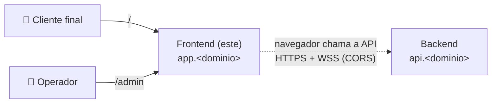

# Bot Varejo — Frontend

App **Next.js** (servidor padrão, usado como SPA) com duas áreas:

| Área | URL | Público | Escopo da API |
|------|-----|---------|---------------|
| **web** | `/` | Cliente final do parceiro | `public` |
| **admin** | `/admin` | Operadores, time interno, parceiros | `admin` |

**Stack:** Node 24 · Next.js · React · TypeScript · Tailwind CSS · TanStack Query. Consome o **backend** (repositório próprio) em outro domínio.

> 📚 Documentação completa: [`docs/`](./docs/README.md) · Branch/commit/MR: [CONTRIBUTING.md](./CONTRIBUTING.md) · Templates de MR: [`.gitlab/`](./.gitlab/merge_request_templates)
>
> ⚠️ **Status:** documentação e arquivos Docker prontos; o código da aplicação ainda não existe. Build e execução passam a funcionar quando o código for implementado.

## O sistema

O Bot Varejo tem dois projetos, implantados de forma independente:

| Projeto | Domínio | Papel |
|---------|---------|-------|
| **Frontend** (este) | `app.<dominio>` | App Next.js: web em `/` (escopo `public`) e admin em `/admin` (escopo `admin`) |
| Backend | `api.<dominio>` | APIs REST (`/api/v1/public`, `/api/v1/admin`) e WebSocket (`/api/v1/ws/public`, `/api/v1/ws/admin`) |



- **Um processo por container** (`node server.js`); TLS e domínio ficam na plataforma de deploy.
- A única ligação com o backend é o **contrato** HTTP/WebSocket, consumido via `pnpm openapi` ([docs/07-integracao-api.md](./docs/07-integracao-api.md)).
- O backend tem repositório, documentação e deploy próprios.

## Pré-requisitos

| Ferramenta | Versão | Obrigatória para |
|------------|--------|------------------|
| Docker Engine + Docker Compose v2 | Compose ≥ 2.24 | Rodar o app (caminho recomendado) |
| Node.js | 24 LTS (`.nvmrc`) | Rodar sem Docker, testes e lint |
| pnpm | via `corepack enable` | Dependências |
| pre-commit | 3+ | Hooks de commit (`pipx install pre-commit` ou `uv tool install pre-commit`) |

> **Linux/WSL:** seu usuário precisa estar no grupo `docker` — `sudo usermod -aG docker $USER` e abra um novo terminal. Sem isso aparece `permission denied … docker.sock`.
>
> O front precisa da **API rodando** para as telas de status funcionarem (ver [Rodando](#rodando)).

## Configuração

1. **Clonar e entrar no repositório**

   ```bash
   git clone <url-do-repositorio-frontend> bot-varejo-frontend
   cd bot-varejo-frontend
   ```

2. **Criar o `.env`** a partir do exemplo (os valores padrão já funcionam localmente):

   ```bash
   cp .env.example .env
   ```

   | Variável | Quando mudar |
   |----------|--------------|
   | `API_URL` / `WS_URL` | A API não está em `localhost:8000` (lembre: são as URLs que o **navegador** acessa) |
   | `WEB_PORT` | A porta 3000 já está em uso |

   As URLs da API são lidas **em runtime**: a mesma imagem funciona em qualquer ambiente, basta mudar as variáveis.

3. **Preparar o ambiente para contribuir** *(uma vez por clone)*:

   ```bash
   git config commit.template .gitmessage   # template de mensagem de commit
   corepack enable && pnpm install          # dependências
   pre-commit install                       # hooks: commitlint, nome da branch, prettier, eslint
   ```

## Rodando

### 1. Deixe a API disponível

A API e o banco sobem **pelo repositório do backend** — este compose sobe só o frontend:

```bash
# no repositório do backend
docker compose -f docker-compose.dev.yml up --build   # bot-varejo-api em :8000 + bot-varejo-dynamodb em :8001
```

Confira: `curl -s http://localhost:8000/api/v1/public/health` deve responder `"status":"ok"`.

### 2. Suba o frontend

| Serviço | Container (runtime / dev) | Porta no host |
|---------|---------------------------|---------------|
| `bot-varejo-web` | `bot-varejo-web` / `bot-varejo-web-dev` | `3000` (`WEB_PORT`) |

**Desenvolvimento** (recomendado no dia a dia) — `src/` e `public/` montados, *hot reload*:

```bash
docker compose -f docker-compose.dev.yml up --build
```

**Imagem de produção** — servidor Next standalone, usuário não-root, healthcheck:

```bash
docker compose up --build -d
```

**Sem Docker** — o `next dev` lê o `.env` automaticamente:

```bash
corepack enable && pnpm install
pnpm dev
```

### Comandos úteis

Acrescente `-f docker-compose.dev.yml` quando estiver usando o compose de desenvolvimento.

| Ação | Comando |
|------|---------|
| Ver status | `docker compose ps` |
| Acompanhar logs | `docker compose logs -f bot-varejo-web` |
| Parar | `docker compose down` |
| Recriar após mudar `package.json`/`next.config.ts`/`Dockerfile` | `docker compose up --build` |
| Shell dentro do container | `docker compose exec bot-varejo-web sh` |

### URLs

| URL | O quê |
|-----|-------|
| http://localhost:3000/ | Área web |
| http://localhost:3000/health | Status da API (escopo public) |
| http://localhost:3000/admin | Área admin |
| http://localhost:3000/admin/health | Status da API (escopo admin) |
| http://localhost:3000/healthz | Liveness do servidor do front |

Nas telas de status, **API (HTTP)** e **Tempo real (WebSocket)** devem aparecer como `ok`.

## Testes e qualidade

```bash
pnpm lint          # eslint (inclui fronteiras web/admin/features)
pnpm prettier --check .
pnpm typecheck     # tsc --noEmit
pnpm test          # vitest + cobertura (≥ 80%)
pnpm e2e           # Playwright contra E2E_BASE_URL do .env — front e API já no ar
pnpm openapi       # atualiza os tipos a partir do /api/openapi.json da API
```

## Variáveis de ambiente

| Variável | Padrão | Descrição |
|----------|--------|-----------|
| `API_URL` | `http://localhost:8000` | Base REST da API (como o navegador enxerga) — **runtime** |
| `WS_URL` | `ws://localhost:8000` | Base WebSocket da API — **runtime** |
| `WEB_PORT` | `3000` | Porta publicada no host |
| `E2E_BASE_URL` | `http://localhost:3000` | Front testado pelos E2E (Playwright) |
| `OPENAPI_URL` | `http://localhost:8000/api/openapi.json` | Origem do contrato para `pnpm openapi` |

## Solução de problemas

| Sintoma | Causa provável | Solução |
|---------|----------------|---------|
| `permission denied … docker.sock` | Usuário fora do grupo `docker` | `sudo usermod -aG docker $USER` e abrir um novo terminal |
| `port is already allocated` | Porta 3000 em uso | Parar o outro processo ou mudar `WEB_PORT` no `.env` |
| Erro de CORS no console | Origem do front não liberada no backend | No backend: `APP_CORS_ORIGINS='["http://localhost:3000"]'` |
| WebSocket `closed` na tela de status | API fora do ar ou `Origin` não permitido | Subir a API; conferir `APP_CORS_ORIGINS` |
| Erro "Variável de ambiente obrigatória não definida" | `API_URL`/`WS_URL` ausentes | Definir no `.env` ou no ambiente |
| Tipos da API desatualizados | `openapi.json` antigo | `pnpm openapi` com a API rodando |
| Mudança em `package.json` não aparece no dev | Deps instaladas no build | Subir com `--build` |

## Contribuindo

Leia o [CONTRIBUTING.md](./CONTRIBUTING.md). Resumo:

```text
branch:    feat/CPBS-123-descricao-curta                        ← sai da developer
commit:    feat(admin): adiciona tela de status      ← escopos: web admin frontend | ci deps repo
           (linha em branco)
           Refs: CPBS-123
MR:        → developer · merge commit (sem squash) · template de .gitlab/ · ≥ 1 aprovação · pipeline verde
publicar:  developer → staging → master   (MRs de promoção, template Release)
tag:       frontend-vX.Y.Z na master → deploy em production (aprovação manual)
```

- Template de commit: [`.gitmessage`](./.gitmessage) (ativado com `git config commit.template .gitmessage` — ver [Configuração](#configuração)).
- Templates de MR: [`.gitlab/merge_request_templates/`](./.gitlab/merge_request_templates) — Default, Bugfix, Docs, Hotfix, Release.
- Branches permanentes e protegidas: `developer` (development), `staging` (homologação), `master` (production) — fluxo e promoção em [CONTRIBUTING §1](./CONTRIBUTING.md#1-branches-e-fluxo-de-publicação).
- Mudanças que envolvem o backend: ver [CONTRIBUTING §3.5](./CONTRIBUTING.md#35-mudanças-que-envolvem-o-backend).
