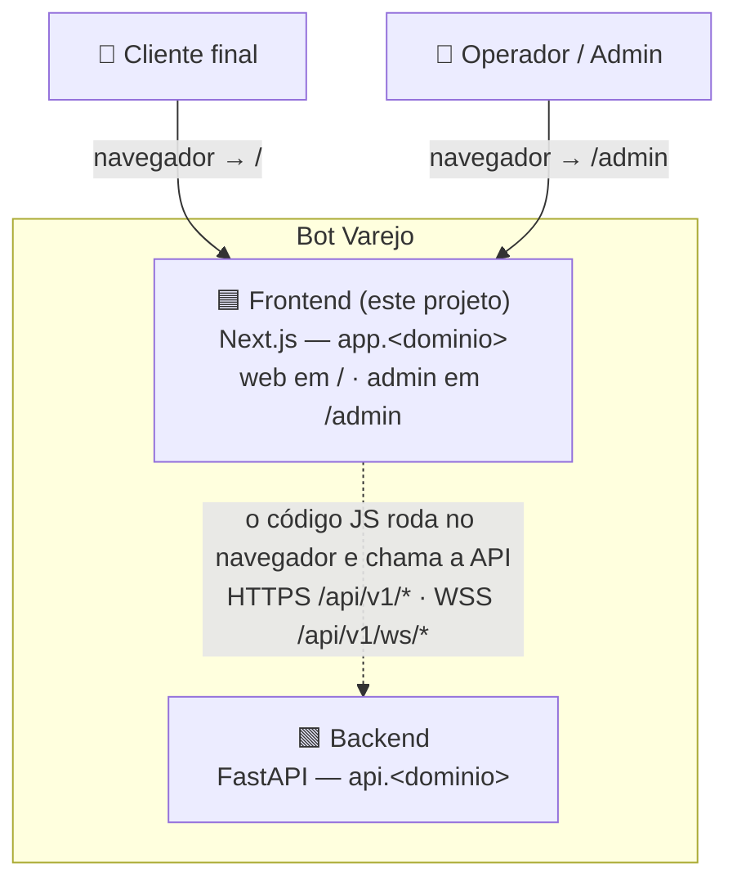
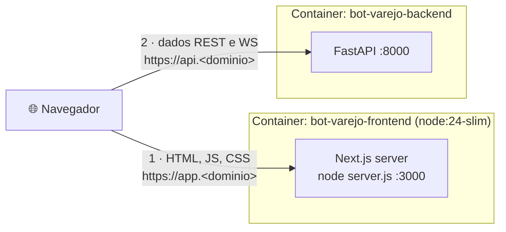
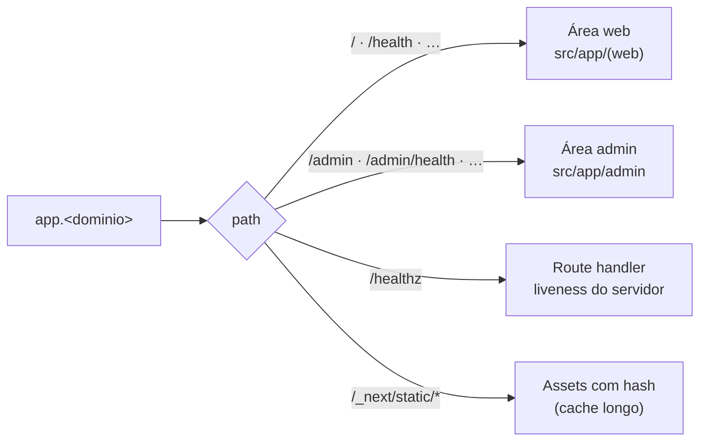
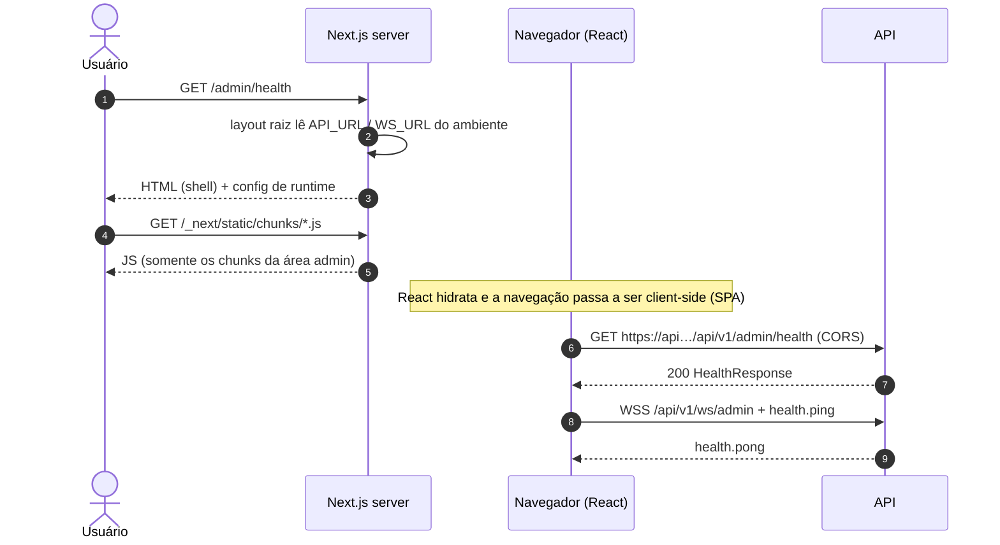
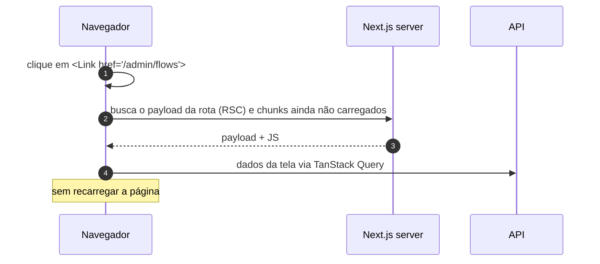
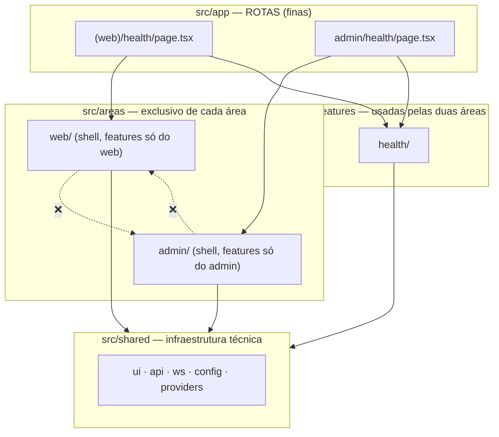

# 01 — Arquitetura (frontend)

Diagramas no estilo **C4** (Contexto → Containers → Componentes), em Mermaid.

## 1. Contexto do sistema

## 2. Containers

| Elemento | Responsabilidade | Não é responsável por |
|----------|------------------|------------------------|
| **Next.js server** | Entregar HTML/JS/CSS das duas áreas, injetar a **configuração de runtime** (URL da API), headers de segurança, `/healthz`; no futuro, *middleware* de autenticação do `/admin` | Buscar dados de negócio (SPA: quem busca é o navegador) |
| **Código no navegador** | Toda a interação e busca de dados (TanStack Query + WebSocket) direto na API | — |
| **Backend** | REST, WebSocket, CORS | Servir o front |

TLS e domínio (`app.<dominio>`) ficam na plataforma de deploy. **Um processo por container.**

## 3. Rotas do app

## 4. Fluxos

### 4.1 Carregamento de uma tela

### 4.2 Navegação entre telas (SPA)

## 5. Componentes internos

Detalhes em [04 — Organização por áreas e features](./04-organizacao-areas-features.md).

## 6. Evolução prevista (não implementar agora)

| Área | Features futuras |
|------|------------------|
| web | `chat` (conversa com o bot em tempo real) |
| admin | `flows` (construtor de fluxos), `integrations`, `partners`, `attendances` |
| ambas | `auth` (login/sessão — admin primeiro, com *middleware* no `/admin`) |
