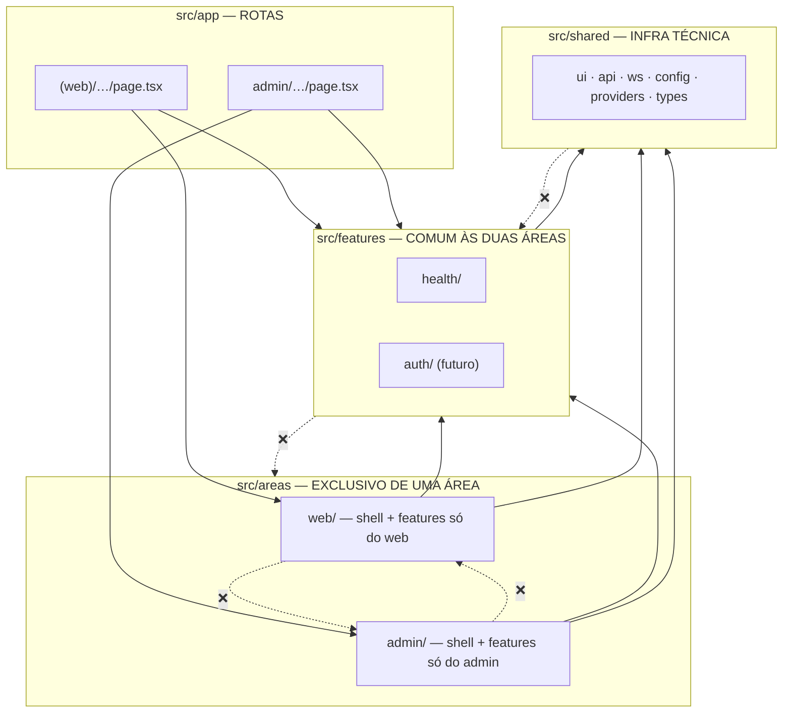

# 04 — Organização por áreas e features

Objetivo declarado: **mexer em uma feature sem interferir nas demais** — e, com web e admin no mesmo app, **mexer em uma área sem interferir na outra** ([ADR-0002](./adr/0002-app-unico-areas-e-features.md)).

## 1. As quatro camadas de pastas



| Camada | Conteúdo | Pode importar |
|--------|----------|---------------|
| `src/app/` | Rotas Next (`page`, `layout`, `not-found`, `route`) — **só composição** | `areas`, `features`, `shared` |
| `src/areas/web/` | Shell do web + features exclusivas do web | `features`, `shared`, a própria área |
| `src/areas/admin/` | Shell do admin + features exclusivas do admin | `features`, `shared`, a própria área |
| `src/features/` | Features usadas pelas duas áreas (ex.: `health`, parametrizada por escopo) | `shared`, a própria feature |
| `src/shared/` | UI genérica, cliente HTTP/WS, config, providers, tipos | apenas `shared` |

## 2. Regras

| # | Regra | Por quê |
|---|-------|---------|
| 1 | `app/` só **compõe**: zero lógica, zero fetch | Rota fina; comportamento testado nas features |
| 2 | **web não importa admin, admin não importa web** | As áreas evoluem de forma independente, como se fossem apps separados |
| 3 | Uma feature **não importa outra feature** | Isolamento; a composição acontece na rota ou na área |
| 4 | Import de uma feature só pelo **`index.ts`** dela | `index.ts` é a API pública; o resto pode ser refatorado livremente |
| 5 | `features/` não conhece áreas: recebe o que precisa por **props/parâmetros** (ex.: `scope`) | Reuso real nas duas áreas |
| 6 | `shared/` não conhece features nem áreas e **não contém regra de negócio** | Evita dependência circular |
| 7 | Feature nasce na área que a usa; só sobe para `features/` quando a outra área precisar | Evita abstração antecipada (KISS) |
| 8 | Todo arquivo de feature tem teste em `__tests__/` | "Toda feature, rota, tela deve ter teste" |

## 3. Anatomia de uma feature

```text
<local>/features/<nome-da-feature>/
├── index.ts          # API pública — exporta só o que rotas/áreas usam
├── types.ts          # tipos (derivados do OpenAPI quando possível)
├── api/              # funções que chamam a API (recebem o ApiClient)
├── hooks/            # hooks React (TanStack Query, WebSocket, estado local)
├── components/       # componentes da feature ('use client' quando necessário)
├── utils/            # funções puras (opcional)
└── __tests__/        # testes de tudo acima
```

## 4. Como a área mapeia para o escopo da API

| Área | Rotas | Escopo usado nas features |
|------|-------|---------------------------|
| web | `src/app/(web)/**` | `'public'` |
| admin | `src/app/admin/**` | `'admin'` |

A rota passa o escopo explicitamente — a feature nunca "adivinha" em que área está:

```tsx
// src/app/admin/health/page.tsx
<HealthStatusCard scope="admin" />
```

## 5. Fronteiras garantidas por lint

```js
// eslint.config.mjs (trecho ilustrativo — sintaxe final conforme a versão do plugin)
import boundaries from 'eslint-plugin-boundaries';

export default [
  {
    plugins: { boundaries },
    settings: {
      'boundaries/elements': [
        { type: 'app', pattern: 'src/app/**' },
        { type: 'area', pattern: 'src/areas/*', capture: ['area'] },
        { type: 'feature', pattern: 'src/features/*', capture: ['feature'] },
        { type: 'shared', pattern: 'src/shared/**' },
      ],
    },
    rules: {
      'boundaries/element-types': ['error', {
        default: 'disallow',
        rules: [
          { from: 'app', allow: ['area', 'feature', 'shared'] },
          { from: 'area', allow: [['area', { area: '${from.area}' }], 'feature', 'shared'] },
          { from: 'feature', allow: [['feature', { feature: '${from.feature}' }], 'shared'] },
          { from: 'shared', allow: ['shared'] },
        ],
      }],
      'boundaries/entry-point': ['error', {
        default: 'allow',
        rules: [{ target: 'feature', disallow: '**', allow: 'index.ts' }],
      }],
    },
  },
];
```

Isolamento entre features **dentro** de uma área (`areas/admin/features/flows` × `areas/admin/features/partners`) segue a mesma regra 3 e é coberto por um elemento `area-feature` adicional quando a primeira feature exclusiva for criada.

## 6. Isolamento em tempo de execução

- O Next divide o JavaScript **por rota**: quem abre só `/` não baixa o código das telas do admin.
- ⚠️ Isso **não é segurança**: o código do admin é público para quem acessar `/admin`. Segurança vem da **API** (autorização por escopo) e, no futuro, do `middleware.ts` do `/admin`.

## 7. Checklist para criar uma nova feature

1. Decidir o local: `areas/<area>/features/<nome>` (uma área) ou `features/<nome>` (duas).
2. Escrever o teste do componente/hook **antes** (TDD), com MSW mockando a API.
3. `api/` usando o `ApiClient` (se o endpoint não existe no contrato, ele nasce primeiro no backend; depois `pnpm openapi`).
4. Exportar só o necessário no `index.ts`.
5. Criar/ajustar a rota em `src/app/...` apenas compondo a feature.
6. Teste da tela (`page.test.tsx`) + cenário E2E se for tela nova.
7. Lint de fronteiras verde; atualizar a tabela de telas/features da área ([05](./05-area-web.md) / [06](./06-area-admin.md)).
