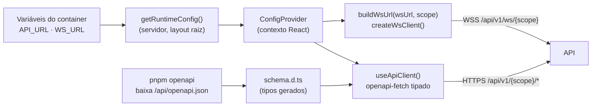
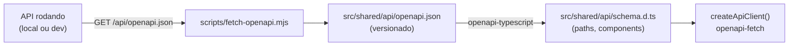

# 07 — Integração com a API

O navegador chama o backend **diretamente**, em outro domínio (`api.<dominio>`). Este documento cobre a configuração da URL, o cliente HTTP tipado, o cliente WebSocket e como os tipos são gerados a partir do contrato do backend.

Contrato de referência (endpoints, schemas, mensagens WS, CORS): `docs/06-contratos-api.md` no repositório do **backend**.

## 1. Visão geral



## 2. Configuração em runtime

A URL da API **não é embutida no build**: é lida do ambiente do container a cada requisição e entregue ao navegador pelo `ConfigProvider`. Resultado: **a mesma imagem** roda em local, dev, staging e produção ([ADR-0004](./adr/0004-config-em-runtime.md)).

| Variável | Exemplo local | Exemplo produção |
|----------|---------------|------------------|
| `API_URL` | `http://localhost:8000` | `https://api.<dominio>` |
| `WS_URL` | `ws://localhost:8000` | `wss://api.<dominio>` |

### `src/shared/config/types.ts`

```ts
export interface RuntimeConfig {
  apiUrl: string;
  wsUrl: string;
}
```

### `src/shared/config/runtimeConfig.ts` (só servidor)

```ts
import 'server-only';

import type { RuntimeConfig } from './types';

const requireEnv = (name: string): string => {
  const value = process.env[name];
  if (!value) throw new Error(`Variável de ambiente obrigatória não definida: ${name}`);
  return value;
};

export const getRuntimeConfig = (): RuntimeConfig => ({
  apiUrl: requireEnv('API_URL'),
  wsUrl: requireEnv('WS_URL'),
});
```

> `import 'server-only'` faz o build falhar se este módulo for importado por código do navegador.

### `src/shared/config/ConfigProvider.tsx`

```tsx
'use client';

import { createContext, useContext, type ReactNode } from 'react';

import type { RuntimeConfig } from './types';

const ConfigContext = createContext<RuntimeConfig | null>(null);

export const ConfigProvider = ({ config, children }: { config: RuntimeConfig; children: ReactNode }) => (
  <ConfigContext.Provider value={config}>{children}</ConfigContext.Provider>
);

export const useRuntimeConfig = (): RuntimeConfig => {
  const config = useContext(ConfigContext);
  if (!config) throw new Error('useRuntimeConfig deve ser usado dentro de <ConfigProvider>');
  return config;
};
```

### `src/shared/providers/Providers.tsx`

```tsx
'use client';

import { QueryClient, QueryClientProvider } from '@tanstack/react-query';
import { useState, type ReactNode } from 'react';

import { ConfigProvider } from '@/shared/config/ConfigProvider';
import type { RuntimeConfig } from '@/shared/config/types';

export const Providers = ({ config, children }: { config: RuntimeConfig; children: ReactNode }) => {
  const [queryClient] = useState(() => new QueryClient());
  return (
    <ConfigProvider config={config}>
      <QueryClientProvider client={queryClient}>{children}</QueryClientProvider>
    </ConfigProvider>
  );
};
```

O layout raiz que chama `getRuntimeConfig()` está em [03 — Next.js como SPA](./03-nextjs-spa.md#4-layout-raiz--configuração-em-runtime).

## 3. Cliente HTTP tipado (`src/shared/api`)

### Geração dos tipos



`package.json`:

```json
{
  "scripts": {
    "openapi": "node scripts/fetch-openapi.mjs && openapi-typescript src/shared/api/openapi.json -o src/shared/api/schema.d.ts"
  }
}
```

`scripts/fetch-openapi.mjs`:

```js
import { writeFile } from 'node:fs/promises';

const url = process.env.OPENAPI_URL ?? 'http://localhost:8000/api/openapi.json';
const response = await fetch(url);
if (!response.ok) {
  throw new Error(`Falha ao baixar ${url}: HTTP ${response.status}`);
}
const spec = await response.json();
await writeFile('src/shared/api/openapi.json', `${JSON.stringify(spec, null, 2)}\n`);
console.log(`OpenAPI atualizado a partir de ${url}`);
```

Fluxo de uma mudança de contrato:

1. Backend publica a mudança (retrocompatível — ver evolução do contrato (`docs/06-contratos-api.md` no repositório do **backend**)).
2. No frontend: `pnpm openapi` (com a API nova rodando localmente ou `OPENAPI_URL` apontando para dev).
3. O TypeScript acusa todo lugar que precisa mudar; o diff de `openapi.json` entra no MR do frontend.

### `src/shared/api/createApiClient.ts`

```ts
import createClient, { type Client } from 'openapi-fetch';

import type { paths } from './schema';

export type ApiClient = Client<paths>;

export const createApiClient = (baseUrl: string): ApiClient => createClient<paths>({ baseUrl });
```

### `src/shared/api/useApiClient.ts`

```ts
'use client';

import { useMemo } from 'react';

import { useRuntimeConfig } from '@/shared/config/ConfigProvider';

import { createApiClient, type ApiClient } from './createApiClient';

export const useApiClient = (): ApiClient => {
  const { apiUrl } = useRuntimeConfig();
  return useMemo(() => createApiClient(apiUrl), [apiUrl]);
};
```

### `src/shared/types/scope.ts`

```ts
import type { components } from '@/shared/api/schema';

export type Scope = components['schemas']['Scope']; // 'public' | 'admin'
```

## 4. Cliente WebSocket (`src/shared/ws`)

### `buildWsUrl.ts`

```ts
import type { Scope } from '@/shared/types/scope';

export const buildWsUrl = (wsUrl: string, scope: Scope): string =>
  `${wsUrl.replace(/\/$/, '')}/api/v1/ws/${scope}`;
```

### `types.ts`

```ts
export interface WsMessage<TType extends string = string, TPayload = Record<string, unknown>> {
  type: TType;
  id?: string | null;
  payload: TPayload;
}

export type WsStatus = 'connecting' | 'open' | 'closed';

export interface WsClient {
  send: <TType extends string, TPayload>(message: WsMessage<TType, TPayload>) => void;
  subscribe: (listener: (message: WsMessage) => void) => () => void;
  onStatusChange: (listener: (status: WsStatus) => void) => () => void;
  close: () => void;
}
```

`createWsClient({ url, maxRetries })` abre a conexão com o `WebSocket` nativo, reconecta com *backoff* exponencial (1s, 2s, 4s… máx. 30s) e notifica mudanças de status. O navegador envia o header `Origin` automaticamente — o backend recusa origens fora de `APP_CORS_ORIGINS`.

## 5. CORS — o que o front precisa saber

- A API só aceita chamadas das origens listadas em `APP_CORS_ORIGINS` no backend. Localmente o padrão já inclui `http://localhost:3000`.
- Erro de CORS no console = origem do front não configurada no backend do ambiente.
- Headers customizados enviados pelo front precisam estar liberados no backend; `X-Request-ID` da resposta é legível pelo front.
