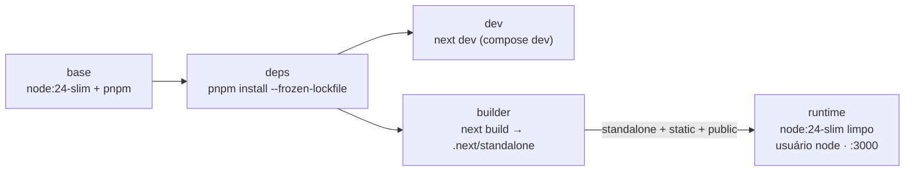
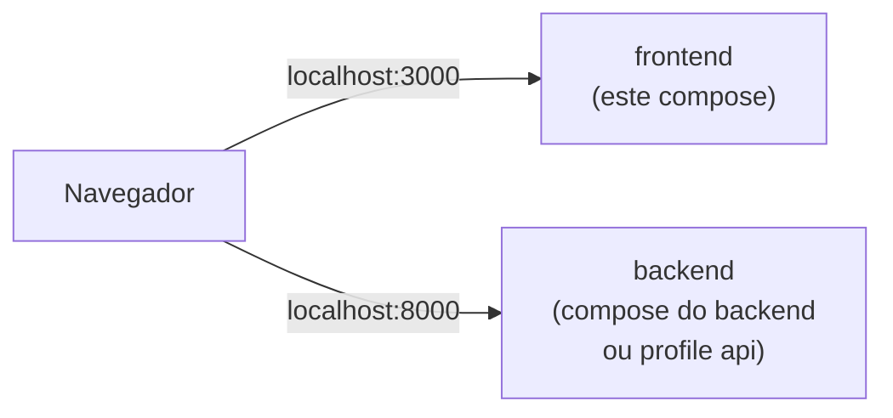
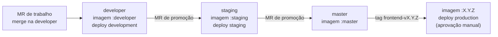

# 10 — Docker e deploy (frontend)

Imagem própria do frontend, baseada em **`node:24-slim`**, rodando o **servidor padrão do Next.js** (`output: 'standalone'` → `node server.js`) — um processo por container ([ADR-0003](./adr/0003-imagem-node.md)). TLS e domínio (`app.<dominio>`) ficam na plataforma de deploy.

## 1. Dockerfile multi-stage



### `Dockerfile`

```dockerfile
# syntax=docker/dockerfile:1
ARG NODE_VERSION=24

# ---------- base ---------------------------------------------------------------
FROM node:${NODE_VERSION}-slim AS base
ENV PNPM_HOME=/pnpm PATH=/pnpm:$PATH NEXT_TELEMETRY_DISABLED=1
RUN corepack enable
WORKDIR /app

# ---------- deps ---------------------------------------------------------------
FROM base AS deps
COPY package.json pnpm-lock.yaml ./
RUN --mount=type=cache,id=pnpm,target=/pnpm/store pnpm install --frozen-lockfile

# ---------- dev (docker-compose.dev.yml) ---------------------------------------
FROM deps AS dev
COPY . .
EXPOSE 3000
CMD ["pnpm", "dev", "--hostname", "0.0.0.0", "--port", "3000"]

# ---------- builder ------------------------------------------------------------
FROM deps AS builder
COPY . .
RUN pnpm build

# ---------- runtime (imagem final) ---------------------------------------------
FROM node:${NODE_VERSION}-slim AS runtime
ENV NODE_ENV=production \
    NEXT_TELEMETRY_DISABLED=1 \
    PORT=3000 \
    HOSTNAME=0.0.0.0
WORKDIR /app

COPY --from=builder --chown=node:node /app/.next/standalone ./
COPY --from=builder --chown=node:node /app/.next/static ./.next/static
COPY --from=builder --chown=node:node /app/public ./public

USER node
EXPOSE 3000
HEALTHCHECK --interval=30s --timeout=3s --start-period=10s --retries=3 \
  CMD ["node", "-e", "fetch('http://127.0.0.1:3000/healthz').then(r => process.exit(r.ok ? 0 : 1)).catch(() => process.exit(1))"]
CMD ["node", "server.js"]
```

Pontos importantes:

- A imagem final **não tem pnpm nem `node_modules` completos**: o `standalone` traz só o necessário para o `server.js`.
- **Não-root** (usuário `node`, já existente na imagem oficial).
- **Nenhuma URL da API no build**: `API_URL` e `WS_URL` são lidas em runtime ([07](./07-integracao-api.md#2-configuração-em-runtime)). A mesma imagem vai para todos os ambientes.
- HEALTHCHECK usa o `fetch` nativo do Node 24 contra `/healthz` (sem `curl`).
- `.dockerignore`: `node_modules`, `.next`, `coverage`, `playwright-report`, `test-results`, `docs/`, `.env*` (exceto `.env.example`).

## 2. Docker Compose

| Arquivo | Propósito | Comando |
|---------|-----------|---------|
| `docker-compose.yml` | Sobe a **imagem de runtime** (igual à produção). Profile opcional `api` sobe também o backend a partir do registry | `docker compose up --build` |
| `docker-compose.dev.yml` | `next dev` com hot reload e código montado | `docker compose -f docker-compose.dev.yml up --build` |

### `docker-compose.yml`

```yaml
name: bot-varejo-frontend

services:
  frontend:
    build:
      context: .
      target: runtime
    image: bot-varejo-frontend:local
    ports:
      - "${FRONT_PORT:-3000}:3000"
    environment:
      # URLs vistas pelo NAVEGADOR (por isso localhost, e não o nome do serviço)
      API_URL: ${API_URL:-http://localhost:8000}
      WS_URL: ${WS_URL:-ws://localhost:8000}
    env_file:
      - path: .env
        required: false
    restart: unless-stopped

  # Opcional: sobe o backend publicado no registry, para rodar o front sem clonar/rodar o backend.
  # docker compose --profile api up
  api:
    profiles: ["api"]
    image: ${BACKEND_IMAGE:-registry.gitlab.com/<grupo>/<repo-backend>}:${BACKEND_TAG:-developer}
    ports:
      - "${API_PORT:-8000}:8000"
    environment:
      APP_CORS_ORIGINS: '["http://localhost:${FRONT_PORT:-3000}"]'
```

### `docker-compose.dev.yml`

```yaml
name: bot-varejo-frontend-dev

services:
  frontend:
    build:
      context: .
      target: dev
    ports:
      - "${FRONT_PORT:-3000}:3000"
    environment:
      API_URL: ${API_URL:-http://localhost:8000}
      WS_URL: ${WS_URL:-ws://localhost:8000}
    volumes:
      - ./src:/app/src
      - ./public:/app/public
```

> Só `src/` e `public/` são montados (para não sobrescrever o `node_modules` do container). Mudou `package.json`, `next.config.ts` ou configs? Suba com `--build`.

### Rodando com o backend



| Cenário | Como |
|---------|------|
| Trabalhando nos dois projetos | `make dev` no repositório do backend + `make dev` aqui |
| Só no front, sem mexer no backend | `docker compose --profile api up` (usa a imagem publicada do backend) |

## 3. Portas

| Porta | Onde | Exposta no host? |
|-------|------|------------------|
| 3000 | Next.js (runtime e dev) | ✅ (`FRONT_PORT`) |
| 8000 | Backend (só com profile `api`) | ✅ (`API_PORT`) |

## 4. Variáveis de ambiente

Documentadas também em `.env.example`.

| Variável | Padrão (compose) | Obrigatória | Descrição |
|----------|------------------|-------------|-----------|
| `API_URL` | `http://localhost:8000` | ✅ (runtime) | Base REST da API, **como o navegador enxerga** |
| `WS_URL` | `ws://localhost:8000` | ✅ (runtime) | Base WebSocket da API (`wss://` em produção) |
| `PORT` | `3000` | — | Porta do servidor Next dentro do container |
| `FRONT_PORT` | `3000` | — | Porta publicada no host (compose) |
| `BACKEND_IMAGE` | `registry.gitlab.com/<grupo>/<repo-backend>` | — | Repositório da imagem do backend (profile `api` e E2E no CI) |
| `BACKEND_TAG` | `developer` | — | Tag da imagem do backend no profile `api` (`developer`, `staging`, `master` ou `X.Y.Z`) |
| `API_PORT` | `8000` | — | Porta do backend no profile `api` |
| `OPENAPI_URL` | `http://localhost:8000/api/openapi.json` | — | Origem do contrato para `pnpm openapi` (ferramenta de dev) |

> O front falha ao renderizar se `API_URL`/`WS_URL` não estiverem definidas — erro explícito em vez de apontar silenciosamente para o lugar errado.

## 5. Entrega por ambiente

Cada branch permanente publica no seu ambiente ([CONTRIBUTING §1](../CONTRIBUTING.md#1-branches-e-fluxo-de-publicação)):



| Ambiente | Branch | Imagem | URL (convenção) | Deploy |
|----------|--------|--------|-----------------|--------|
| development | `developer` | `frontend:developer` | `https://app-dev.<dominio>` | automático |
| staging | `staging` | `frontend:staging` | `https://app-staging.<dominio>` | automático |
| production | `master` (tag) | `frontend:X.Y.Z` | `https://app.<dominio>` | manual (aprovação) |

A mesma imagem roda em qualquer ambiente: o que muda são as **variáveis de ambiente** configuradas em cada um (§4). Detalhes do pipeline em [13 — CI](./13-ci.md).
