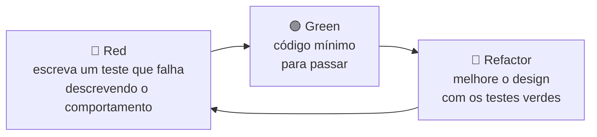
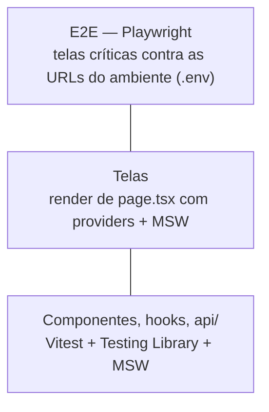

# 11 — Testes (frontend)

Regra do projeto: **toda feature, rota e tela deve ter teste**. Trabalhamos com **TDD**: o teste é escrito antes do código de produção e entra no mesmo MR.

## 1. Ciclo TDD



## 2. Pirâmide



## 3. Matriz obrigatória — o que testar

| Artefato | Tipo de teste | Ferramenta | Obrigatório |
|----------|---------------|-----------|-------------|
| Função em `api/` | Unitário com MSW | Vitest + MSW | ✅ |
| Hook | `renderHook` | Vitest + Testing Library | ✅ |
| Componente de feature | Render + interação | Vitest + Testing Library | ✅ |
| Componente de `shared/ui` | Render + acessibilidade básica | Vitest + Testing Library | ✅ |
| Shell de área (`WebShell`, `AdminShell`) | Render | Vitest + Testing Library | ✅ |
| Cliente WS (`shared/ws`) | Unitário com WebSocket falso (reconexão, mensagens) | Vitest | ✅ |
| **Tela (`page.tsx`)** | Render com providers | Vitest + Testing Library | ✅ **toda tela** |
| Jornada crítica | E2E contra as URLs do ambiente (`E2E_BASE_URL`) | Playwright | ✅ para cada tela nova (smoke) |
| Imagem Docker | Smoke: container sobe e `/healthz` responde 200 | CI | ✅ |

## 4. Convenções

| Item | Regra |
|------|-------|
| Local | `__tests__/` na feature; teste de tela ao lado da `page.tsx`; E2E em `e2e/<area>/` |
| Nome | `<Arquivo>.test.ts(x)`; E2E `<fluxo>.spec.ts` |
| Descrição | `it('exibe … quando …')` em pt-BR |
| Estrutura | Arrange / Act / Assert separados por linha em branco |
| Dublês | MSW para HTTP; `vi.mock` apenas para isolar o hook de WebSocket |
| Seletores | Por papel/texto acessível (`getByRole`, `getByText`); `data-testid` só sem alternativa |
| Dados | Factories tipadas em `src/test/factories/` |
| Cobertura | ≥ 80% linhas e branches (piso, não meta) |

## 5. Infraestrutura

### `vitest.config.ts`

```ts
import react from '@vitejs/plugin-react';
import tsconfigPaths from 'vite-tsconfig-paths';
import { defineConfig } from 'vitest/config';

export default defineConfig({
  plugins: [react(), tsconfigPaths()],
  test: {
    environment: 'jsdom',
    setupFiles: ['./src/test/setup.ts'],
    exclude: ['e2e/**', 'node_modules/**'],
    coverage: { provider: 'v8', thresholds: { lines: 80, branches: 80 } },
  },
});
```

### `src/test/setup.ts`

```ts
import '@testing-library/jest-dom/vitest';
import { afterAll, afterEach, beforeAll } from 'vitest';

import { server } from './server';

beforeAll(() => server.listen({ onUnhandledRequest: 'error' }));
afterEach(() => server.resetHandlers());
afterAll(() => server.close());
```

### `src/test/server.ts`

```ts
import { setupServer } from 'msw/node';

import { handlers } from './mocks/handlers';

export const server = setupServer(...handlers);
```

### `src/test/renderWithProviders.tsx`

```tsx
import { QueryClient, QueryClientProvider } from '@tanstack/react-query';
import { render, type RenderOptions } from '@testing-library/react';
import type { ReactElement } from 'react';

import { ConfigProvider } from '@/shared/config/ConfigProvider';
import type { RuntimeConfig } from '@/shared/config/types';

export const TEST_CONFIG: RuntimeConfig = { apiUrl: 'http://api.test', wsUrl: 'ws://api.test' };

// QueryClient novo por teste: sem cache vazando entre testes, sem retry mascarando erro.
export const renderWithProviders = (ui: ReactElement, options?: RenderOptions) => {
  const queryClient = new QueryClient({ defaultOptions: { queries: { retry: false } } });
  return render(
    <ConfigProvider config={TEST_CONFIG}>
      <QueryClientProvider client={queryClient}>{ui}</QueryClientProvider>
    </ConfigProvider>,
    options,
  );
};
```

### `src/test/factories/health.ts`

```ts
import type { HealthResponse } from '@/features/health';

export const buildHealth = (overrides: Partial<HealthResponse> = {}): HealthResponse => ({
  status: 'ok',
  scope: 'public',
  version: 'test',
  uptimeSeconds: 1,
  checkedAt: '2026-01-01T00:00:00Z',
  components: [],
  ...overrides,
});
```

## 6. Exemplos

### Componente de feature (os dois escopos)

```tsx
// src/features/health/__tests__/HealthStatusCard.test.tsx
import { screen } from '@testing-library/react';
import { http, HttpResponse } from 'msw';
import { describe, expect, it, vi } from 'vitest';

import { buildHealth } from '@/test/factories/health';
import { renderWithProviders, TEST_CONFIG } from '@/test/renderWithProviders';
import { server } from '@/test/server';

import { HealthStatusCard } from '../components/HealthStatusCard';

vi.mock('../hooks/useHealthSocket', () => ({
  useHealthSocket: () => ({ status: 'connecting' }),
}));

describe('HealthStatusCard', () => {
  it.each(['public', 'admin'] as const)('exibe status ok do escopo %s', async (scope) => {
    server.use(
      http.get(`${TEST_CONFIG.apiUrl}/api/v1/${scope}/health`, () =>
        HttpResponse.json(buildHealth({ status: 'ok', scope })),
      ),
    );

    renderWithProviders(<HealthStatusCard scope={scope} />);

    expect(await screen.findByTestId('http-status')).toHaveTextContent('ok');
  });

  it('exibe indisponível quando a API falha', async () => {
    server.use(http.get(`${TEST_CONFIG.apiUrl}/api/v1/admin/health`, () => HttpResponse.error()));

    renderWithProviders(<HealthStatusCard scope="admin" />);

    expect(await screen.findByTestId('http-status')).toHaveTextContent('indisponível');
  });

  it('exibe down quando a API responde 503', async () => {
    server.use(
      http.get(`${TEST_CONFIG.apiUrl}/api/v1/public/health`, () =>
        HttpResponse.json(buildHealth({ status: 'down' }), { status: 503 }),
      ),
    );

    renderWithProviders(<HealthStatusCard scope="public" />);

    expect(await screen.findByTestId('http-status')).toHaveTextContent('down');
  });
});
```

### Tela (rota)

```tsx
// src/app/admin/health/page.test.tsx
import { screen } from '@testing-library/react';
import { expect, it } from 'vitest';

import { renderWithProviders } from '@/test/renderWithProviders';

import AdminHealthPage from './page';

it('renderiza o card de status da plataforma', () => {
  renderWithProviders(<AdminHealthPage />);

  expect(screen.getByText('Status da plataforma')).toBeInTheDocument();
});
```

### E2E

```ts
// e2e/admin/health.spec.ts
import { expect, test } from '@playwright/test';

test('admin mostra a API saudável via HTTP e WebSocket', async ({ page }) => {
  await page.goto('/admin/health');

  await expect(page.getByTestId('http-status')).toContainText('ok');
  await expect(page.getByTestId('ws-status')).toContainText('ms');
});
```

```ts
// e2e/web/health.spec.ts
import { expect, test } from '@playwright/test';

test('web mostra a API saudável via HTTP e WebSocket', async ({ page }) => {
  await page.goto('/health');

  await expect(page.getByTestId('http-status')).toContainText('ok');
  await expect(page.getByTestId('ws-status')).toContainText('ms');
});
```

### `playwright.config.ts`

```ts
import { defineConfig } from '@playwright/test';

// URLs vêm do .env (local) ou das variáveis do ambiente (CI).
// Sem webServer: o Playwright nunca sobe o front nem a API.
try {
  process.loadEnvFile('.env');
} catch {
  // sem .env: valem as variáveis já definidas no ambiente
}

export default defineConfig({
  testDir: './e2e',
  use: { baseURL: process.env.E2E_BASE_URL ?? 'http://localhost:3000' },
});
```

Os E2E usam **as URLs configuradas** — nunca sobem front, API ou banco:

| Onde | Front testado (`E2E_BASE_URL`) | API usada pelo front (`API_URL`/`WS_URL`) |
|------|-------------------------------|-------------------------------------------|
| Local | `.env` → `http://localhost:3000` (front rodando pelo compose deste projeto) | `.env` → `http://localhost:8000` (API rodando pelo compose do backend) |
| CI | Variável do ambiente → `https://app-dev.<dominio>` / `https://app-staging.<dominio>` | Configuradas no front implantado daquele ambiente |

Assim os E2E validam CORS, WebSocket e a configuração de runtime de verdade.

## 7. Onde cada teste roda

| Etapa | Comando | Local | CI |
|-------|---------|-------|----|
| Unit + componentes + telas | `make test` | ✅ | ✅ |
| E2E | `pnpm e2e` (front e API no ar, URLs do `.env`) | ✅ | ✅ após deploy em development/staging |
| Smoke da imagem | job `frontend:build` | — | ✅ |
