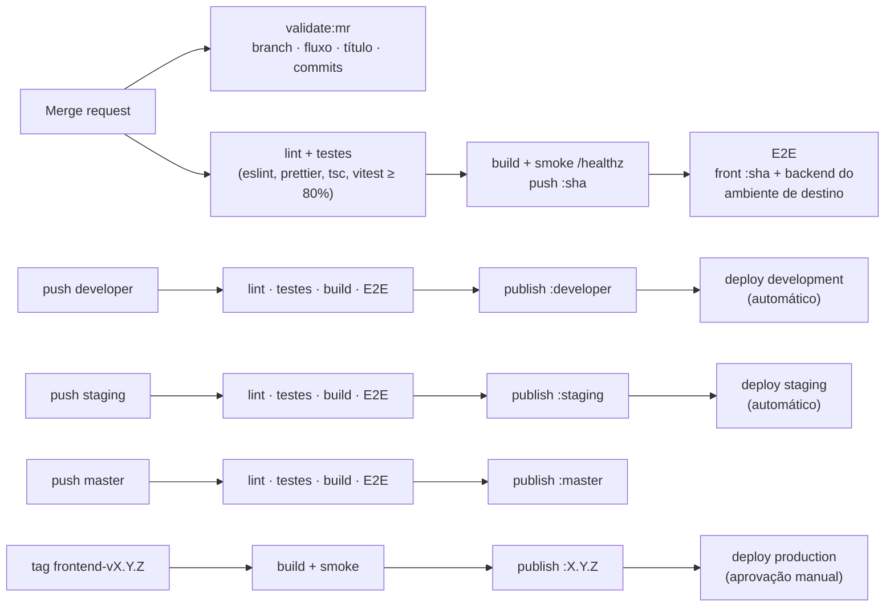

# 13 — CI e comandos (frontend)

Pipeline do frontend em `.gitlab-ci.yml`. Roda em merge requests, nas branches permanentes `developer`, `staging` e `master` e em tags `frontend-v*` — cada branch publica no seu ambiente.

Padrão de branches, commits e MRs (inclui o job `validate:mr`): [CONTRIBUTING.md](../CONTRIBUTING.md).

## 1. Branches, ambientes e imagens

O pipeline segue o fluxo `developer → staging → master` ([CONTRIBUTING §1](../CONTRIBUTING.md#1-branches-e-fluxo-de-publicação)): **cada branch permanente publica no seu ambiente** e produção só recebe **versões com tag** da `master`.

| Evento | Jobs | Imagem publicada | Deploy |
|--------|------|------------------|--------|
| Merge request (qualquer destino) | `validate:mr`, lint, testes, build + smoke, E2E | `:<sha>` | — |
| Push em `developer` (merge de MR de trabalho) | lint, testes, build, E2E, publish, deploy | `:developer` | **development** — automático |
| Push em `staging` (promoção) | lint, testes, build, E2E, publish, deploy | `:staging` | **staging** — automático |
| Push em `master` (promoção ou hotfix) | lint, testes, build, E2E, publish | `:master` | — (aguarda a tag) |
| Tag `frontend-vX.Y.Z` (na `master`) | build, publish, deploy | `:X.Y.Z` | **production** — **aprovação manual** |

| Ambiente | Branch | URL (convenção, a definir) | `API_URL` / `WS_URL` |
|----------|--------|----------------------------|----------------------|
| development | `developer` | `https://app-dev.<dominio>` | `https://api-dev.<dominio>` / `wss://api-dev.<dominio>` |
| staging | `staging` | `https://app-staging.<dominio>` | `https://api-staging.<dominio>` / `wss://api-staging.<dominio>` |
| production | `master` (tag) | `https://app.<dominio>` | `https://api.<dominio>` / `wss://api.<dominio>` |



Imagens publicadas em `$CI_REGISTRY_IMAGE` (GitLab Container Registry). O job `validate:mr` está em [CONTRIBUTING §5.5](../CONTRIBUTING.md#55-gitlab-ciyml--job-validatemr).

Variável de CI/CD necessária: **`BACKEND_IMAGE`** — repositório da imagem do backend, sem tag (ex.: `registry.gitlab.com/<grupo>/<repo-backend>`). O E2E usa a tag do **mesmo ambiente** do destino: MR para `developer` testa contra `backend:developer`, para `staging` contra `backend:staging`, para `master` contra `backend:master`.

## 2. `.gitlab-ci.yml`

```yaml
stages: [validate, test, build, e2e, publish, deploy]

workflow:
  rules:
    - if: $CI_PIPELINE_SOURCE == "merge_request_event"
    - if: $CI_COMMIT_BRANCH =~ /^(developer|staging|master)$/
    - if: $CI_COMMIT_TAG =~ /^frontend-v\d+\.\d+\.\d+$/

variables:
  IMAGE: $CI_REGISTRY_IMAGE

# ---------- qualidade ---------------------------------------------------------
.node:
  image: node:24-slim
  cache:
    key:
      files: [pnpm-lock.yaml]
    paths: [.pnpm-store]
  before_script:
    - corepack enable
    - pnpm config set store-dir .pnpm-store
    - pnpm install --frozen-lockfile
  rules:
    - if: $CI_COMMIT_TAG
      when: never                     # tag = mesmo commit já validado na master
    - when: on_success

frontend:lint:
  extends: .node
  stage: test
  script:
    - pnpm lint
    - pnpm prettier --check .
    - pnpm typecheck

frontend:test:
  extends: .node
  stage: test
  script:
    - pnpm test -- --coverage --reporter=default --reporter=junit --outputFile.junit=report.xml
  artifacts:
    reports:
      junit: report.xml

# ---------- imagem ------------------------------------------------------------
.docker:
  image: docker:27
  services: [docker:27-dind]
  before_script:
    - echo "$CI_REGISTRY_PASSWORD" | docker login -u "$CI_REGISTRY_USER" --password-stdin "$CI_REGISTRY"

frontend:build:
  extends: .docker
  stage: build
  script:
    - docker build --target runtime -t "$IMAGE:$CI_COMMIT_SHORT_SHA" .
    - docker run -d --name smoke -e API_URL=http://api.invalid -e WS_URL=ws://api.invalid "$IMAGE:$CI_COMMIT_SHORT_SHA"
    - for i in $(seq 1 20); do docker exec smoke node -e "fetch('http://127.0.0.1:3000/healthz').then(r=>process.exit(r.ok?0:1)).catch(()=>process.exit(1))" && break; sleep 1; done
    - docker push "$IMAGE:$CI_COMMIT_SHORT_SHA"

# ---------- E2E contra o backend do mesmo ambiente ------------------------------
frontend:e2e:
  stage: e2e
  image: mcr.microsoft.com/playwright:v1-noble   # fixar a versão igual à do @playwright/test
  rules:
    - if: $CI_MERGE_REQUEST_TARGET_BRANCH_NAME =~ /^(developer|staging|master)$/
      variables: { BACKEND_TAG: $CI_MERGE_REQUEST_TARGET_BRANCH_NAME }
    - if: $CI_COMMIT_BRANCH =~ /^(developer|staging|master)$/
      variables: { BACKEND_TAG: $CI_COMMIT_BRANCH }
  services:
    - name: $BACKEND_IMAGE:$BACKEND_TAG
      alias: api
      variables:
        APP_CORS_ORIGINS: '["http://web:3000"]'
    - name: $CI_REGISTRY_IMAGE:$CI_COMMIT_SHORT_SHA
      alias: web
      variables:
        API_URL: http://api:8000
        WS_URL: ws://api:8000
  variables:
    E2E_BASE_URL: http://web:3000
  script:
    - corepack enable && pnpm install --frozen-lockfile
    - pnpm e2e
  artifacts:
    when: on_failure
    paths: [playwright-report]

frontend:publish:
  extends: .docker
  stage: publish
  rules:
    - if: $CI_COMMIT_BRANCH =~ /^(developer|staging|master)$/
    - if: $CI_COMMIT_TAG =~ /^frontend-v\d+\.\d+\.\d+$/
  script:
    - TARGET="${CI_COMMIT_TAG:-$CI_COMMIT_BRANCH}"
    - TARGET="${TARGET#frontend-v}"         # frontend-v1.2.3 → 1.2.3 · developer → developer
    - docker pull "$IMAGE:$CI_COMMIT_SHORT_SHA"
    - docker tag "$IMAGE:$CI_COMMIT_SHORT_SHA" "$IMAGE:$TARGET"
    - docker push "$IMAGE:$TARGET"

# ---------- deploy ------------------------------------------------------------
# O mecanismo de deploy está fora do escopo da CPBS-275: scripts/deploy.sh recebe o
# ambiente e a imagem. API_URL/WS_URL de cada ambiente ficam na plataforma de deploy.
.deploy:
  stage: deploy
  image: alpine:3
  before_script:
    - apk add --no-cache bash git

deploy:development:
  extends: .deploy
  rules:
    - if: $CI_COMMIT_BRANCH == "developer"
  environment:
    name: development
    url: https://app-dev.<dominio>
  script:
    - ./scripts/deploy.sh development "$IMAGE:developer"

deploy:staging:
  extends: .deploy
  rules:
    - if: $CI_COMMIT_BRANCH == "staging"
  environment:
    name: staging
    url: https://app-staging.<dominio>
  script:
    - ./scripts/deploy.sh staging "$IMAGE:staging"

deploy:production:
  extends: .deploy
  rules:
    - if: $CI_COMMIT_TAG =~ /^frontend-v\d+\.\d+\.\d+$/
      when: manual                    # aprovação humana antes de produção
  allow_failure: false
  environment:
    name: production
    url: https://app.<dominio>
  script:
    # Produção só aceita tags que estejam na master.
    - git fetch --quiet origin master
    - git merge-base --is-ancestor "$CI_COMMIT_SHA" origin/master || { echo "Tag fora da master"; exit 1; }
    - ./scripts/deploy.sh production "$IMAGE:${CI_COMMIT_TAG#frontend-v}"
```

> No E2E, front e API sobem como **services** do GitLab: o Playwright (no job) acessa `http://web:3000`, e o navegador do Playwright chama a API em `http://api:8000` — por isso `API_URL` usa o alias `api` e o backend libera a origem `http://web:3000`.
>
> Pré-requisito: a imagem do backend do ambiente correspondente publicada (`BACKEND_IMAGE:developer|staging|master`) — é isso que garante que o front não sobe para um ambiente antes da API de que depende ([CONTRIBUTING §3.5](../CONTRIBUTING.md#35-mudanças-que-envolvem-o-backend)).
>
> **Rollback:** reexecutar o job de deploy de um pipeline anterior do mesmo ambiente (Operate → Environments → *Re-deploy*) ou fazer deploy da tag anterior.

## 3. Scripts do `package.json`

| Script | Comando |
|--------|---------|
| `dev` | `next dev` |
| `build` | `next build` |
| `start` | `node .next/standalone/server.js` |
| `lint` | `eslint .` |
| `typecheck` | `tsc --noEmit` |
| `test` | `vitest run` |
| `e2e` | `playwright test` |
| `openapi` | baixa `/api/openapi.json` da API e gera `schema.d.ts` ([07](./07-integracao-api.md#3-cliente-http-tipado-srcsharedapi)) |

## 4. Makefile — atalhos

| Alvo | O que faz |
|------|-----------|
| `make setup` | `pnpm install` + `pre-commit install` + `git config commit.template .gitmessage` |
| `make up` | `docker compose up --build` (imagem de runtime) |
| `make up-with-api` | `docker compose --profile api up --build` (front + backend do registry) |
| `make down` | `docker compose down` |
| `make dev` | `docker compose -f docker-compose.dev.yml up --build` (hot reload) |
| `make run` | `API_URL=… WS_URL=… pnpm dev` (sem Docker) |
| `make lint` | `pnpm lint` + `prettier --check` |
| `make format` | `prettier --write` + `eslint --fix` |
| `make typecheck` | `pnpm typecheck` |
| `make test` | `pnpm test` com cobertura |
| `make e2e` | `pnpm e2e` (front e API precisam estar no ar) |
| `make openapi` | `pnpm openapi` |
| `make build` | `docker build --target runtime -t bot-varejo-frontend:local .` |
